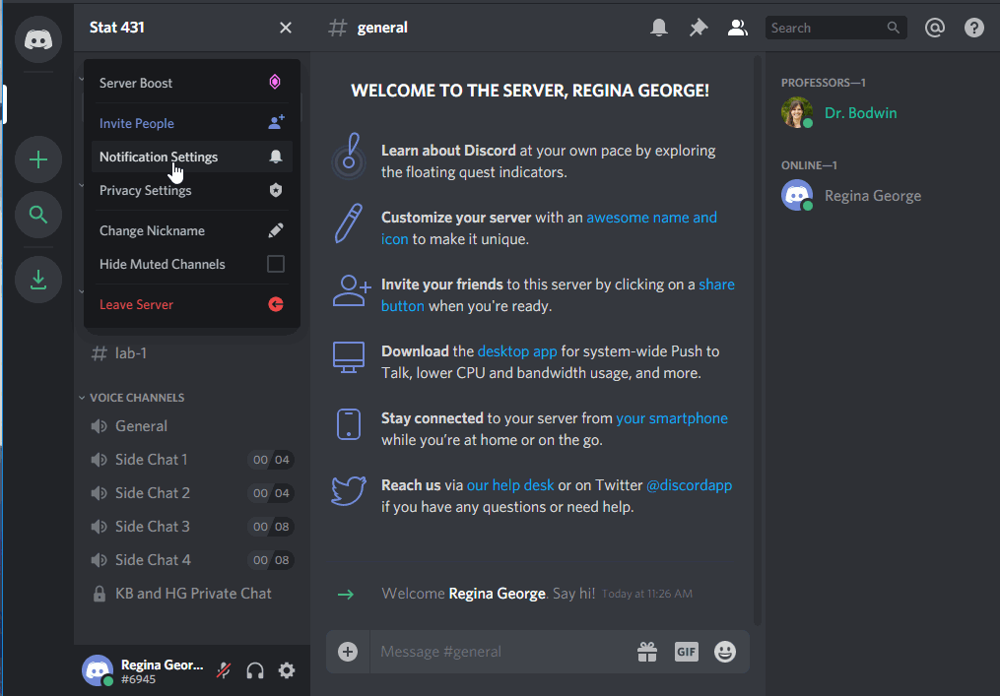
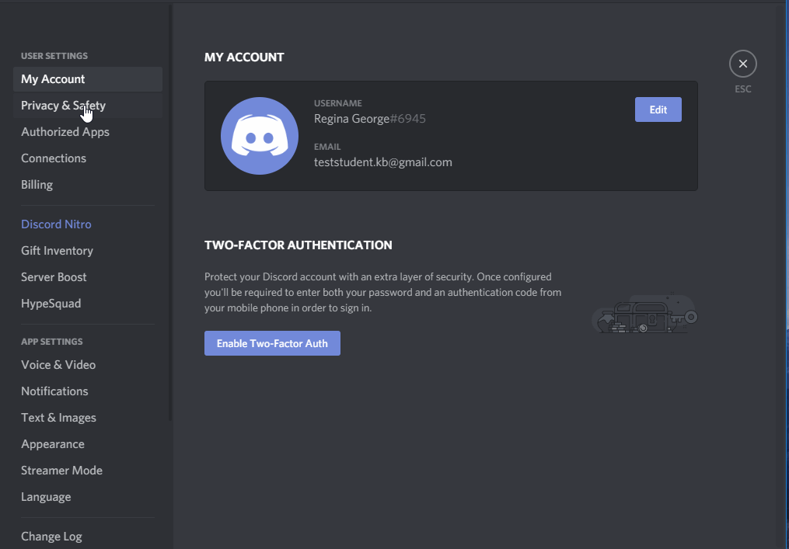
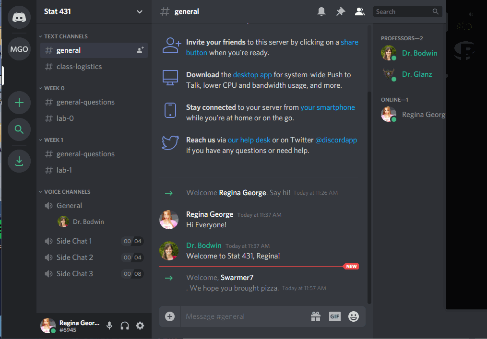
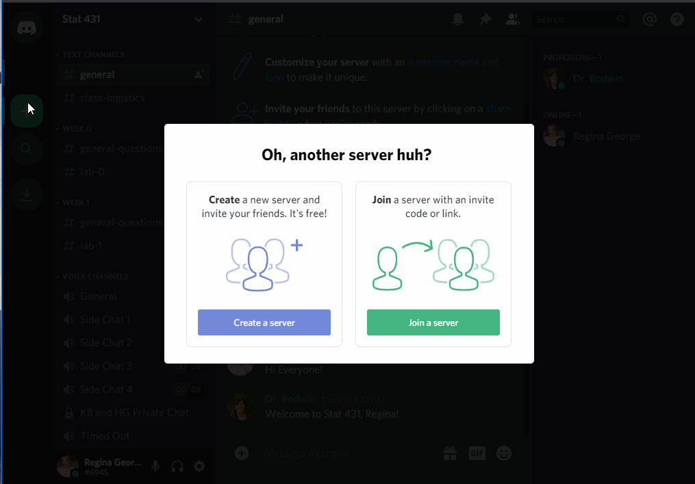
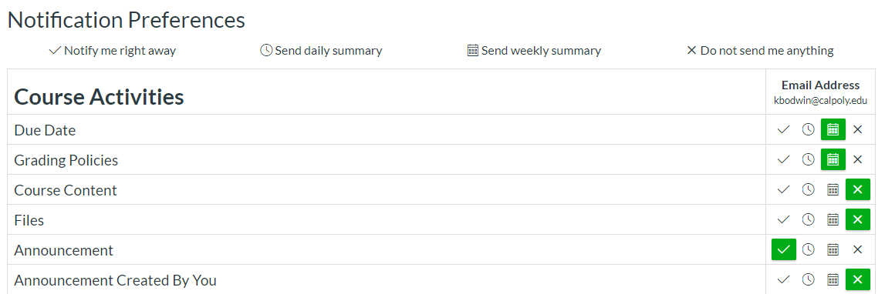

```{r setup, include=FALSE}
knitr::opts_chunk$set(echo = TRUE)
options("couRsework-img_path" = "../../Images/icons") 
### change this if icons local
```

```{r, include = FALSE}
library(tidyverse)
library(flair)
library(emo)
```


Welcome!

In this coursework, you'll get set up with the Class Discord, learn about what
is expected of you each week, and hear some tips from me about how to succeed.

[Required Video: Welcome to Stat 331 from Dr. Theobold (8 minutes)](https://www.youtube.com/watch?v=lO5Pj7Kx4iU)

## Course TODOs

`r emo::ji("play")` Watch Video: 20 min

`r emo::ji("book")` Readings: 15 minutes 

`r emo::ji("computer")` Activities: 0 min 

`r emo::ji("check")` Check-ins: 3

---

# Synchronous Meetings

---

This is a *synchronous* **in-person** course, scheduled to meet on Mondays and
Wednesdays for 2 hours at a time. 

We **will** be meeting every Monday and Wednesday this quarter, and attendance
is expected. 

---

# Using the Class Discord

---

We'll be using Discord to interact with our peers and group members. 

Discord is a platform for text chatting, voice chatting, and screen sharing.

In particular, course **office hours** are held via Discord. I will be available
for public questions, or one-on-one and small group chats by text, voice, or
video.

The office hours for this class are:

#### Tuesdays & Thursdays from 3:30 - 4:30pm **in-person**
#### Tuesdays & Thursdays from 4:30 - 5:30pm **on Discord**

I will often be willing to hop on Discord and help out at other times, and I
will answer text chat questions regularly throughout every day!

---

## Join the server


Join the [Stat 331 Server (https://discord.gg/4MY346Bm)](https://discord.gg/4MY346Bm)
to start experimenting with the interface.

When you join the server, you will be given some suggestions to get started.  


I recommend you click through these - and in particular, it is probably a good
idea to download the desktop version of Discord, and perhaps to install it on
your phone if you wish.

---

## Set up your account

### Verify your email

To use this Discord server, you **must** have a verified email.  

Nobody (including your professors) will be able to see this email, and it does 
not have to be your Cal Poly email.  This is simply to keep the server from
being overrun by temporary accounts.


### Create your identity

The first thing you should do is decide what name and picture you would like to
use.


I would like to **strongly** encourage you to use your **real name and picture**, 
so that everyone can get to know you.  However, if you prefer to remain
anonymous, you are free to do so.




(Please do not be like Regina and use the name of another student, however!  
This kind of impersonation will result in a permanent ban from the server.)


### Decide about privacy and notifications

The default settings on the channel are probably just fine for you.  
Feel free to make any changes that work for you, though.

You can change your message notifications:


You can edit your privacy settings, although most things are already private:



### Connect other apps

You can connect other apps to Discord, either for productivity or just for fun.


---

## Using the Channels

The server is made up of many channels.  Some are text chatrooms, while some are
"Voice Channels" that connect you via audio to everyone else in the channel.


### Text Channels

Use the `#general` channel for anything and everything:


If your question is about course logistics, rather than the material itself,
consider using the `#class-logistics` channel:


You can use the specific weekly channels to ask questions about the material...


... or the specific lab assignment.


Notice that you can use tick marks (` ``` `), like in R Markdown, to make your
code appear in a formatted code box.


### Voice Channels

To join a voice channel, simply click it!  Make sure you are careful about when
you are muted or unmuted.


The extra "Side Chat" channels are limited to 4 or 8 people, if you would like
to start an impromptu study conversation without being heard by me and / or the
rest of the class.  (I'll only drop in if you invite us!)

Voice channels can also be used for people to "Go Live", and share their screen
with everyone else.



While this will usually be something professors use to demonstrate code, you can
go live, too!  But you may need to download the desktop version of Discord to do
so.


### Private messages

It is also easy to send private messages, to your professor or to each other. 
These private messages can also easily be used to launch a private video chat
and / or screen sharing.


---

## Creating your own server

Last but not least - for the teams you are a part of, you may want to use
Discord to communicate with each other about the weekly assignments. You can do
this by creating your own server! You can easily hop between servers during work
parties, to ask each other questions or just to take a break and chat about
life.





---

## See you at the Party!

---

`r emo::ji("check")` Check-in 1: Discord Server

Introduce yourself in the "Introductions" channel of the Discord Server.

---

# Course Structure

---

[Required Video: Class Structure (10 minutes)](https://www.youtube.com/watch?v=8TUyUN71JMY)

---

## What your typical week will look like

### Coursework

Each week, you will be expected to work through a sequence of readings, videos,
and check-ins. (Much like this one!)

These are meant to replace the in-class lecture experience; thus, you should
plan to devote about 1 - 3 hours a week to this coursework. 


### Practice Activities

*Due Tuesdays at midnight*

As part of your "in-class" work, each week you will have short practice tasks to
complete which tie the concepts from the reading and lectures together.  You
should plan for these to take you 1-3 hours per week.

The course meetings on Mondays will have at least 1-hour dedicated to working on
these practice activities, where you will work in your team. This allows for you
to have the ability to ask me questions during the early stages of the activity. 

### Lab Assignments

*Due Saturdays at midnight*

Aside from the Final Project and Exams, the majority of your grade in this class
comes from Lab Assignments.  You should plan to spend a large amount of time
outside of class (5-10 hours each week) completing your Lab Assignment.

Lab work is completed in **teams**. Please read the description of the team
roles that will be circulated around. 

Labs will be submitted on Canvas.


### Challenges

*Due Saturdays at midnight*

Each week, your Lab Assignment will have an individual challenge, which will
require you to learn and use skills beyond what is covered in the assignment.
These challenges are an individualized component of your lab assignment and are 
worth 10% of your overall grade.

Although you may discuss ideas with your classmates and seek help from the usual
sources, all code and text **absolutely must** be your own.  

Challenges are worth 10 points each and are graded based on how you extend your
understanding. There is the opportunity to more than 10 points on a Challenge
assignment, by submitting a Challenge with impressive effort. Extra bonus points
earn you extra credit toward your overall course grade.


### Think Out Loud Recordings 

*Due Saturdays at midnight*

Each week you will record a short video explaining what the code from your 
challenge "solution" does. Each recording will be done through FlipGrid,
associated with a Canvas assignment.

Because these assignments are intended to give you practice explaining what the 
code is doing, full credit will be given so long as you provide a response that
demonstrates you have spent time thinking about how to explain your code.

---

`r emo::ji("check")` Check-in 2: Syllabus Quiz

**Question 1:** Where are my office hours held? 

**Question 2:** What materials and technology are required for this course? 

**Question 3:** In this course, what is due every Tuesday? 

**Question 4:** Revisions will be required for questions not earning at least
what score on lab assignments?

**Question 5:** How will the midterm and final exams be administered?

**Question 6:** You have finished the week's Practice Assignment, and you want
to know if you did it right.  You ask your friend, and she says, "Oh, I got *Luke
Skywalker* as my answer."  This is a violation of the Academic Honesty policy. 

**Question 7:** You and a friend have been working on Lab 1 together.  You finish
up and want to go to bed, but she is still a little confused.  You email her your
file, and say, "Don't copy this, just look how I did it so you can figure it out."
Have you violated Academic Honesty policies?

**Question 8:** You have been working on Challenge 1 for what feels like forever
and it seems like you are making little to no progress. You type the prompt into
Google and "Wham!" the first result is a Stack Overflow page with a solution. 
You copy-and-paste the solution from the Stack Overflow page into your Challenge
submission and do not reference that you used an outside source. You have
violated the Academic Honesty policy. 

---

`r emo::ji("check")` Check-in 3: Team Formation Schedule Survey 

[Link to Google Form](UPDATE LINK)

---

# What to do when you have questions

---

Stuck on something, or have a logistical question about the course?  
Follow these easy steps to success!

## Make sure your question isn't already answered somewhere.

#### Double-check the syllabus.


#### Double-check the instructions for the assignment.

Remember that most details will appear in the Coursework pages or in the Lab
Assignment instructions - **not** in the submission links on Canvas.

#### Double-check the Announcements

On the "Account" section of Canvas, under "Notifications", make sure your
preferences are updated for Announcements.  We recommend opting to receive an
email any time an announcement is posted.




---


## Ask your question on Discord

If you post your question to a text channel, you will probably get a fast
response from a classmate.  If not, you will get a response from me within 24 
hours.

---


## Send a message via Canvas

If your question is private, you may message me directly via Canvas.

To do so, find the "Inbox" section, and click "compose a new message".

**Note:** Although I *will* answer emails, I strongly prefer Canvas messages.

---

# Tips for succeeding in this class:

---

## Take the Coursework pages as seriously as you take in-person lecture.

Flipped classrooms puts you in the driver seat of mastering the course material.
It can be tempting to cut corners to save yourself time, but this will likely
result in you having a less complete understanding of the material. 

I encourage you to commit to giving the Coursework segments the same 
level of attention that you would ordinarily give to in-class lecture. Put the
same effort into the Check-In Activities that you would if you were sitting in a classroom. In return for your efforts, I promise to choose required videos and readings carefully, so that I do not waste your time.


---

## Google is your friend.

The R community has an enormous aresenal of online learning resources.  I've
linked a few on the "Extra Resources" module in Canvas, but you can always find
more!


Learn to:

- Google for tutorials and examples
- Use [Stack Overflow](https://stackoverflow.com/)
- Ask questions on Twitter
- Make good use of the vast and welcoming R network on the internet

---

##  Use your team for your benefit!

This course makes use of team-based learning. In the first week you will be
placed into a team that will last for the first five weeks of the course. After
the midterm exam, you will be given the option to join a new group or stick with
the group you've been working with thus far. 

Outside of your group, I encourage you to establish study buddies and/or study
groups early in the quarter, even if you don't know anyone yet.  

The class Discord server is a great way to get started. I also hope you will
be proactive about setting up your own video chat sessions, phone calls, Google
Docs, group chats, etc.  (How many different platforms can you talk about Stat
331 on?  Facebook? Snapchat?  Instagram?  TikTok?  Bumble???)

I hope that we will all be purposeful and creative about finding ways to work as
a team.


