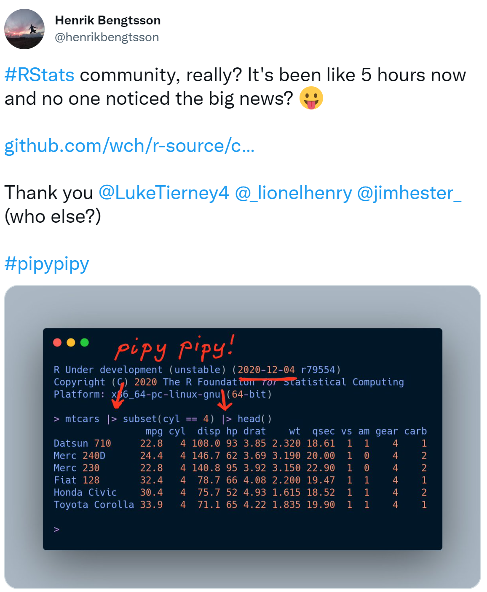
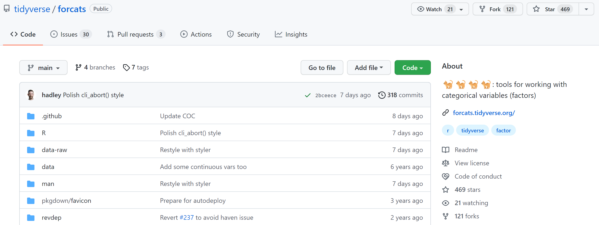
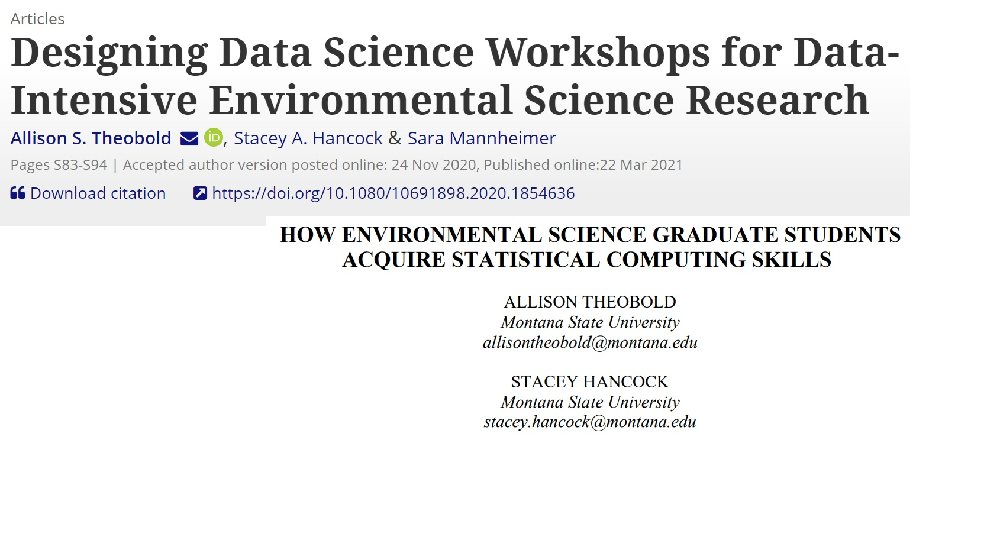
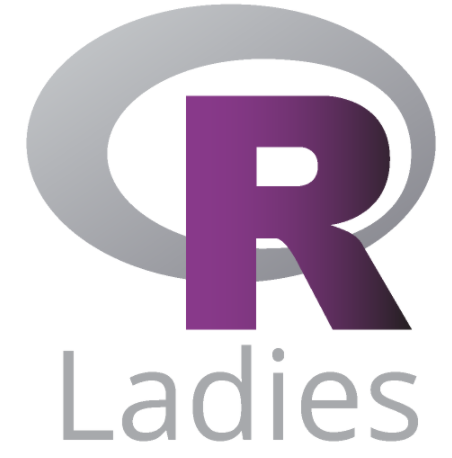

```{r, include = FALSE}
knitr::opts_chunk$set(fig.align = "center")

options(htmltools.dir.version = FALSE)

library(xaringanthemer)
library(xaringan)
library(tidyverse)

style_duo_accent(
  primary_color      = "#b76352", # mango
  secondary_color    = "#34605f", # bayberry
  header_font_google = google_font("Raleway"),
  text_font_google   = google_font("Raleway", "300", "300i"),
  code_font_google   = google_font("Source Code Pro"),
  header_color = "#793540", #rhubarb
  white_color = "#F5F5F5", # lightest color
  black_color = "#36454F", # darkest color
  text_font_size = "30px", 
  link_color = "#696969" #grey
)
```

class: middle, center, inverse

.huge-text[R has so much more!]

---

.pull-left[

]

.pull-right[
</br>
</br>
</br>
</br>

]

---

class: center, middle, inverse

.larger[Programming experiences can change your life!]

---

class: center, middle, inverse


---

class: center, middle, inverse



---

class: center, middle, inverse

.pull-left[


]

.pull-right[
</br>
</br>
</br>
</br>
</br>

]

