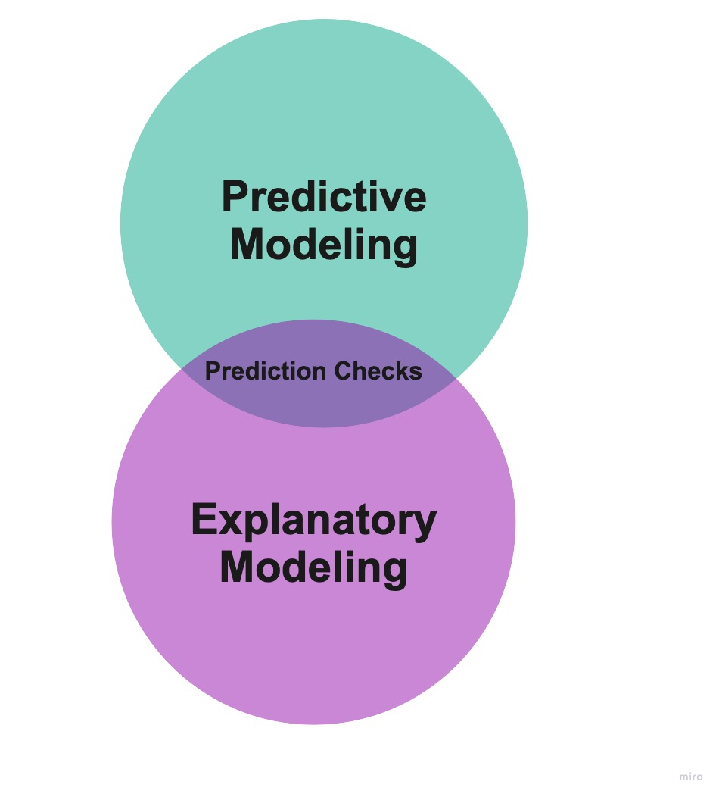
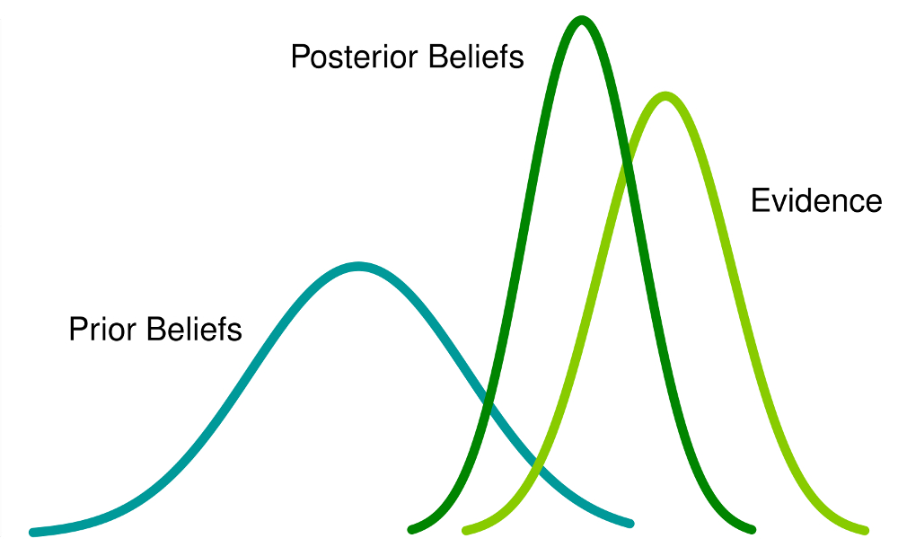

```{r, include = FALSE}
knitr::opts_chunk$set(fig.align = "center")

options(htmltools.dir.version = FALSE)

library(xaringanthemer)
library(xaringan)
library(tidyverse)


style_duo_accent(
  primary_color      = "#0F4C81", # pantone classic blue
  secondary_color    = "#B6CADA", # pantone baby blue
  header_font_google = google_font("Raleway"),
  text_font_google   = google_font("Raleway", "300", "300i"),
  code_font_google   = google_font("Source Code Pro"),
  text_font_size     = "30px"
)
```

class: inverse, center, middle

.hand-large[What is a predictive check?] 

---

.pull-left[
.larger[The middle point]
]

.pull-right[
```{r, echo = FALSE}

```
]

---

class: middle, center

.larger[What predictive checks **do**]

.large[*Assess if the model would produce data similar to what was observed*]

---

class: middle, center

.larger[What predictive checks **do not do**]

.large[*Make predictions for __new__ observations*] 

---

class: center, middle

.larger[**Who** does predictive checks?]

--


---

class: center, middle

.larger[**Why** do predictive checks?]

.pull-left[
.large[**An Assessment of "Subjective" Choices**]
]

.pull-right[
```{r, echo = FALSE, out.height = "90%", out.width = "90%"}

```
]

---

class: center, middle, inverse

.larger[For the project, what is our subjective choice?]

---

.larger[Requirements of a "good" regression model]

--

.pull-left[
- Linear relationships
- Independence of observations
] 

.pull-right[
- Normality of residuals
- Constant / Equal variance
]

---

class: inverse, center, middle

.hand-large[How do you do a predictive check?] 

---
.pull-left[
.larger[**Step 1**]

.large[Fit a regression model]

.larger[**Step 2**]

.large[Obtain predictions from the model]
]

--

.pull-right[
.larger[**Step 3**]

.large[Add random errors to the predictions]

.larger[**Step 4**]

.large[Compare simulated data to observed data]
]

---

class: inverse, center, middle

.hand-large[How do you do add errors?] 

---

.larger[Linear Model Assumptions]

</br>

.pull-left[
$$
\text{y} = \beta_0 + \beta_1 \times x_1 + \cdots + \beta_n \times x_n + \epsilon
$$

$\epsilon \sim N(0, \sigma)$
]

--

.pull-right-narrow[
Random draws from Normal distribution
  * Mean 0
  * Standard deviation $\widehat{\sigma}$
]

---

class: inverse, center, middle

.hand-large[How do you compare?] 

---

class: center, middle 

.larger[Measure "similarity"]

--

$r$ -- correlation

--

$R^2$ -- proportion of variability explained

--

$SSE$ -- size of the sum of squared errors 

--

$RMSE$ -- estimate of $\widehat{\sigma}$
