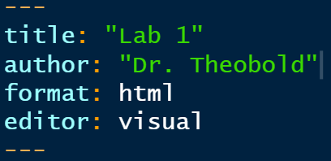

```{r write-data, include=FALSE}
library(tidyverse)
```

## Setup

### Make a Stat 331 and Lab 1 Folder

1.  If you have not already, create a folder on your computer called
    "Stat 331" or similar.

2.  Create an RStudio Project **inside** of this folder.

3.  Inside your Stat 331 folder, create another folder called either
    "Week 1" or "Labs".

4.  Inside of this folder, create another folder called "Lab 1".

### Create your Lab 1 File

To create a Quarto document, you first need to install Quarto on your
computer. Do do this go to the following link
<https://quarto.org/docs/get-started/>.

1.  Once you have Quarto installed, open RStudio on your computer.

2.  In RStudio, go to "File" \> "New File" \> "Quarto Document..." and
    click on "Create" in the dialog box **without changing anything**.

3.  Change the title of your document to be "Lab 1"

4.  Add an `author` line to your YAML, and include your name

5.  Save the Quarto file as "lab1" in your "Week 1" or "Labs" folder.
    You can change up the name of your document, but the name **cannot**
    have spaces and it should describe what the document is.

## Lab Instructions

### Changing the Execution Options

Execution options specify how the R code in your Quarto document should
be displayed. This guide
<https://quarto.org/docs/computations/execution-options.html> provides
descriptions on the options you can specify in a document's execution.

To start, your YAML should look something like this:



Similar to what you did before adding an `author` line, here you will
need to add an `execution` line to your YAML.

Use the guide above to specify execution options that:

-   your source code is always output on the page
-   your document will render even if there are errors

## Running the Provided Code

Next, click on the "Play" button on the right of the first code chunk.
Alternatively, you can highlight the code you want to run and type
<kbd>ctrl</kbd> + <kbd>Enter</kbd> or <kbd>⌘\<</kbd> + <kbd>Enter</kbd>.

You should see the code appear in the console, as well as the result of
the code (`2`). Keep in mind the `[1]` before the `2` is vector
notation. This means the result is a *vector* of length 1, whose first
element is `2`.

Let's spice this code up a bit. Delete `1 + 1` from the code chunk and
write the following code: `summary(cars)`

Now run this code. You should see a six-number summary of the variables
`speed` and `dist` included in the `cars` dataset. However, if you
inspect environment tab, the `cars` dataset should not appear!

### Check the data documentation

In your **console** (*not* in the Quarto document), type `?cars`.

Use the information that pops up in your *Help* pane in RStudio to fill
in the blanks below. Add the questions and your responses *after* the R
code chunk. *Before* the code chunk, create a section header (using
`#`s) that describes the contents of the section (e.g., Cars Dataset).

<center>

*This dataset contains information about \_\_\_\_. The data was
collected in \_\_\_\_.*

*It has \_\_\_ rows and \_\_\_\_ variables.*

</center>

## Creating a Plot {#sec-creating-a-plot}

Your second code chunk is just as boring as your first, so let's spice
it up! Replace the `2 * 2` code with the following: `plot(pressure)`

Now, run this code chunk! You should see a scatterplot of the
relationship between temperature and pressure of mercury, contained in
the `pressure` dataset.

Similar to what you did before with the `cars` dataset, look up the help
file on the `pressure` dataset to determine what units `temperature` and
`pressure` were measured in.

Next, look up the help file on the `plot()` function to find the
arguments you can use to specify the x- and y-axis labels. Change the
x-axis and y-axis labels to reflect the units of measurement you found
in the `pressure` help file.

Create another section header (like you did before) stating what is
included in this section.

### Inserting a New Code Chunk

Navigate to the last sentence of the Quarto document, we're going to
insert a new `R` code chunk at the bottom of the document.

There are three different ways to do this:

1.  type <kbd>ctrl</kbd> + <kbd>alt</kbd> + <kbd>i</kbd> on Windows, or
    <kbd>⌘</kbd> + <kbd>⌥</kbd> + <kbd>i</kbd> on macOS,

2.  Click on the  symbol. This should
    automatically default to R code, but if you have a Python compiler
    on your computer, you might need to select "R" from the options.

3.  If you are using the Visual editor (isn't it fun?!), then click on
    the "Insert" button, then select "Code Chunk", and finally select
    "R".

### Creating and Discussing Visualizations {#sec-creating-and-discussing-visualizations}

Now, in the code chunk you just created, carry out the following steps:

-   Step 1: Extract the distance column of the `cars` dataset (remember
    how we did this in the Practice Activity) and save it into a new
    object named `dist`.

-   Step 2: Plot the distribution of the stopping distances (contained
    in `dist`).[^1]

-   Step 3: Create a second plot, a scatterplot, visualizing the
    relationship between the stopping distance and speed.[^2]

[^1]: You are permitted to use whatever code you would prefer. This task
    can be completed with the `plot()` function, but if you would rather
    use `ggplot()` you are more than welcome to. We will be getting
    there next week!

[^2]: See previous footnote!

To earn a "Success" on your plots, make sure each plot has reasonable
axis labels. For example, if you use the `dist` variable, your axis
should say "Stopping Distance" with the correct units not just "dist".

-   Step 4: Create another section header, describing the contents of
    this section.

-   Step 5: Create a numbered list of two aspects of the plots you would
    like to improve.

### Knit your document

Render your document as an **html** file. Use the "Render" button.

If you run into trouble rendering your document, try running your code
chunks again in order, and see if you can find the problem.

Another common issue is deleting the tick marks (```` /``` ````) that
surround your code chunks. If you notice that the code chunks are not
showing a "Play" button, or that they are not highlighted in gray,
double check your tick marks!

### Turn it in!

Upload the knitted document to Canvas!

> You'll be doing this same process for all your future Lab Assignments
> and Challenges. Each of these will involve an R Markdown file.

## Challenge:

### Styling Quarto Documents

You can find a list of every option you can use to format an HTML
document [here](https://quarto.org/docs/output-formats/html-basics.html)

[Here](https://quarto.org/docs/output-formats/html-themes.html) are
lists of different themes you can specify in your YAML which will
produce different stylings.

For this Challenge, there are some specific additions to your document I
would like you to make, as they will benefit you for the rest of the
course.

1.  Specify "code folding" in your document options

2.  Specify in the code chunk options that your plot of the `pressure`
    dataset should be center aligned.

3.  Specify a figure caption in the above code chunk (plot of the
    `pressure` data).

4.  In the code chunk created in **Creating and Discussing
    Visualizations**, specify the figures should be printed side-by-side
    (in two columns).

5.  Now, make **at least one** additional modification to your Quarto
    document. Make sure you explicitly state which tip you tried; for
    example, you might write "Here is an example of alt text:" followed
    by your alt text description.

6.  Upload your knitted (.html) document to the Challenge 1 assignment
    on Canvas.
