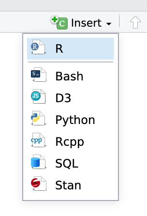

```{r write-data, include=FALSE}
library(tidyverse)
```

## Setup

### Make a Stat 331 and Lab 1 Folder

1. If you have not already, create a folder on your computer called "Stat 331"
or similar.  

2. Inside this folder, create another folder called either "Week 1" or "Labs". 

3. Inside of this folder, create another folder called "Lab 1".


### Create your Lab 1 File

1. Open RStudio.cloud or RStudio on your computer (preferably RStudio on your
computer!)

2. In RStudio, go to "File" > "New File…" > "R Markdown…" and click "OK" in the
dialog **without changing anything**.

3. Change the title of the document to be `"Lab 1"`

4. Change the author of the document to be your name

5. Save the R Markdown file with some sort of name (**without any spaces!**).
Make sure you save it to your new "Lab 1" folder.


## Lab Instructions


### Changing the Set-up Chunk

Click the "Play" button on the right of the first code chunk to run the code.
Alternatively, you can highlight the code you want to run and type
<kbd>ctrl</kbd> + <kbd>Enter</kbd> or <kbd>⌘<</kbd> + <kbd>Enter</kbd>.  You 
should see the lines of code appear in the *console*. 

This first chunk of code is what we call the "set-up" chunk, where we can
specify how we want the **entire** R Markdown document to look. The
`echo = TRUE` specification, tells `R` that when it knits the file to an HTML
document it should display the code **and** its output. 

Using the R Markdown cheatsheet 
[link](https://www.rstudio.org/links/r_markdown_cheat_sheet) add specifications 
*inside* the `opts_chunk$set()` that:

- ensure all figures are center aligned 
- remove messages from being output


## Running the Provided Code

Next, click on the "Play" button on the right of the second code chunk. 
Alternatively, you can highlight the code you want to run and type 
<kbd>ctrl</kbd> + <kbd>Enter</kbd> or <kbd>⌘<</kbd> + <kbd>Enter</kbd>. 

This code should output a six-number summary of the variables `speed` and `dist`
included in the `cars` dataset. However, if you inspect environment tab, the 
`cars` dataset should not appear! 


### Check the data documentation

In your **console** (*NOT* in the R Markdown document), type `?cars`.

Use the information that pops up in your *Help* pane in RStudio to fill in the
blanks below. Make certain to include the *age* of the dataset! 

Delete the text before the code chunk (starting in "This is an R Markdown
document") and insert your completed sentences. 

Change the name of the section to say **Cars Dataset**. 

<center> 

*This dataset contains information about ______.*

*It has _____ rows and ______ variables.*

</center> 


## Modify the Plot 

The final code chunk uses the built-in `plot()` function to create a plot for a
different dataset. This plot a relationship for a different dataset. This plot 
shows the relationship between temperature and pressure of mercury, contained 
in the `pressure` dataset. 

Look up the help file on the `pressure` dataset to determine what units 
`temperature` and `pressure` are in. Next, look up the help file on the `plot()`
function to find the arguments you can use to specify the x- and y-axis labels. 

Change the x-axis and y-axis labels to reflect the units of the measurements. 


### Make a Code Chunk

After the last sentence of the file, insert a new `R` code chunk. Either type
<kbd>ctrl</kbd> + <kbd>alt</kbd> + <kbd>i</kbd> on Windows, or 
<kbd>⌘</kbd> + <kbd>⌥</kbd> + <kbd>i</kbd> on macOS, or use the "Insert Chunk"
menu:



### Create and discuss visualizations and summaries

* Step 1: Extract the distance column of the `cars` dataset and save it into a 
new object named `dist`. 

* Step 2: Plot the distribution of the stopping distances(contained in `dist`).^[You
are permitted to use whatever code you would prefer. This task can be 
completed with the `plot()` function, but if you would rather use `ggplot()` you 
are more than welcome to. We will be getting there next week!]  

* Step 3: Plot the relationship between the stopping distance and speed.^[See 
previous footnote!]

Type the code to complete each task in a new empty chunk, in the appropriate
section of your document.

For full credit, make sure your plots have reasonable axis labels. For example,
if you use the `dist` variable, your axis should say "Stopping Distance" with 
the correct units not "dist".

In regular text (possibly using *Markdown* formatting!), type two aspects of
the plots that you wish you could improve. 


### Knit your document

Knit your document as an **html** file. Use the "Knit" menu:


If you run into trouble knitting, try running your code again in order, and see
if you can find the problem.

Another common issue is deleting the tick marks (`/``` `) that surround your
code chunks. If you notice that the code chunks are not showing a "Play" button,
or that they are not highlighted in gray, double check your tick marks!

### Turn it in!

Upload the knitted document to Canvas! 

>
> You'll be doing this same process for all your future Lab Assignments and
> Practice Activities. Each of these will involve an R Markdown file. 
>

## Challenge: 

### Pretty R Markdown documents

There are infinitely many ways to make R Markdown documents look prettier or 
fancier.  In fact, that's how I create all the coursework and assignment
documents for this class!

1. Read through [this guide](https://holtzy.github.io/Pimp-my-rmd/), and make
sure to check out the [themes](https://holtzy.github.io/Pimp-my-rmd/#theme) and [templates](https://holtzy.github.io/Pimp-my-rmd/#template) sections.

2. Change your Lab 1 R Markdown document to use a new theme or template.

3. Demonstrate how to use one of the other tips in the guide. Make sure you
explicitly state which tip you tried; for example, you might write "Here is an
example of a figure with a caption:" and then show the figure.

4. Upload your knitted (.html) document to the Challenge 1 assignment on Canvas.
