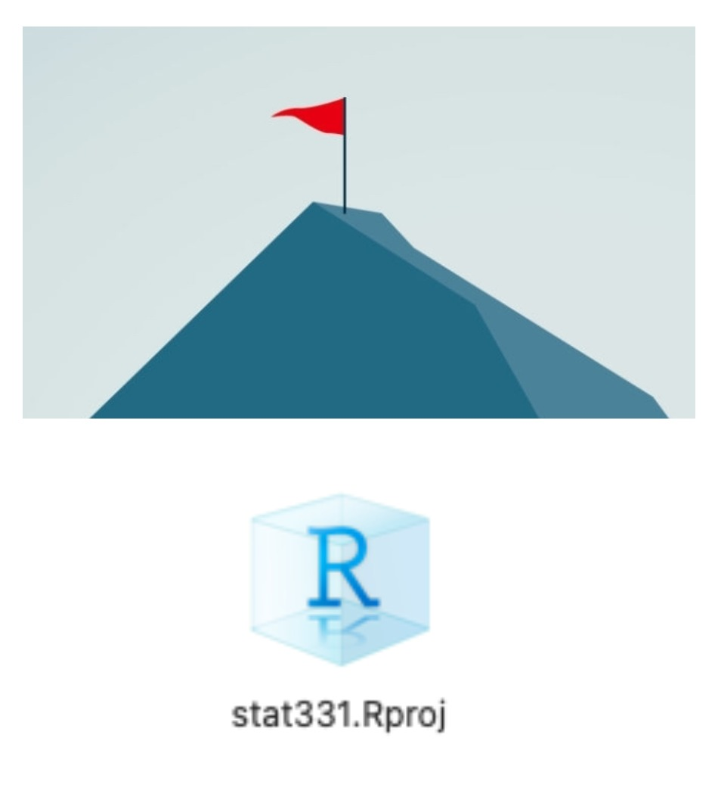

```{r setup, include=FALSE}
options(htmltools.dir.version = FALSE)
library(tidyverse)
```

```{r xaringan-themer, include=FALSE}
library(xaringanthemer)
style_duo_accent(
  primary_color      = "#b76352", # mango
  secondary_color    = "#34605f", # bayberry
  header_font_google = google_font("Raleway"),
  text_font_google   = google_font("Raleway", "300", "300i"),
  code_font_google   = google_font("Source Code Pro"),
  header_color = "#793540", #rhubarb
  white_color = "#F5F5F5", # lightest color
  black_color = "#36454F", # darkest color
  text_font_size = "30px", 
  link_color = "#a17b76" #pink
)
```

## Principles of Reproducibility

The idea:  You should be able to send your project to someone else, and they can
jump in and start working right away.

1. Files are organized and well-named.

2. References to data and code work for everyone.

3. Package dependency is clear.

4. Code will run the same every time, even if data values change.

5. Analysis process is well-explained and easy to read.

```{r, include = FALSE}
library(tidyverse)
```

---

# Dealing with Directories

</br>

## What is a directory?

- A **directory** is just a fancy name for a folder.

- Your **working directory** is the folder that `R` "thinks" it lives in at the
moment.

```{r getwd}
getwd()
```

- If you save things you have created, they save to your working directory by
default.

---

class: center, middle

# Manage your Class Directory

Is it in a place you can easily find it?

--

Does it have an informative name?

--

Are the files inside it well-organized?

---

class: middle 

## Paths

- A **path** describes where a certain file or directory lives.

```{r getwd2}
getwd()
```

This file lives in my user files `Users/`, 

on my account `atheobol/` 

in my Documents `Documents` 

in a series of organized folders

---

class: center

</br>
</br>
</br>
</br>

.huge-text[Try it!]

Find the **path** to your class directory.

---

## The Beauty of R Projects

.pull-left[ An **R Project** is basically a "flag" planted in a certain
directory.

When you double click a **.Rproj** file, it does two things:

1. Open RStudio

2. Set the working directory to be wherever the .Rproj file lives.

3. Link to GitHub, if setup (more on that later!)]

.pull-right[

]

---

class: center

# RStudio Projects & Reproducibility

</br> 

.bitlarger[This is great for reproducibility!]

</br>

.bitlarger[You can send anyone your folder with your .Rproj file and they will
be able to run your code on their computer.]

---

class: middle

# Setting up an RStudio Project

---

class: middle 

# Good practice

- Organize your folders carefully, and name them meaningfully:
  * `/User/atheobold/Stat331/lab1/` rather than `Desktop/stuff/`
    
- Use **R Projects** liberally - put one in the "main" folder for each project

    * I have a project for every class I teach.
    * I have a project for every data analysis I do.
    * I **never** work in RStudio, except in a project.

---

# Bad practice

If you put something like this at the top of your .Rmd file, I will set your 
computer on fire:

```{r setwd, eval = FALSE}
setwd("/User/reginageorge/Desktop/R_Class/Lab_1/")
```

- Setting working directory by hand = BAD!  

--

- That directory is specific to you!

--

- R Markdown files ignore this code when knitting! 

---

class: middle, inverse

# Do this right now:

### 1. Create a R Project in your class directory.

### 2. Add a folder to the directory called "Week 1" or "Lab 1"