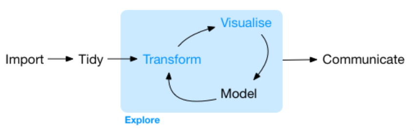
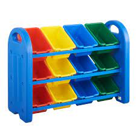

```{r setup, include=FALSE}
options(htmltools.dir.version = FALSE)
library(tidyverse)
library(flair)
```

```{r xaringan-themer, include=FALSE}
library(xaringanthemer)
style_duo_accent(
  primary_color      = "#0F4C81", # pantone classic blue
  secondary_color    = "#B6CADA", # pantone baby blue
  header_font_google = google_font("Raleway"),
  text_font_google   = google_font("Raleway", "300", "300i"),
  code_font_google   = google_font("Source Code Pro"),
  text_font_size     = "30px"
)
```


class: middle 

<center>

.bitlarger[**Welcome to Stat 331!**]

</center>

This course will teach you the fundamentals of R Statistical Software and of
statistical computing principles, extending your knowledge to more "intermediate"
topics, such as: 

* data wrangling
* data visualization
* data summaries 
* reproducible presentations 
* writing efficient and well-documented `R` code
* programming simulations

---

class: center, middle

.bitlarger[Data Science] 

>Data science is an inter-disciplinary field that uses scientific methods,
> processes, algorithms and systems to extract knowledge and insights from
> structured and unstructured data.

Wikipedia 

</br> 

>The ability to take data — to be able to understand it, to process it, to
> extract value from it, to visualize it, to communicate it. 
>

Hal Varian, chief economist at Google and UC Berkeley professor of information sciences, business, and economics

---

class: center 

.bitlarger[What Data Science Is To Me]

</br>
</br>



---

class: middle 

.larger[Course Components]

.pull-left[
- Coursework
- Check-ins
- Practice Activities
]

.pull-right[
- Lab Assignments 
- Challenges 
- Think Out Loud Recordings
]

---

.larger[Team-based Learning]

*Team-based learning* is a structured form of small-group learning

- Emphasizes student preparation out of class
- Application of knowledge in class
- Diverse teams of 4-5 students
- Designated role for each member

---

.large[**Group Norms:**]

- Zero tolerance for: racism, sexism, homophobia, transphobia, ageism, ableism 
- Do not make generalizations -- Use "I" statements

- Respect one another

- Intent and impact *both* matter

- Non-judgmental 

- Take space, make space -- Share the air (page) 

- Embrace discomfort

- Make decisions by consensus

---

class: center

.large[Mastery-based Grading]

Score   | Justification
--------|--------------
4       | __Master__ -- Outstanding work that exhibits comprehensive and thoughtful understanding of the content of the question, with an individualized perspective. Errors do not occur in the assignment.
3       | __Practitioner__ -- Work reflects a solid understanding of the content of the question. Work may not exhibit original perspectives. Several errors may occur in the question. 
R       | __Redo (Required)__ -- Work satisfies the requirements of the assignment while missing the spirit of the assignment. May be an incomplete rendering of the assignment. The work may contain inconsistencies or demonstrate limited understanding of the content. May be incoherent or poorly written. 
1       | __Novice__ -- The work shows a lack of understanding of the assignment.

---

.huge-text[But I haven't used R in...]

---

.larger[Let's start at the very beginning] 


An "object" in `R` is where we attach / map a value onto a name. 

```{r}
x <- 12
```

---

.bitlarger[The fundamental structure in `R` is a vector]

```{r}
y <- c(1, 2, 3, 4)
```

.large[The `c()` function binds a list of numbers or letters into a vector]

--

</br>

.hand[How could you create a vector of numbers 1 to 100 without typing them all?]

---

.bitlarger[Data Types & Vectors]

- We also could have created a vector of characters 

```{r}
letters <- c("a", "b", "c", "d", "e")
```

</br>

```{r}
letters_numbers <- c("a", "b", "c", 1)
letters_numbers
  
```

--

.hand[How many data types can a vector contain?]

---

class: inverse, center, middle

.larger[**R** is a **functional programming** language.]

--

.large[This means R is designed for using and writing *functions*.]

---

.larger[Components of a Function]

```{r, eval = FALSE}
sqrt()

plot()

```

- function name / call
- input(s) / arguments 
- output / return

---

class: center, middle 

.bitlarger[Anatomy of a function]

```{r seq, eval = FALSE, echo = FALSE}
seq(from = 1, to = 100, by = 2)
```

```{r, echo = FALSE}
decorate("seq", eval = FALSE)
```

--

</br>

**Function name:**

```{r, echo = FALSE}
decorate("seq", eval = FALSE) %>%
  flair("seq")
```

--

**Required arguments:**


```{r, echo = FALSE}
decorate("seq", eval = FALSE) %>%
  flair("from") %>% 
  flair("to")
```

---

class: center, middle 

.bitlarger[Anatomy of a function]

</br>

**Optional arguments:**

```{r, echo = FALSE}
decorate("seq", eval = FALSE) %>%
  flair("by = 2")
```

--

</br>
</br>

.large[**Naming your arguments makes your code more readable!**]

---

.bitlarger[Most functions in `R` expect a vector as the input]

```{r}
sqrt(2)

```


```{r}
sqrt(y)
```

---

.bitlarger[Creating New Objects from Old Objects]

- Make a new object from using an existing object as an input to a function

```{r}
y_sqrt <- sqrt(y)
```

</br>

- Overwrite / Update an existing object 

```{r}
y <- sqrt(y)
```


---

.larger[A Matrix]

- A two-dimensional set of vectors

- All elements must have **same** data type

.pull-left[
```{r}
y
```
]

.pull-right[
```{r}
matrix(y, nrow = 2, ncol = 2)
```
]

---

class: center

.bitlarger[**Extracting Elements from a Matrix**]

```{r, echo = FALSE}

mat <- matrix(1:20, nrow = 4, ncol = 5)
mat
```

.pull-left[
Dimensions are noted by  
`[rows, columns]`

Extract rows using:  
`[rows, ]`

Extract columns using:  
`[ , columns]`
]

--

.pull-right[

.midi[.hand[How would you extract the second row of `mat`?]


.hand[How would you extract the third column of `mat`?]


.hand[How would you extract rows 1-3 and columns 2-4?]

]]

---

.larger[A List]

.pull-left[



]

.pull-right[

- Each bin is an element of a list 

- Each bin can have different contents

- The contents of one bin have to be the same
]

---

# Extracting Elements from a List

.pull-left[
```{r, echo = FALSE}

my_list <- list(num = 1:4, 
              letters = LETTERS[1:4], 
              animals = c("dog", "cat", "bird", "fish"))
```

```{r}
my_list
```

]

.pull-right[
- Elements are by `$`
  * Extract elements with `$` or `[[]]`

- Items are noted by `[]`
  * Extract items with `[]` **after** `$` or `[[]]`
] 

<center>

```{r, eval = FALSE}
my_list$num
my_list$num[1]

my_list[[1]]
my_list[[1]][1]
```

---

# Extracting Elements from a Dataframe

.pull-left[
```{r, echo = FALSE}

my_df <- data.frame(num = 1:4, 
              letters = LETTERS[1:4], 
              animals = c("dog", "cat", "bird", "fish"))
```

```{r}
my_df
```
 
]

.pull-right[

</br>
</br>

- Extract elements with `$`

- Extract items with `[]` **after** `$`
] 

</br>

<center>

```{r, eval = FALSE}
my_df$num

my_df$num[1]

```
