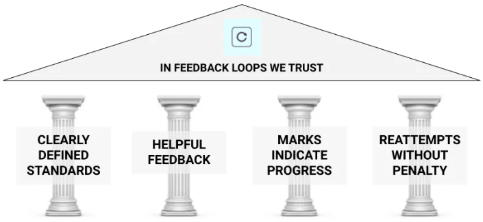
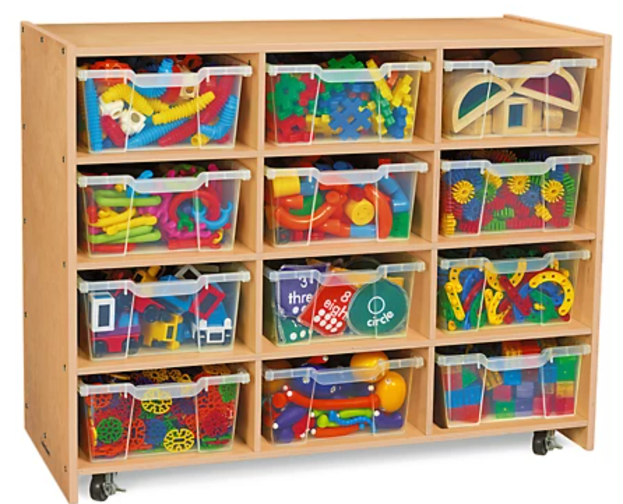

```{r setup, include=FALSE}
options(htmltools.dir.version = FALSE)
library(tidyverse)
library(flair)
```

```{r xaringan-themer, include=FALSE}
library(xaringanthemer)
style_duo_accent(
  primary_color      = "#0F4C81", # pantone classic blue
  secondary_color    = "#B6CADA", # pantone baby blue
  header_font_google = google_font("Raleway"),
  text_font_google   = google_font("Raleway", "300", "300i"),
  code_font_google   = google_font("Source Code Pro"),
  text_font_size     = "30px"
)
```


class: middle 

<center>

.bitlarger[**Welcome to Stat 331!**]

</center>

This course will teach you the fundamentals of R Statistical Software and of
statistical computing principles, extending your knowledge to more
"intermediate" topics, such as: 

* data wrangling
* data visualization
* data summaries 
* reproducible presentations 
* writing efficient and well-documented `R` code
* programming simulations

---

class: center, middle

.bitlarger[Data Science] 


> The ability to take data — to be able to understand it, to process it, to
> extract value from it, to visualize it, to communicate it. 
> 

---

class: center, inverse, middle

.hand-large[A Bit About Subversive Grading]

---

class: center, inverse, middle



---


class: middle 

.larger[Course Components]

.pull-left-narrow[
*Before Class*

- Coursework
- Preview Activities
]

.pull-right-wide[
.pull-left[

*During Class* 

- Practice Activities
- Lab Assignments 
]
.pull-right[
*Outside of Class* 

- Challenges
- Revisions 
- Reflections
- Portfolio
]
]

---

.larger[How Smart are You?]

What **criteria** would you use to **rank** yourself compared to everyone else
in this class?

Saying "this is not possible" or "this is not something we should be trying to
do" is not an acceptable answer for this exercise. I want actual criteria!

Be prepared to share some possible criteria. 

---

.larger[Cooperative Learning]

is a structured form of small-group learning

--

- Roles relate to **how** the work should be done
  * Roles **are not** about breaking up the work intellectually
- Roles allow each person to contribute to the group in significant ways
  * Each person's participation is necessary to complete the task

---

.bitlarger[Group Norms]

.pull-left[

- Zero tolerance for: racism, sexism, homophobia, transphobia, ageism, ableism 

- Respect one another

- Intent and impact *both* matter
]

.pull-right[

- Non-judgmental 

- Take space, make space -- Share the air (page) 

- Embrace discomfort

- Make decisions by consensus
]

---

.bitlarger[How We Learn Together]

.pull-left[

- No one is done until everyone is done

- You have the *right* to ask **anyone** in your group for help

- You have the *duty* to help **anyone** in your group who asks for help

]

.pull-right[

- Helping someone means explaining your thinking **not** giving answers or doing
the work for them

- Provide a justification when you make a statement

- Think and work together -- don't divide up the work

]

---

class: center, middle

.hand-large[But I haven't used R in...]

---

.larger[Let's start at the very beginning] 


</br>

An "object" in `R` is where we attach / map a value onto a name. 

```{r}
x <- 12
```

---

.bitlarger[The fundamental structure in `R` is a vector]

```{r}
y <- c(1, 2, 3, 4)
```

.large[The `c()` function binds a list of numbers or letters into a vector]

--

</br>

.hand[Q: How could you create a vector of numbers 1 to 100 without typing them
all?]

---

.bitlarger[Data Types & Vectors]

- We also could have created a vector of characters 

```{r}
letters <- c("a", "b", "c", "d", "e")
```

</br>

```{r}
letters_numbers <- c("a", "b", "c", 1)
letters_numbers
  
```

--

.hand[Q: How many data types can a vector contain?]

---

class: inverse, center, middle

.larger[**R** is a **functional programming** language.]

--

.large[This means R is designed for using and writing *functions*.]

---

.larger[Components of a Function]

```{r, eval = FALSE}
sqrt()

plot()

```

- function name / call
- input(s) / arguments 
- output / return

---

class: center, middle 

.bitlarger[Anatomy of a function]

```{r seq, eval = FALSE, echo = FALSE}
seq(from = 1, to = 100, by = 2)
```

```{r, echo = FALSE}
decorate("seq", eval = FALSE)
```

--

</br>

**Function name:**

```{r, echo = FALSE}
decorate("seq", eval = FALSE) %>% 
  flair(pattern = "seq")
```

--

**Required arguments:**


```{r, echo = FALSE}
decorate("seq", eval = FALSE) %>% 
  flair(pattern = "from") %>% 
  flair(pattern = "to")
```

---

class: center, middle 

.bitlarger[Anatomy of a function]

</br>

**Optional arguments:**

```{r, echo = FALSE}
decorate("seq", eval = FALSE) %>% 
  flair(pattern = "by")
```

--

</br>

Technically, `seq(1, 100, 2)` works too, but...

.large[**naming your arguments makes your code more readable!**]

---

.bitlarger[Most functions in `R` expect a vector as the input]

```{r}
sqrt(2)

```


```{r}
sqrt(y)
```

---

.bitlarger[Creating New Objects from Old Objects]

- Make a new object from using an existing object as an input to a function

```{r}
y_sqrt <- sqrt(y)
```

</br>

- Overwrite / Update an existing object 

```{r}
y <- sqrt(y)
```


---

.larger[A Matrix]

- A two-dimensional set of vectors

- All elements must have **same** data type

.pull-left[
```{r}
y
```
]

.pull-right[
```{r}
matrix(y, nrow = 2, ncol = 2)
```
]

---

class: center

.bitlarger[**Extracting Elements from a Matrix**]

```{r, echo = FALSE}

mat <- matrix(1:20, nrow = 4, ncol = 5)
```

```{r}
mat
```

.pull-left[
Dimensions are noted by  
`[rows, columns]`

Extract rows using:  
`[rows, ]`

Extract columns using:  
`[ , columns]`
]

--

.pull-right[

.midi[.hand[Q: How would you extract the second row of `mat`?]


.hand[Q: How would you extract the third column of `mat`?]


.hand[Q: How would you extract rows 1-3 and columns 2-4?]

]]

---

.larger[A List]

.pull-left[



]

.pull-right[

- Each bin is an element of a list 

- Each bin can have different contents

- The contents of one bin have to be the same
]

---

# Extracting Elements from a List

.pull-left[
```{r, echo = FALSE}

my_list <- list(num = 1:4, 
              letters = LETTERS[1:4], 
              animals = c("dog", "cat", "bird", "fish"))
```

```{r}
my_list
```

]

.pull-right[
- Elements are denoted by `$`
  * Extract elements with `$` or `[[]]`

- Items are noted by `[]`
  * Extract items with `[]` **after** `$` or `[[]]`
] 

<center>

```{r, eval = FALSE}
my_list$num
my_list$num[1]

my_list[[1]]
my_list[[1]][1]
```

---

# Extracting Elements from a Dataframe

.pull-left[
```{r, echo = FALSE}

my_df <- data.frame(num = 1:4, 
              letters = LETTERS[1:4], 
              animals = c("dog", "cat", "bird", "fish"))
```

```{r}
my_df
```
 
]

.pull-right[

</br>
</br>

- Extract elements with `$`

- Extract items with `[]` **after** `$`
] 

</br>

<center>

```{r, eval = FALSE}
my_df$num

my_df$num[1]

```
