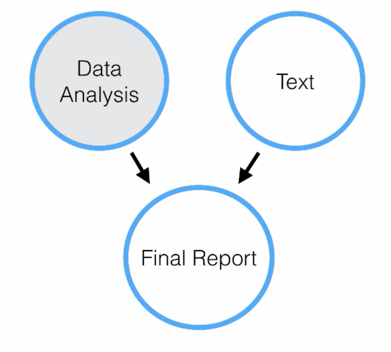
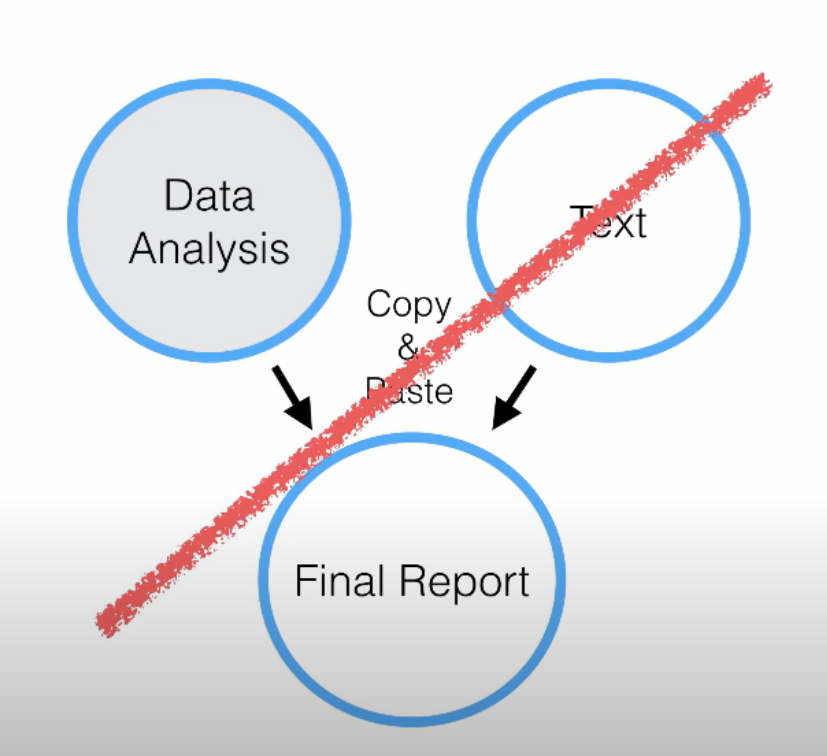
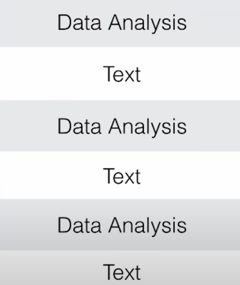

```{r setup, include=FALSE}
options(htmltools.dir.version = FALSE)
library(tidyverse)
```


```{r xaringan-themer, include=FALSE}
library(xaringanthemer)
style_duo_accent(
  primary_color      = "#0F4C81", # pantone classic blue
  secondary_color    = "#B6CADA", # pantone baby blue
  header_font_google = google_font("Raleway"),
  text_font_google   = google_font("Raleway", "300", "300i"),
  code_font_google   = google_font("Source Code Pro"),
  text_font_size     = "30px"
)
```

class: center, middle

.larger[What is Quarto?]

**Quarto** is an open-source scientific and technical publishing system built on
Pandoc. You can weave together narrative text and code to produce elegantly
formatted output as documents, web pages, blog posts, books and more. 

--

Quarto was developed to be multilingual, beginning with R, Python, Javascript,
and Julia, with the idea that it will work even for languages that don’t yet
exist.

--

Quarto is a single “batteries included” consistent system that reflects
everything we’ve learned from R Markdown over the past 10 years.

--

Quarto files have the **.qmd** extension.

---


---

# What is R Markdown?

**R Markdown** (with the "R") uses regular Markdown, plus it can run and display
**R** code.  (Other languages, too!)

--

R Markdown files have the **.Rmd** extension.

---


---

# Why Use R Markdown? 

<center>

```{r, echo = FALSE, out.width = "50%"}

```

---

# Creating a Report 

.pull-left[

```{r, echo = FALSE}

```
]

.pull-right[

```{r, echo = FALSE, out.width = "80%"}

```
]

---

# Components of an R Markdown 


---

# YAML


---
class: center 

# Issues in YAML 

</br>
</br> 

Error in yaml::yaml.load(..., eval.expr = TRUE) : 
  Scanner error: while scanning a quoted scalar at line 1, column 8 found unexpected end of stream at line 10, column 20
Calls: <Anonymous> ... parse_yaml_front_matter -> yaml_load -> <Anonymous>
Execution halted

---

# Markdown 

**Markdown** (without the "R") is a *markup language*.  This means special
symbols and formatting to pretty documents.

\*text\* -- makes italics 

\*\*text\*\* -- makes bold text

\# -- makes headers 

\!\[ \]( ) -- includes images or HTML links

< > -- embeds URLs

---

class: middle

# R Code 

- Begins with three ` ``` ` characters 
- Then a curly brace `{`
- Then a letter `r` 
- Then an (optional) name 
- Then specifications for the code chunk 
- Closes with three ` ``` ` characters  

</br> 

````
```{r libraries, echo = FALSE}`r ''`
library(tidyverse)
```
````

---

class: middle 

# Rendering

To convert your R Markdown file to a beautiful document, click **Knit**.


---

# Rendering a Document


---

# Render

When you click **Render**, here is what happens:

--

- Your file is saved.

--

- The R code written in your *.qmd* file gets run.

    + Any code you ran already doesn't "count"; we start from scratch.
    + The code is run *in order*.

--

- A new file is created.

    + If your Quarto file is called "Lab1.qmd", then a file called "Lab1.html" will be created.
    + This will save in the same folder as "Lab1.qmd".
    
---

class: center, middle, invert

# Let's try it!

