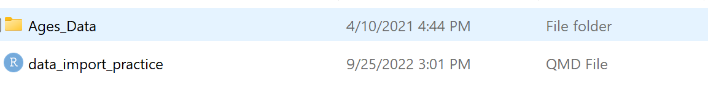

```{r, message = FALSE, warning = FALSE}
library(tidyverse)
library(readxl)
library(here)
```

**Keep in mind, this is what my folder structure looks like:**

<center> 


</br>


</br>


</br>



</br>

</center>

# Step 1: Read in the dataset `ages.csv`.

```{r}
# Code to read in the ages.csv data goes here! 

read_csv(here("2_ggplot_import", "Coursework", "Data Import", "Ages_Data", "ages.csv"))
```

# Step 2: Read in the dataset `ages_tab.txt`

**ages_tab.txt is not actually tab delimited! Tricky!** 

```{r}
# Code to read in the ages_tab.txt data goes here! 

read_delim(here("2_ggplot_import", "Coursework", "Data Import", "Ages_Data", "ages_tab.txt"), 
         delim = " ")

```

**Some entries are separated by two spaces and some are separated by a single space. This is why `Age` is read in as a character, with some whitespace at the beginning of some of the rows.** 


# Step 3: Read in the dataset `ages_mystery.txt`

```{r}
# Code to read in the ages_mystery.txt data goes here! 

read_delim(here("2_ggplot_import", "Coursework", "Data Import", "Ages_Data", "ages_mystery.txt"), 
           delim = "|")

```

# Step 4: Read in the dataset `ages.xlsx`

```{r}
# Code to read in the ages.xlsx data goes here! 

read_xlsx(here("2_ggplot_import", "Coursework", "Data Import", "Ages_Data", "ages.xlsx"))

```

# Step 5: 

**Both `read.csv` and `read.table` have an optional argument called `stringsAsFactors`.  Figure out what this does.**

*The `stringsAsFactors` argument converts variables that are strings (or characters) into a `factor` data type. A `factor` data type is different from a character in how it stores the values of the variable. We will learn more about `factor`s in a few weeks!*

# Step 6: 

**Find a way to use `read_csv()` to read `ages.csv` with the variable "Name" as a factor and "Age" as a character.**

```{r}
# Code to read in the ages.csv with "Name" as a factor and "Age" as a character goes here! 

read_csv(here("2_ggplot_import", "Coursework", "Data Import", "Ages_Data", "ages.csv"), 
         col_types = list("f", "c")
         # The column types need to be specified as a list() not as a vector!
         # You can find this in the help file for read_csv() in the examples at the bottom!
         )
```
