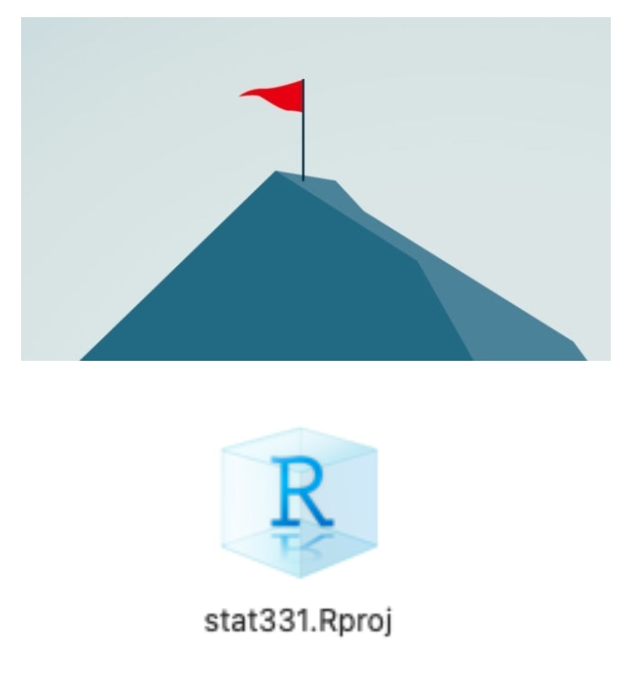

```{r setup, include=FALSE}
options(htmltools.dir.version = FALSE)
library(tidyverse)
```

```{r xaringan-themer, include=FALSE}
library(xaringanthemer)
style_duo_accent(
  primary_color      = "#0F4C81", # pantone classic blue
  secondary_color    = "#B6CADA", # pantone baby blue
  header_font_google = google_font("Raleway"),
  text_font_google   = google_font("Raleway", "300", "300i"),
  code_font_google   = google_font("Source Code Pro"),
  text_font_size     = "30px"
)
```

class: middle

.larger[`read_csv()`]

- The most common way to read data is with `read_csv()` or `read.csv()`.

- You may supply either a **url** to the dataset or a **path**.

--

```{r read.csv, eval = FALSE}
surveys <- read_csv("https://www.dropbox.com/s/1qqyshx5ikt9zoc/surveys.csv?dl=1")
## This will work for everyone!

```

--

```{r read.csv2, eval = FALSE}

surveys <- read_csv("/Users/atheobold/Teaching/stat331/Labs/Lab 2/surveys.csv")
## This will work only on my computer

```

--

```{r read.csv3, eval = FALSE}

surveys <- read_csv("surveys.csv")
## This will work if the file is in the same directory as the code 
## (i.e., the RMarkdown and the data are in the same folder)
```

--

```{r read.csv4, eval = FALSE}

surveys <- read.csv("data/surveys.csv")
## This will work if a folder called "data" is in the same directory as the code.
```

---

# The **here** package

A great solution to consistency in paths is the `here` package:

```{r, eval = FALSE}
install.packages("here")
```

--

</br> 
</br> 

This package thinks that *"here"* means
*"the directory of the closest RStudio project"*.

```{r, eval = FALSE}
here::dr_here()
```

```
here() starts at /Users/atheobol/Documents/Teaching/stat331.
```

---

class: center, inverse

.larger[Homebase]

```{r, echo = FALSE, out.height = "30%", out.width = "40%"}

```

---

# The **here** package

My slides live in a subfolder for Week 2 and for this Lesson:

```{r, eval = FALSE}
getwd()
```

```
## [1] "Users/atheobol/Documents/Teaching/stat331/2_ggplot-import/Slides"
```

--

</br> 
</br>

If I wanted to access a dataset from the Lab folder, I'd have to use a
relative file path:

```{r, eval = FALSE}
surveys <- read.csv("../../Labs/Lab 2/surveys.csv")
```
--

If I ever reshuffle my folder structure, I'm in trouble!

---

# The **here** package

Instead of trying to reference data relative to **this** file, let's reference
it relative to the **Project** location, which is unlikely to change.


---

class: center, middle

.larger[Using `here()` **and** `read_csv()`]

```{r, eval = FALSE}
surveys <- read_csv(here::here("Labs", "Lab 2", "surveys.csv"))
```

</br>

.large[This path will work for anyone who you share your project with!]
