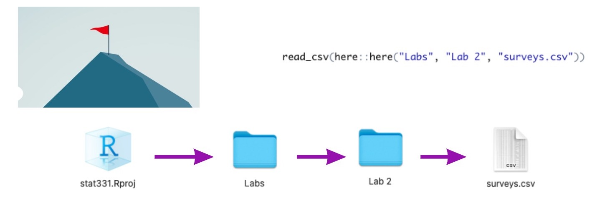

```{r, echo = FALSE, message = FALSE, warning = FALSE, fig.width = 8, fig.height = 6}
knitr::opts_chunk$set(message = FALSE, 
                      warning = FALSE, 
                      fig.align = "center")
```

class: inverse

.larger[R Projects!]

--

- Self contained 

--

- Flag where R should look for files 

--

- Allow for us to *easily* use `here()` to find files

--

- Should be how you work in RStudio **every time**

---



---

class: middle, center

.large[.hand[**Why**] use `here()` to read in your data?]

</br>
--

Working in R? Knitting? `here()` uses the **same** path to load in data! 

</br>

--

Never set a relative / full path or change your working directory!!!

```{r}
setwd("/Users/atheobol/Documents/Teaching/Stat 331/stat-331-allison")
```

</br>

--

Need to share your materials? Share your RProject!

---

class: center, middle, inverse

.huge-text[Your turn!]