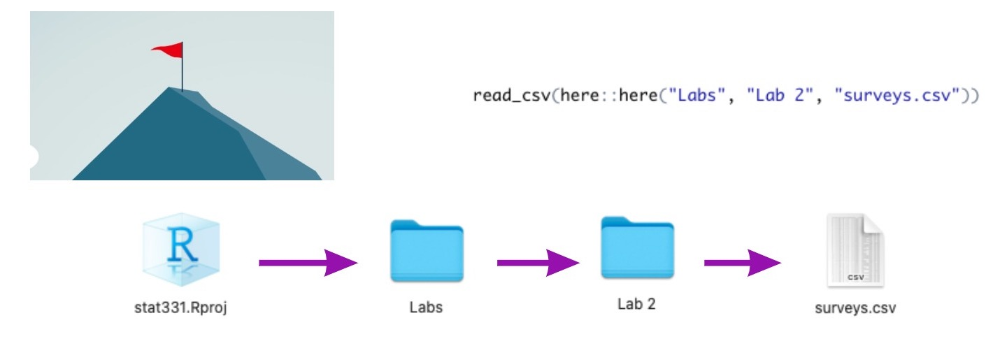

```{r, echo = FALSE, message = FALSE, warning = FALSE, fig.width = 8, fig.height = 6}
knitr::opts_chunk$set(message = FALSE, 
                      warning = FALSE, 
                      fig.align = "center")
```

class: inverse

.larger[R Projects!]

- Flag where R should look for files 

--

- Allow for us to *easily* use `here()` to find files

--

- Should be how you open RStudio **every time**

---



---

.larger[Your turn!]