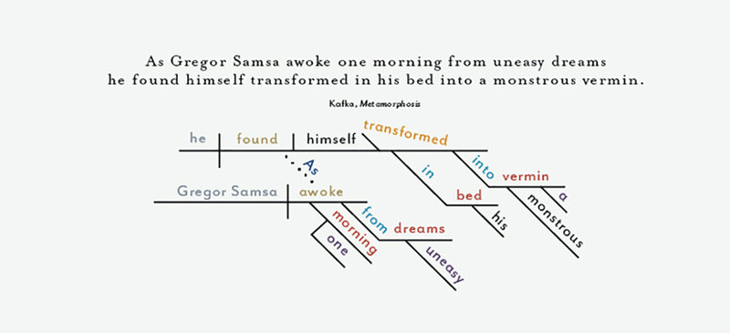
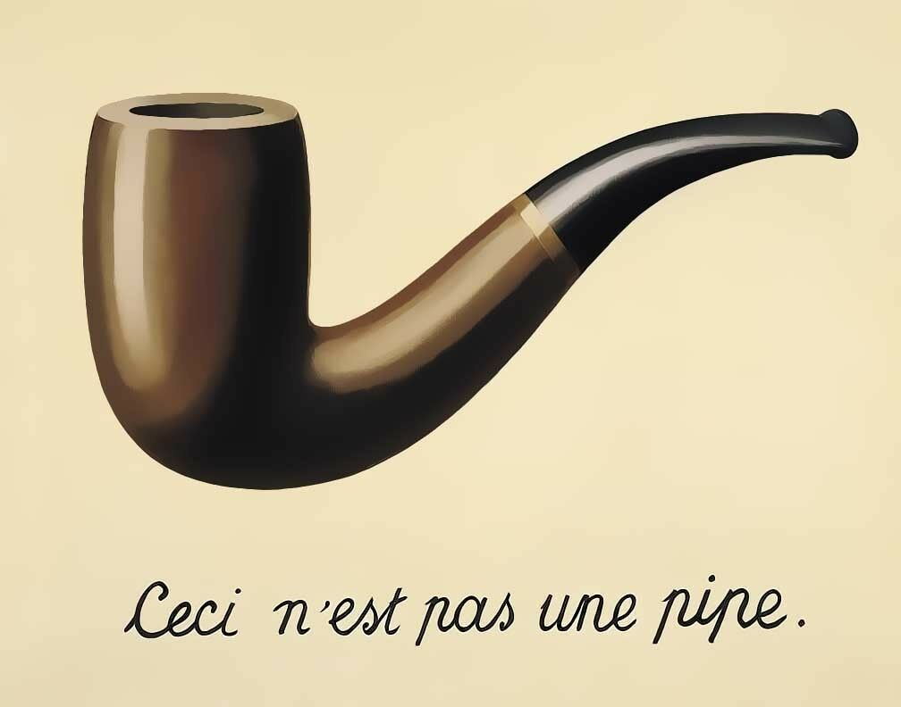
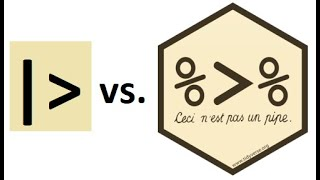
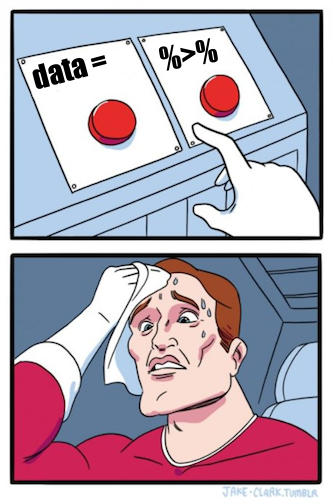

```{r setup, include=FALSE}
options(htmltools.dir.version = FALSE)
```

```{r xaringan-themer, include=FALSE}
library(xaringanthemer)
library(xaringan)
library(tidyverse)
library(flair)

style_duo_accent(
  primary_color      = "#0F4C81", # pantone classic blue
  secondary_color    = "#B6CADA", # pantone baby blue
  header_font_google = google_font("Raleway"),
  text_font_google   = google_font("Raleway", "300", "300i"),
  code_font_google   = google_font("Source Code Pro"),
  text_font_size     = "30px"
)
```

```{r, echo = FALSE, message = FALSE}
cereals <- read_csv("../practice/cereals.csv") |> 
  mutate(type = as_factor(type), 
         mfr = as_factor(mfr)) |> 
  mutate_all(list(~na_if(., -1))) |> 
  rename(temp = type)
```


</br>
</br> 

>No matter how complex and polished the individual operations are, it is often
the quality of the glue that most directly determines the power of the system.
>
>— Hal Abelson

---

.larger[The Pipe]

.pull-left[
```{r, echo = FALSE, out.width = "120%"}

```
]

.pull-right[
* Idea:  Code should read **like a sentence**

* Idea:  The **data** is the primary object, so it should come first in your
code.
]

---

.bitlarger[A Brief History of the Pipe]

.pull-left[
The original pipe (`%>%`) was part of the **magrittr** package
]

.pull-right[
```{r, echo = FALSE, out.width = "60%"}

```
]

--

.pull-left[
The pipe because ubiquitous with data wrangling, so R version 4.1.0 created 
the "native" pipe. 
]
]
.pull-right[

]

---


# The Pipe

```{r, eval = FALSE}
dr_theobold |>
  do_a_dance()
```

--

```{r, eval = FALSE}
dr_theobold |>
  put_on("cool hat") |>
  do_a_dance(type = "macarena")
```

---

.larger[Don't Fear the Pipe!]

```{r, echo = FALSE, out.height = "20%", out.width = "25%", fig.align='center'}

```

---

# The Pipe

```{r, echo = FALSE}
decorate('cereals |> summary()', eval = FALSE) |> 
  flair("|>") |> 
  flair_funs(color = "teal")
```

is the same as

```{r, echo = FALSE}
decorate('summary(cereals)', eval = FALSE) |> 
  flair_funs(color = "teal")
```

---
# The Pipe

What do you think the following will do?

```{r, eval = FALSE}
cereals |>
  filter(mfr == "Q") |>
  arrange(calories)
```

--

```{r, echo = FALSE}
cereals |>
  filter(mfr == "Q") |>
  arrange(calories)
```


---

# The Pipe

What do you think the following will do?

```{r, eval = FALSE}
cereals |>
  filter(mfr == "Q") |>
  group_by(temp) |> 
  arrange(sugars)
```


--

```{r, echo = FALSE}
cereals |>
  filter(mfr == "Q") |>
  group_by(temp) |> 
  arrange(sugars) 
```
