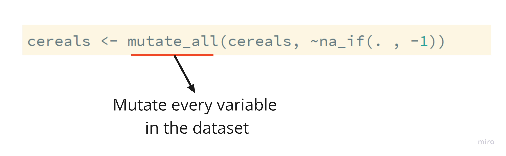
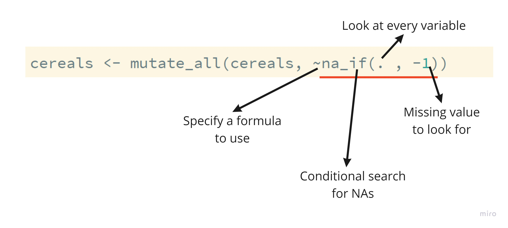

```{r setup, include=FALSE}
options(htmltools.dir.version = FALSE)
```

```{r xaringan-themer, include=FALSE}
library(xaringanthemer)
library(xaringan)
library(tidyverse)
library(flair)

style_duo_accent(
  primary_color      = "#0F4C81", # pantone classic blue
  secondary_color    = "#B6CADA", # pantone baby blue
  header_font_google = google_font("Raleway"),
  text_font_google   = google_font("Raleway", "300", "300i"),
  code_font_google   = google_font("Source Code Pro"),
  text_font_size     = "30px"
)
```

```{r, echo = FALSE, message = FALSE}
cereals <- read_csv("../practice/cereals.csv") %>% 
  mutate(type = as_factor(type), 
         mfr = as_factor(mfr))
```

# Ordering

Verb: `arrange()`

We **arrange** the dataset in order of a particular variable.

```{r}
arrange(cereals, calories)
```

---

.larger[Descending Order]

.pull-left[
Default is ascending order!

```{r, eval = FALSE}
arrange(cereals, calories)
```
]

.pull-right[
Need to add `desc()` to get descending order! 

```{r, eval = FALSE}
arrange(cereals, desc(calories))
```

]

---

.larger[Related: `top_n()`]

```{r}
top_n(cereals, 3, sugars)
```

---

.larger[Function Arguments]

This is correct, but lazy. 

```{r, eval = FALSE}
top_n(cereals, 3, sugars)
```

This is **much** better practice!

```{r, eval = FALSE}
top_n(x = cereals, n = 3, wt = sugars)
```

---

.larger[`bottom_n()` ?] 

```{r}
top_n(cereals, n = 3, wt = desc(sugars))
```

---

.larger[Data Investigation]

```{r}
arrange(cereals, sugars, carbo)
```

---

.larger[Tying to `mutate()`]

Missing values were recorded as `-1`. Let's fix that!

```{r}
cereals <- mutate_all(cereals, ~na_if(. , -1))
```

---

.larger[`mutate_all()`]



---


.larger[`na_if()`]



---


.larger[Checking our work]

```{r}
arrange(cereals, sugars)
```

---

<center>


