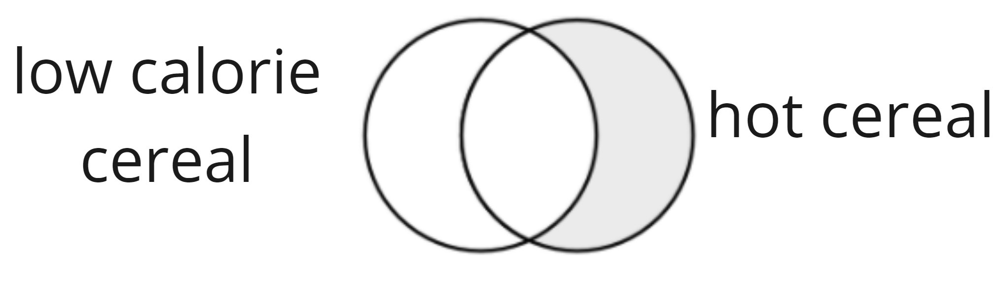

```{r setup, include=FALSE}
options(htmltools.dir.version = FALSE)
```

```{r xaringan-themer, include=FALSE}
library(xaringanthemer)
library(xaringan)
library(showtext)
library(fontawesome)
library(tidyverse)
library(flair)
library(forcats)

style_duo_accent(
  primary_color      = "#0F4C81", # pantone classic blue
  secondary_color    = "#B6CADA", # pantone baby blue
  header_font_google = google_font("Raleway"),
  text_font_google   = google_font("Raleway", "300", "300i"),
  code_font_google   = google_font("Source Code Pro"),
  text_font_size     = "30px"
)
```

.larger[Data Wrangling Verbs] 

- `filter()`
- `select()`
- `mutate()`
- `arrange()`
- `summarize()`
- `group_by()`

---

.bitlarger[Today's Data: Cereal]

```{r, echo = FALSE, message = FALSE}
cereals <- read_csv("../practice/cereals.csv") %>% 
  mutate(type = as_factor(type), 
         mfr = as_factor(mfr))

glimpse(cereals)
```

---

.larger[Filtering]

Verb: `filter()`

We **filter** to the rows (observations) we would like to keep in the dataset.

```{r, eval = FALSE}
filter(cereals, calories < 100) 
```

---

.larger[Getting Specific]

We can add **multiple** filters to our data, to get a more specific subset! 

```{r, eval = FALSE}
filter(cereals, calories < 100, 
       type == "H") 
```

---

.larger[Ugh!]

But I wanted **either** "low calorie" cereals *or* hot cereals...

```{r}
filter(cereals, calories < 100, 
       type == "H") 
```

---

.larger[And vs. Or]

```{r, out.width = "80%", echo = FALSE, fig.align = 'center'}

```

---

.pull-left[.large[**and**]
```{r, out.width = "80%", echo = FALSE, fig.align = 'center'}

```

```{r, eval = FALSE}
filter(cereals, calories < 100, type == "H")
```

**same as**

```{r, eval = FALSE}
filter(cereals, calories < 100 & type == "H")
```

]

.pull-right[.large[**or**]
```{r, out.width = "80%", echo = FALSE, fig.align = 'center'}

```


```{r, eval = FALSE}
filter(cereals, calories < 100 | type == "H")
```
]

---

.larger[One **not** the other]

.pull-left[.large[x **not** y]
```{r, out.width = "80%", echo = FALSE, fig.align = 'center'}

```
]

.pull-right[.large[y **not** x]
```{r, out.width = "80%", echo = FALSE, fig.align = 'center'}

```
]

---


.larger[Handy Helpers]

The following are some great "helper" functions when `filter()`ing data! 

- `>`, `<`, `>=`, `<=`
- `==`
- `%in%`
- `is.na()`
- `!` 

---

.bitlarger[Filtering Characters & Factors]

Are you interested in observations included in a list of levels? 

```{r in, eval = FALSE, echo = FALSE}
filter(cereals, name %in% 
         c("Cheerios", "Cinnamon Toast Crunch", 
            "Raisin Bran", "Cracklin' Oat Bran")
       )
```

```{r, echo = FALSE}
decorate("in", eval = FALSE) %>% 
  flair(pattern = "%in%")
```

---

.bitlarger[Filtering Missing Data]

**Lots** of ways to do the _same_ operation!

.midi[
```{r not_true, eval = FALSE, echo = FALSE}
filter(cereals, 
       is.na(calories) != TRUE
       )
```

```{r, echo = FALSE}
decorate("not_true", eval = FALSE) %>% 
  flair(pattern = "!= TRUE")
```


```{r false, eval = FALSE, echo = FALSE}
filter(cereals, 
       is.na(calories) == FALSE
       )
```

```{r, echo = FALSE}
decorate("false", eval = FALSE) %>% 
  flair(pattern = "== FALSE")
```

```{r negate, eval = FALSE, echo = FALSE}
filter(cereals, 
       !is.na(calories)
       )
```

```{r, echo = FALSE}
decorate("negate", eval = FALSE) %>% 
  flair(pattern = "!is.na(")
```
]
