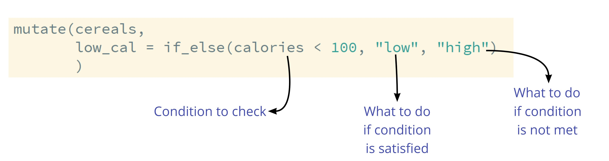

```{r setup, include=FALSE}
options(htmltools.dir.version = FALSE)
```

```{r xaringan-themer, include=FALSE}
library(xaringanthemer)
library(xaringan)
library(tidyverse)
library(flair)

style_duo_accent(
  primary_color      = "#0F4C81", # pantone classic blue
  secondary_color    = "#B6CADA", # pantone baby blue
  header_font_google = google_font("Raleway"),
  text_font_google   = google_font("Raleway", "300", "300i"),
  code_font_google   = google_font("Source Code Pro"),
  text_font_size     = "30px"
)
```

```{r, echo = FALSE, message = FALSE}
cereals <- read_csv("../practice/cereals.csv")
```

# Making new variables

Verb: `mutate()`

The dataset gets *mutated* to either

.pull-left[
- include a new variable
```{r, eval = FALSE}
mutate(cereals, 
       cal_per_cup = calories / cups
       )
```

]

.pull-right[
- revise an existing variable

```{r, eval = FALSE}
mutate(cereals, 
       type = as.factor(rating)
       )

```

]

---

.larger[Save your changes!]

```{r}
cereals
```

---

class: inverse

.larger[When making changes to a dataset **always** save your changes!]


---

.larger[Common Changes]

.pull-left[
- re-level a variable 
(lots of levels $\rightarrow$ few levels)

- discritize a variable 
(numerical $\rightarrow$ categorical)

- changing data type
- arithmetic operations (`+`, `-`, `*`, `/`)
- modulus operations (`%%`)
]

.pull-right[
- `if_else()` or `case_when()`
</br>

- `if_else()` or `case_when()`

- `as.factor()`, `as.numeric()`, etc.
- `+`, `-`, `*`, `/`
- `%%`

]

---

.larger[Discritize with `if_else()`]



---

.larger[Re-leveling with `case_when()`]

```{r, eval = FALSE}
mutate(cereals, 
       mfr = case_when(mfr == "A" ~ "American Home Food Products", 
                       mfr == "G" ~ "General Mills", 
                       mfr == "K" ~ "Kelloggs", 
                       mfr == "N" ~ "Nabisco", 
                       mfr == "P" ~ "Post", 
                       mfr == "Q" ~ "Quaker Oats", 
                       mfr == "R" ~ "Ralston Purina"
       )
```

---

.larger[Changing Data Types]

```{r, eval = FALSE}
mutate(cereals, 
       type = as.factor(type), 
       mfr = as.factor(mfr)
       )
```

