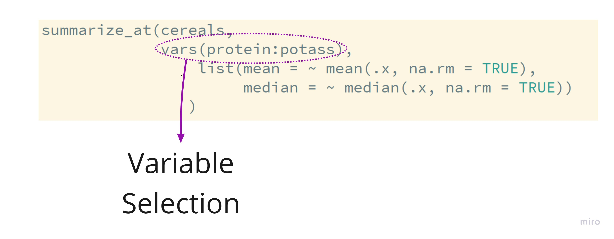
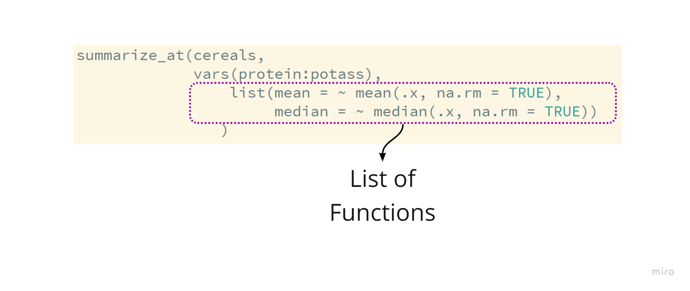
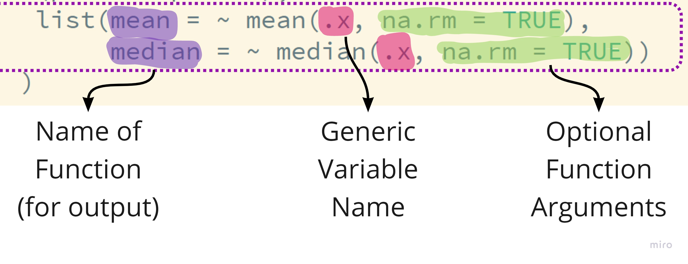

```{r setup, include=FALSE}
options(htmltools.dir.version = FALSE)
```

```{r xaringan-themer, include=FALSE}
library(xaringanthemer)
library(xaringan)
library(showtext)
library(fontawesome)
library(tidyverse)
library(flair)

style_duo_accent(
  primary_color      = "#0F4C81", # pantone classic blue
  secondary_color    = "#B6CADA", # pantone baby blue
  header_font_google = google_font("Raleway"),
  text_font_google   = google_font("Raleway", "300", "300i"),
  code_font_google   = google_font("Source Code Pro"),
  text_font_size     = "30px"
)
```

```{r, echo = FALSE, message = FALSE}
cereals <- read_csv("../practice/cereals.csv") %>% 
  mutate(type = as_factor(type), 
         mfr = as_factor(mfr))
```


.larger[Summarizing Variables]

Verb: `summarize()`

We calculate different **summaries** of variables in the dataset.

```{r summarize, echo = FALSE, eval = FALSE}
summarize(cereals, 
          mean_calories = mean(calories)
)
```


```{r, echo = FALSE}
decorate("summarize") %>% 
  flair("summarize") %>% 
  flair("mean_calories", color = "teal") %>%
  flair("mean(calories)")
```

--

.larger[Function Arguments]

* What are the **required** arguments of `summarize()`?

--

- dataset to summarize
- name-value pairs of summary functions

--

* Are there any optional arguments?

- `.groups` -- grouping structure of result
- will explain further in `group_by()`

---

.larger[Many Summaries]

```{r many, echo = FALSE, eval = FALSE}
summarize(cereals, 
          mean_calories = mean(calories), 
          num_cereals = n(), 
          mean_sugar = mean(sugars)
)
```

```{r, echo = FALSE}
decorate("many") %>% 
  flair(pattern = "mean_calories", color = "blue") %>% 
  flair(pattern = "num_cereals",  color = "purple") %>% 
  flair(pattern = "mean_sugar", color = "green")
```


---

.larger[Handy Helpers]

- `mean()`, `median()`, `sd()`, `sum()`
- `n()`, `n_distinct()` 
- `min()`, `max()`
- `first()`, `last()`, `nth()`

---


class: inverse

.larger[What if I want summaries for **every** nutritional variable?]

---

.larger[`summarize_at()`]

```{r across, eval = FALSE, echo = FALSE}
summarize_at(cereals,
             vars(protein:potass), 
                 list(mean = ~ mean(.x, na.rm = TRUE),
                      median = ~ median(.x, na.rm = TRUE))
                )
```

```{r, echo = FALSE}
decorate("across", eval = FALSE) %>% 
  flair("summarize_at") %>%
  flair_rx("vars", color = "cornflowerblue") %>%
  flair_rx("list", color = "darkred")
```


---

.larger[Select the Variables]



---

.larger[Declare Functions]



---


---

.larger[Neato!]

.pull-left-wide[
```{r, echo = FALSE}
summarize_at(cereals,
             vars(protein:potass), 
                 list(mean = ~ mean(.x, na.rm = TRUE),
                      median = ~ median(.x, na.rm = TRUE))
                )
```
]

.pull-right[

]