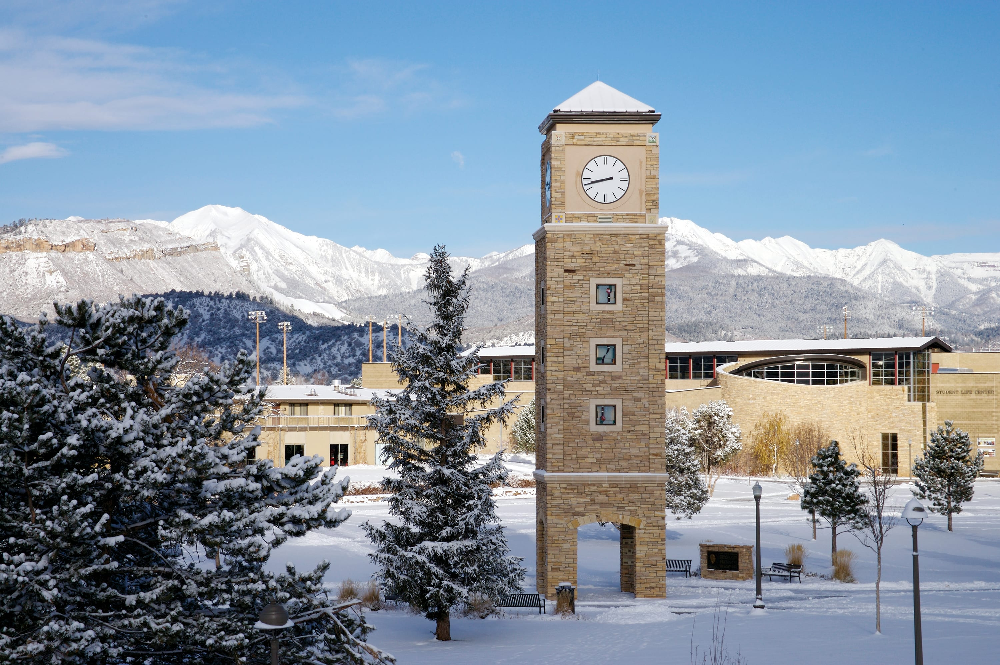

### Part One: Data import and cleaning

This section will clean today's dataset, so that you can use it more easily in Part Two.  

First, we declare our package dependencies and load the data.

(Note that the data loading function `read_csv` will give you an outpouring of helpful information about the dataset.  If you do not see the word "error", there is nothing to be concerned about.)

```{r setup, message = FALSE, warning = FALSE}
library(tidyverse)

colleges <- read_csv("https://www.dropbox.com/s/bt5hvctdevhbq6j/colleges.csv?dl=1")
```


Now we will clean the data.  Alas, each of the R chunks in this section will
cause an error and / or do the desired task incorrectly.  (Even the chunks that
run without error **are not** correct!) You will need to find the mistake and
correct it to complete the intended action. 


There are too many variables in this dataset.  We don't need all of them.
Narrow your dataset down to only:

- Name of the institution
- City, State, and ZIP code of the institution
- The Admissions Rate
- The average SAT score
- The number of undergraduate students
- The in and out of state tuition
- Whether the school is public or private
- The "REGION" variable.

```{r, eval = FALSE}
# The closing % was missing from the %>% 
colleges_clean <- colleges %>%
  select(INSTNM, CITY, STABBR, ZIP,
         ADM_RATE, SAT_AVG, UGDS,
         TUITIONFEE_IN, TUITIONFEE_OUT,
         CONTROL, REGION) 
```

Remove the schools that are private and for-profit (category 3).

_The `filter()`s are **and** statements, so `filter()` will retain only the data
where each condition is satisfied. No colleges are **both** private **and**
public. To remove category 3 we need to either (1) change the **and** to an 
**or** using the `|` sign, or (2) exclude category 3 directly with a `!=`
filter._

  
```{r, eval = FALSE}
# OPTION 1
colleges_clean <- colleges_clean %>%
  filter(CONTROL == 1 | CONTROL == 2) 

# OPTION 2
colleges_clean <- colleges_clean %>%
  filter(CONTROL != 3) 

```

Adjust the appropriate variables to be numeric.

_The warnings here are from `as.numeric()` coercing the `NULL` values from 
`TUITIONFEE_IN`, `TUITIONFEE_OUT`, `SAT_AVG`, and `ADM_RATE` into numerical 
values. The default coercion is `NULL` $\rightarrow$ `NA`, which is what we 
want!_


```{r, eval = FALSE}
colleges_clean <- colleges_clean %>%
  mutate(
    # as.numeric() is the function that converts a variable to a numeric data type
    TUITIONFEE_IN = as.numeric(TUITIONFEE_IN),
    TUITIONFEE_OUT = as.numeric(TUITIONFEE_OUT),
    SAT_AVG = as.numeric(SAT_AVG),
    ADM_RATE = as.numeric(ADM_RATE)
    ) 
```

Adjust the appropriate variables to be factors.


```{r, eval = FALSE}
# Notice these changes WERE NOT saved back into the colleges_clean dataset!
# We needed to add a <- and put them back in the colleges_clean data

colleges_clean <- colleges_clean %>% 
  mutate(
    CONTROL = as.factor(CONTROL),
    REGION = as.factor(REGION)
)
```

Create a new variable called `TUITION_DIFF` which contains the difference between in and out of state costs.

```{r, eval = FALSE}
colleges_clean <- colleges_clean %>% 
  # To add a variable you need the mutate() function!
    mutate(TUITION_DIFF = TUITIONFEE_OUT - TUITIONFEE_IN)
```

Remove every row with missing data.  

**Note:** This is not always a great idea!  Usually, even if *some* of the
information is missing, we don't want to throw out the entire row.  This time,
however, we'll be lazy.

```{r, eval = FALSE}
# There is no drop.na() function, only a drop_na() function! 
colleges_clean <- colleges_clean %>% 
  drop_na()
```

Lastly, notice that each of these steps started with 

```
colleges_clean <- colleges_clean %>% ...
```

That is pretty redundant!  Instead, we could perform all these tasks as one long
"pipeline."  Combine your (fixed) code chunks into a **single** code chunk that
carries out all of the steps necessary to clean the data.

**Note:** You **should not** have multiple calls to the `mutate()` function! 

```{r, warning = FALSE}
colleges_clean <- colleges %>%
  select(INSTNM, CITY, STABBR, ZIP,
         CONTROL, ADM_RATE, SAT_AVG,
         TUITIONFEE_IN, TUITIONFEE_OUT,
         UGDS, REGION) %>%
  filter(CONTROL != 3) %>%
  mutate(
    TUITIONFEE_IN = as.numeric(TUITIONFEE_IN),
    TUITIONFEE_OUT = as.numeric(TUITIONFEE_OUT),
    SAT_AVG = as.numeric(SAT_AVG),
    ADM_RATE = as.numeric(ADM_RATE),
    CONTROL = as.factor(CONTROL),
    TUITION_DIFF = TUITIONFEE_OUT - TUITIONFEE_IN,
    REGION = as.factor(REGION)
    ) %>%
    drop_na()
```


## Part Two:  Identify the mystery college

Wow!  Your best friend Ephelia has been accepted to her top choice college!
Unfortunately, Ephelia is a very mysterious person, and she won't tell you
directly which college this is.  You'll have to use her clues to figure out
which school is her dream school.


Clues:

1. This college is located in Region 7.

2. This college's admission rate is above the median rate for the region.

```{r, message = FALSE}
# Code to obtain region 7's median admission rate
region_median <- colleges_clean %>% 
  group_by(REGION) %>% 
  summarize(median_adm = median(ADM_RATE)) %>% 
  filter(REGION == 7) %>% 
  pull()
```

3. This college **does not** charge the same for in- and out-of-state tuition.

4. The average SAT score of this college is an odd number.

5. This college **is not** in Idaho. 

6. Less than 1,000 people apply to this college every year.  (Assume the size of
the freshman class is 1/4 of the undergraduate population.)

7. The college **is not** in the state where Dr. Theobold received a Ph.D. 

8. Of the three options remaining at this step, Ephelia will attend the cheapest
one.

```{r}
colleges_clean %>%
  filter(REGION == 7,
         ADM_RATE > region_median,
         TUITION_DIFF != 0) %>%
  mutate(
    SAT_odd = SAT_AVG %% 2 != 0
  ) %>%
  filter(SAT_odd == TRUE,
         STABBR != "ID") %>%
  mutate(
    freshman = as.numeric(UGDS) / 4, 
    applications = freshman / ADM_RATE
  ) %>%
  filter(applications < 1000, 
         STABBR != "MT") %>% 
  DT::datatable()

```


   
