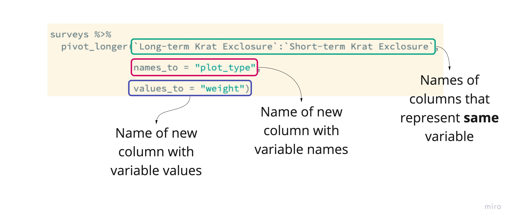
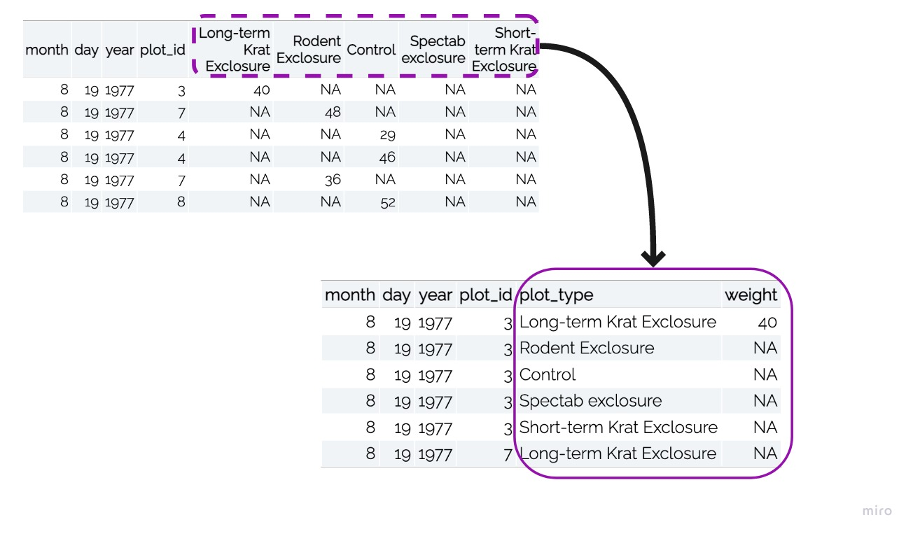

```{r setup, include=FALSE}
options(htmltools.dir.version = FALSE)
```

```{r xaringan-themer, include=FALSE}
library(xaringanthemer)
library(xaringan)
library(tidyverse)
library(flair)
library(knitr)

style_duo_accent(
  primary_color      = "#0F4C81", # pantone classic blue
  secondary_color    = "#B6CADA", # pantone baby blue
  header_font_google = google_font("Raleway"),
  text_font_google   = google_font("Raleway", "300", "300i"),
  code_font_google   = google_font("Source Code Pro"),
  text_font_size     = "30px"
)
```

.larger[Suppose...]

```{r, echo = FALSE, message = FALSE}
surveys <- read_csv("../surveys.csv") 

surveys<- surveys %>% 
  pivot_wider(names_from = plot_type, values_from = weight) %>% 
  select(month, day, year, plot_id, `Long-term Krat Exclosure`:`Short-term Krat Exclosure`)

surveys %>% 
  head() %>% 
  kable()
```

---

.bitlarger[What if we want to make boxplots comparing the weights of the different plot
types?]

```{r, echo = TRUE, eval = FALSE}
ggplot(surveys, 
       aes(x = ?????, y = weight, fill = species)) +
  geom_boxplot()

```

---
class: center, middle, inverse

.larger[Tip 1:  
**Work backwards**

]

---

class: center, middle, inverse

.pull-left[
.larger[Tip 2:
**Draw a picture**
]
]

.pull-right[
```{r, message = FALSE, echo = FALSE, warning = FALSE}
surveys %>%
  pivot_longer(`Long-term Krat Exclosure`:`Short-term Krat Exclosure`, 
               names_to = "plot_type", 
               values_to = "weight") %>%
  ggplot(aes(y = plot_type, x = weight)) +
  geom_boxplot() + 
  scale_x_log10()
```
]

---

.larger[Pivoting longer]

```{r, eval = FALSE, echo = FALSE}
surveys %>%
  pivot_longer(`Long-term Krat Exclosure`:`Short-term Krat Exclosure`,
               
               names_to = "plot_type", 
               
               values_to = "weight")

```



---



---

.larger[Try it!]

Create a new dataset called `cereals_long`, that has three columns:
* The name of the cereal
* A column called "Nutrient" with values `protein`, `fat`, or `fiber`.
* A column called "Amount" with the corresponding amount of the nutrient.
