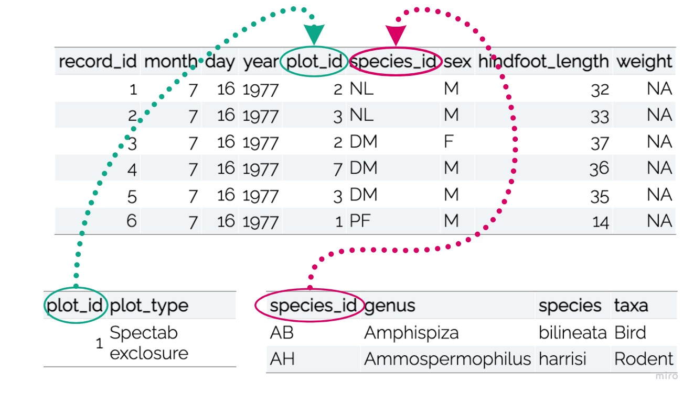
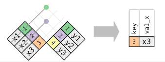

```{r, echo = FALSE, message = FALSE, warning = FALSE, fig.width = 8, fig.height = 6}
knitr::opts_chunk$set(message = FALSE, 
                      warning = FALSE, 
                      fig.align = "center")

library(xaringanthemer)
library(xaringan)
library(tidyverse)
library(kableExtra)

style_duo_accent(
  primary_color      = "#0F4C81", # pantone classic blue
  secondary_color    = "#B6CADA", # pantone baby blue
  header_font_google = google_font("Raleway"),
  text_font_google   = google_font("Raleway", "300", "300i"),
  code_font_google   = google_font("Source Code Pro"),
  text_font_size     = "30px"
)

surveys <- read_csv("data/surveys.csv")
plots <- read_csv("data/plots.csv")
species <- read_csv("data/species.csv")

```

class: inverse

.larger[Relational Data]

- Mutating joins
  * Adds information from a new dataframe to observations in an existing
  dataframe

--

- Filtering joins
  * Filter observations based on values in new dataframe
  
---

.larger[Keys]

.pull-left[
- Uniquely identifies an observation in a dataset

- Relate datasets to each other
]

.pull-right[

]

---

class: center



```{r, echo = FALSE}
surveys %>% 
  head() %>% 
  kable() %>% 
  kable_styling()
```

</br>

```{r, echo = FALSE, eval = FALSE}
plots %>% 
  head(n = 1) %>% 
  kable() %>% 
  kable_styling()
```

```{r, echo = FALSE, eval = FALSE}
species %>% 
  head(n = 2) %>% 
  kable() %>% 
  kable_styling()
```

---

.larger[Inner Join]

Matches pairs of observations when "keys" are equal

<center>

---

class: center

.large[**Species Inner Join**]

.pull-left-narrow[
```{r, echo = FALSE}
surveys_weight <- surveys %>% 
  filter(!is.na(weight)) %>% 
  group_by(species_id) %>% 
  summarize(mean_weight = mean(weight)) 

surveys_weight %>% 
  head() %>% 
  kable() %>% 
  kable_styling()

```
]

</br>

.pull-right-wide[
```{r, eval = FALSE}
surveys_weight %>% 
  inner_join(species, by = "species_id")
```

```{r, echo = FALSE}
surveys_weight %>% 
  inner_join(species, by = "species_id") %>% 
  select(-taxa) %>% 
  head() %>% 
  kable() %>% 
  kable_styling()
```
]

---

.pull-left[
.larger[Mutating Joins]

- Left Join: Everything is kept in the dataset **on the left**

- Right Join: Everything is kept in the dataset **on the right**

- Full Join: Everything is kept in **both** datasets

]

--

.pull-right[
   
]

---

.bitlarger[Filtering Joins -- Keep Observations]


.pull-left[
```{r, eval = FALSE}
surveys_weight %>% 
  semi_join(species, by = "species_id")
```

```{r, echo = FALSE}
surveys_weight %>% 
  semi_join(species, by = "species_id") %>% 
  head(n = 5) %>% 
  kable() %>% 
  kable_styling()
```
]

.pull-right[
```{r, echo = FALSE, fig.width = 12, fig.height = 16}
knitr::include_graphics("figures/semi_join.png")
```
]

---

.bitlarger[Filtering Joins -- Removing Observations]

.pull-left[
```{r, eval = FALSE}
surveys_weight %>% 
  anti_join(species, by = "species_id")
```

```{r, echo = FALSE}
surveys_weight %>% 
  anti_join(species, by = "species_id") %>% 
  head(n = 3) %>% 
  kable() %>% 
  kable_styling()
```
]

.pull-right[
```{r, echo = FALSE}

```
]

---

class: inverse

.larger[Connections to Data Cleaning]

- Including observations with `%in%` 
  * Similar to `semi_join()`

- Excluding observations with `!%in%`
  * Similar to `anti_join()`

