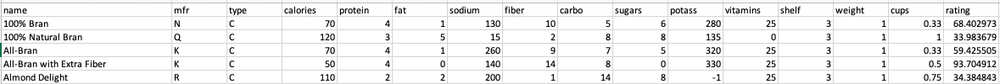
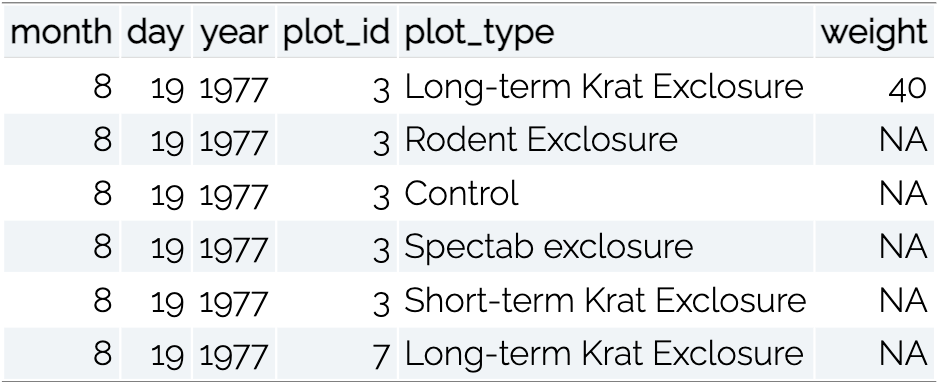
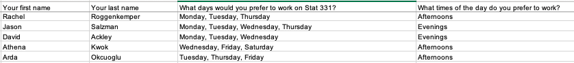

```{r setup, include=FALSE}
options(htmltools.dir.version = FALSE)
```

```{r xaringan-themer, include=FALSE}
library(xaringanthemer)
library(xaringan)
library(tidyverse)
library(knitr)
library(kableExtra)

style_duo_accent(
  primary_color      = "#0F4C81", # pantone classic blue
  secondary_color    = "#B6CADA", # pantone baby blue
  header_font_google = google_font("Raleway"),
  text_font_google   = google_font("Raleway", "300", "300i"),
  code_font_google   = google_font("Source Code Pro"),
  text_font_size     = "30px"
)
```

```{r, echo = FALSE, message = FALSE}
cereals <- read_csv("../cereal.csv") %>% 
  mutate(type = as_factor(type), 
         mfr = as_factor(mfr))
```

class:center,middle,inverse

.larger[Tidy Data]


---
<center>
.larger[Untidy Data]
</center>

.bitlarger[**Variable on Multiple Columns**]


--

.bitlarger[**Observations on Multiple Rows**] 

```{r, echo = FALSE, eval = FALSE}
surveys <- read_csv("../surveys.csv")

surveys %>% 
  pivot_longer(hindfoot_length:weight, 
               names_to = "measurement", 
               values_to = "value") %>% 
  select(record_id, month, day, year, plot_id, species_id, sex, measurement, value)
```



---

<center>
.larger[More Untidy Data]
</center>

.bitlarger[**Multiple Values**]



---

class: inverse, center

.larger[Reshaping]


