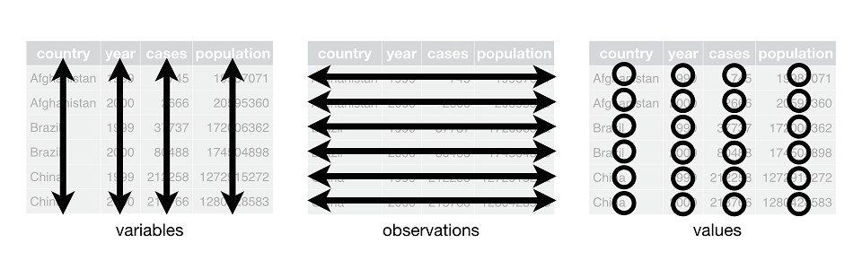

</br>

> ## Learning Objectives
>
> * Describe the purpose of the **`dplyr`** and **`tidyr`** packages.
> * Select certain columns in a data frame with the **`dplyr`** function 
`select`.
> * Select certain rows in a data frame according to filtering conditions with 
> the **`dplyr`** function `filter` .
> * Link the output of one **`dplyr`** function to the input of another function
with the 'pipe' operator `%>%`.
> * Add new columns to a data frame that are functions of existing columns with 
`mutate`.
> * Use the split-apply-combine concept for producing data summaries.
> * Use `summarize`, `group_by`, and `count` to split a data frame into groups 
of observations, apply summary statistics for each group, and then combine the 
results.
> * Describe the concept of a wide and a long table format and for which purpose
those formats are useful.
> * Describe what key-value pairs are.
> * Reshape a data frame from long to wide format and back with the 
`pivot_wider()` and `pivot_longer()`commands from the **`tidyr`** package.
> * Export a data frame to a .csv file.

------------

# Data Wrangling on using **`dplyr`** and **`tidyr`**

<!-- Bracket subsetting is handy, but it can be cumbersome and difficult to read, -->
<!-- especially for complicated operations. Enter **`dplyr`**.  -->

**`dplyr`** is a package for making tabular data wrangling easier. It pairs 
nicely with **`tidyr`** which enables you to swiftly convert between different 
data formats for plotting and analysis. Note that we're not using "data 
manipulation," but "data wrangling." To us, "data manipulation" is a term that 
captures the event where a researcher manipulates their data (e.g moving 
columns, deleting rows, merging data files) in a __non-reproducible__ manner. 
Whereas, with data wrangling, all of these process are done, but in a 
__reproducible__ manner, such as using an `R` script!

Packages in `R` are basically sets of additional functions that let you do more
stuff. The functions we've been using so far, like `str()` or `data.frame()`,
come built into `R`; packages give you access to more of them. Before you use a
package for the first time you need to install it on your machine, and then you
should import it in every subsequent `R` session when you need it. You should
already have installed the **`tidyverse`** package. This is an
"umbrella-package" that installs several packages useful for data analysis which
work together well such as **`tidyr`**, **`dplyr`**, **`ggplot2`**, 
**`tibble`**, etc.


The **`tidyverse`** package tries to address 3 common issues that arise when
doing data analysis with some of the functions that come with R:

1. The results from a base `R` function sometimes depend on the type of data.
2. Using `R` expressions in a non standard way, which can be confusing for new
   learners.
3. Hidden arguments, having default operations that new learners are not aware
   of.

We have seen in our previous lesson that when building or importing a data 
frame, the columns that contain characters (i.e., text) are coerced (=converted)
into the `factor` data type. We had to set **`stringsAsFactors`** to **`FALSE`**
to avoid this hidden argument to convert our data type. 

This time we will use the **`tidyverse`** package to read the data and avoid 
having to set **`stringsAsFactors`** to **`FALSE`**

If we haven't already done so, we can type `install.packages("tidyverse")` 
straight into the console. In fact, it's better to write this in the console 
than in our script for any package, as there's no need to re-install packages 
every time we run the script.

Then, to load the package type:

</br>

```{r, message = FALSE}
## load the tidyverse packages -- including dplyr, tidyr, readr, stringr
library(tidyverse)
```

</br>

## What are **`dplyr`** and **`tidyr`**?

The package **`dplyr`** provides easy tools for the most common data 
wrangling tasks. It is built to work directly with data frames, with many 
common tasks optimized by being written in a compiled language (C++). An 
additional feature is the ability to work directly with data stored in an 
external database. The benefits of doing this are that the data can be managed 
natively in a relational database, queries can be conducted on that database, 
and only the results of the query are returned.

This addresses a common problem with `R` in that all operations are conducted
in-memory and thus the amount of data you can work with is limited by available
memory. The database connections essentially remove that limitation in that you
can connect to a database of many hundreds of GB, conduct queries on it 
directly, and pull back into `R` only what you need for analysis.

The package **`tidyr`** addresses the common problem of wanting to reshape your 
data for plotting and use by different `R` functions. Sometimes we want data 
sets where we have one row per measurement. Sometimes we want a data frame where
each measurement type has its own column, and rows are instead more aggregated 
groups--like plots or aquaria. Moving back and forth between these formats is 
nontrivial, and **`tidyr`** gives you tools for this and more sophisticated data
wrangling.

To learn more about **`dplyr`** and **`tidyr`** after the workshop, you may want
to check out this
[handy data transformation with **`dplyr`** cheatsheet (link)](https://github.com/rstudio/cheatsheets/raw/master/data-transformation.pdf) 
and this [one about **`tidyr`** (link)](https://github.com/rstudio/cheatsheets/raw/master/data-import.pdf).

We'll read in our data using the `read_csv()` function, from the tidyverse 
package **`readr`**, instead of `read.csv()`.

</br>

```{r, results = 'hide', purl = FALSE, eval = FALSE}
surveys <- read_csv("data/surveys.csv")
```

```{r, results = 'hide', purl = FALSE, echo = FALSE}
surveys <- read_csv("data/surveys.csv")
```

</br>

You will see the message `Parsed with column specification`, followed by each 
column name and its data type. When you execute `read_csv` on a data file, it 
looks through the first 1000 rows of each column and guesses the data type for 
each column as it reads it into `R`. For example, in this dataset, `read_csv` 
reads `weight` as `col_double` (a numeric data type), and `species` as 
`col_character`. You have the option to specify the data type for a column 
manually by using the `col_types` argument in `read_csv`.

</br>

```{r, purl = FALSE}
## inspect the data
glimpse(surveys)
```

</br>

```{r, eval = FALSE}
## preview the data
View(surveys)
```

</br>

Notice that the class of the data is now `tbl_df`

This is referred to as a "tibble". Tibbles tweak some of the behaviors of the 
data frame objects we introduced in the previous episode. The data structure is
very similar to a data frame. For our purposes the only differences are that:

1. In addition to displaying the data type of each column under its name, it
   only prints the first few rows of data and only as many columns as fit on one
   screen.
2. Columns of class `character` are never converted into factors.


We're going to learn some of the most common **`dplyr`** functions:

- `select()`: subset columns
- `filter()`: subset rows on conditions
- `mutate()`: create new columns by using information from other columns
- `group_by()` and `summarize()`: create summary statistics on grouped data
- `arrange()`: sort results
- `count()`: count discrete values

## Selecting columns and filtering rows

To select columns of a data frame, use `select()`. The first argument
to this function is the data frame (`surveys`), and the subsequent
arguments are the columns to keep.

</br>

```{r, results = 'hide', purl = FALSE, eval = FALSE}
select(surveys, plot_id, species_id, weight)
```

</br>

To select all columns *except* certain ones, put a "-" in front of
the variable to exclude it.

</br>

```{r, results = 'hide', purl = FALSE, eval = FALSE}
select(surveys, -record_id, -species_id)
```

</br>

This will select all the variables in `surveys` except `record_id`
and `species_id`.

To choose rows based on a specific criteria, use `filter()`:

</br>

```{r, eval = FALSE}
filter(surveys, year == 1995)
```

</br>

__ADDITIONAL INFORMATION ON FILTERING SHOULD GO HERE!__

## Pipes

What if you want to select and filter at the same time? There are three
ways to do this: use intermediate steps, nested functions, or pipes.

With intermediate steps, you create a temporary data frame and use
that as input to the next function, like this:

</br>

```{r, eval = FALSE}
surveys2 <- filter(surveys, weight < 5)
surveys_sml <- select(surveys2, species_id, sex, weight)
```

</br>

This is readable, but can clutter up your workspace with lots of objects that 
you have to name individually. With multiple steps, that can be hard to keep 
track of. You can also nest functions (i.e. one function inside of another), 
like this:

</br>

```{r, eval = FALSE}
surveys_sml <- select(filter(surveys, weight < 5), species_id, sex, weight)
```

</br>

This is handy, but can be difficult to read if too many functions are nested, as
`R` evaluates the expression from the inside out (in this case, filtering, then 
selecting).

The last option, *pipes*, are a recent addition to `R`. Pipes let you take
the output of one function and send it directly to the next, which is useful
when you need to do many things to the same dataset.  Pipes in `R` look like
`%>%` and are made available via the **`magrittr`** package, installed 
automatically with **`dplyr`**. If you use RStudio, you can type the pipe with
<kbd>Ctrl</kbd> + <kbd>Shift</kbd> + <kbd>M</kbd> if you have a PC or 
<kbd>Cmd</kbd> + <kbd>Shift</kbd> + <kbd>M</kbd> if you have a Mac.

</br>

```{r, eval = FALSE}
surveys %>%
  filter(weight < 5) %>%
  select(species_id, sex, weight)
```

</br>

In the above code, we use the pipe to send the `surveys` dataset first through
`filter()` to keep rows where `weight` is less than 5, then through `select()`
to keep only the `species_id`, `sex`, and `weight` columns. Since `%>%` takes
the object on its left and passes it as the first argument to the function on
its right, we don't need to explicitly include the data frame as an argument
to the `filter()` and `select()` functions any more.

Some may find it helpful to read the pipe like the word "then". For instance,
in the above example, we took the data frame `surveys`, *then* we `filter`ed
for rows with `weight < 5`, *then* we `select`ed columns `species_id`, `sex`,
and `weight`. The **`dplyr`** functions by themselves are somewhat simple,
but by combining them into linear workflows with the pipe, we can accomplish
more complex wranglings of data frames.

If we want to create a new object with this smaller version of the data, we
can assign it a new name:

</br>

```{r, eval = FALSE}
surveys_sml <- surveys %>%
  filter(weight < 5) %>%
  select(species_id, sex, weight)

surveys_sml
```

</br>

Note that the final data frame is the leftmost part of this expression.

> ## Challenge 1 
>   Using pipes, subset the `surveys` data to include 
> animals collected on or after 1995 and retain only the columns `year`, `sex`, 
> and `weight`.

</br>

```{r, eval = FALSE, purl = TRUE}
## Pipes Challenge:
##  Using pipes, subset the data to include animals collected
##  before 1995, and retain the columns `year`, `sex`, and `weight.`
```

</br>

## Mutate

Frequently you'll want to create new columns based on the values in existing
columns, for example to do unit conversions, or to find the ratio of values in 
two columns. For this we'll use `mutate()`.

To create a new column of weight in kg:

</br>

```{r, eval = FALSE}
surveys %>%
  mutate(weight_kg = weight / 1000)
```

</br>

You can also create a second new column based on the first new column within the
same call of `mutate()`:

</br>

```{r, eval = FALSE}
surveys %>%
  mutate(weight_kg = weight / 1000,
         weight_lb = weight_kg * 2.2)
```

</br>

If this runs off your screen and you just want to see the first few rows, you
can use a pipe to view the `head()` of the data. (Pipes work with non-**`dplyr`**
functions, too, as long as the **`dplyr`** or `magrittr` package is loaded).

</br>

```{r, eval = FALSE}
surveys %>%
  mutate(weight_kg = weight / 1000) %>%
  head()
```

</br>

The first few rows of the output are full of `NA`s, so if we wanted to remove
those we could insert a `filter()` in the chain:

</br>

```{r, eval = FALSE}
surveys %>%
  filter(!is.na(weight)) %>%
  mutate(weight_kg = weight / 1000) %>%
  head()
```

</br>

`is.na()` is a function that determines whether something is an `NA`. The `!`
symbol negates the result, so we're asking for every row where weight *is not* 
an `NA`.

\pagebreak

> ## Challenge 2 
> 
>  Create a new data frame from the `surveys` data that meets the following
>  criteria: contains only the `species_id` column and a new column called
>  `hindfoot_cm`, which contains the `hindfoot_length` values converted to 
>  centimeters. Make sure that you only retain values in the `hindfoot_cm` 
>  column that are not missing (not `NA`) and are less than 3.
>
>  **Hint**: think carefully about how the commands should be ordered to produce 
>  this data frame!
> 

</br>

```{r} 
## Mutate Challenge:
##  Create a new data frame from the `surveys` data that meets the following
##  criteria: contains only the `species_id` column and a new column called
##  `hindfoot_cm` containing the `hindfoot_length` values converted to centimeters.
##  In this `hindfoot_cm` column, there are no `NA`s and all values are less
##  than 3.

##  Hint: think about how the commands should be ordered to produce this data frame!

```

</br>
 
## Using `lubridate` for dates 

Date-time data can be frustrating to work with in `R`, since `R` commands for 
date-times are generally un-intuitive and change depending on the type of 
date-time object being used. Moreover, the methods we use with date-times must 
be robust to time zones, leap days, daylight savings times, and other time 
related quirks, and `R` lacks these capabilities in some situations. `Lubridate`
makes it easier to do the things `R` does with date-times and possible to do the
things `R` does not.

`Lubridate` has functions that handle easy parsing of times, such as:  

- `ymd()`
- `dmy()` 
- `mdy()` 

```{r, message = FALSE, results = 'hide'}
library(lubridate)

today()
## Today's date
now()
## Today's date, with time and timezone!

surveys <- surveys %>% 
  mutate(date = ymd(paste(year,
                          month,
                          day,
                          sep = "-")
                    ),
         day_of_week = wday(date, label = TRUE)
         ## Creating a day of the week variable
         ## label = TRUE prints the name, not the level! 
         )

```

</br>

> ## Challenge 3 {.challenge}
> 
> What dates were unable to be converted? 
> Why did that happen?  

We can pull off components of dates using a large array of `lubridate` 
functions, such as:  

- `year()` 
- `month()` 
- `mday()` 
- `hour()` 
- `minute()` 
- `second()`

For additional information about `lubridate` visit its reference website 
(https://lubridate.tidyverse.org/) or look over the `lubridate` cheatsheet (https://rawgit.com/rstudio/cheatsheets/master/lubridate.pdf). 

## Using `forcats` and `dplyr` for Character Wrangling   

If we inspect the day of week variable we created in the last code chunk, we'll 
see that it is an ordered (<ord>) factor. 

> ## Challenge 4 {.challenge}
> 
>  What are the names of the days of the week taken from the dates?  

```{r, results = 'hide'}


```

We notice that the labels for the days of the week are not necessarily 
what we would like to have for a graphical display of our data. To reword the 
names of the days of the week, we can use the `case_when()` function from 
`dplyr`. 

The `case_when()` function can be thought of as a "generalized form for 
multiple `if_else()` statements." We'll be getting to `ifelse()` statements in 
the _Intermediate R_ workshop, but let's break them down here. 

For `case_when()` the inputs are sequences of two-sided formulas. The left hand 
side finds the values that match the case and the right hand side says what 
should be done with these matches. 

Let's look at this in action! 

```{r}
surveys <- surveys %>% 
  mutate(day_of_week = case_when(day_of_week == "Mon" ~ "Monday", 
                             day_of_week == "Tue" ~ "Tuesday", 
                             day_of_week == "Wed" ~ "Wednesday", 
                             day_of_week == "Thu" ~ "Thursday", 
                             day_of_week == "Fri" ~ "Friday", 
                             day_of_week == "Sat" ~ "Saturday",
                             day_of_week == "Sun" ~ "Sunday")
         )
```

But, perhaps these days are not in the order that we want them to be in. 

> ## Challenge 5 {.challenge}
> 
> What order did `R` put the days of the week in?
> What datatype is `day_of_week` now? 

There are small differences between character datatypes and factor datatypes. 
Typically, `R` uses factors to handle categorical variables, variables that have
a fixed and known set of possible values. Factors are also helpful for 
reordering character vectors to improve display. However, factors are often 
difficult to work with. Enter the `forcats` package, whose goal is to provide a 
suite of tools that solve common problems with factors, including changing the 
order of levels or the values.

The order of the levels `R` chose may not be what we wanted, but we can 
reorder them using the `fct_relevel()` function from the `forcats` package. 
The function takes three arguments: 

1. the data 
2. the factor to be reordered
3. the order of the new levels separated by commas

This process looks like this: 

```{r}
surveys <- surveys %>% 
  mutate(day_of_week = fct_relevel(day_of_week, 
                                   "Monday", 
                                   "Tuesday", 
                                   "Wednesday", 
                                   "Thursday", 
                                   "Friday", 
                                   "Saturday", 
                                   "Sunday")
  )

```

> ## Challenge 6
> 
> Verify that `R` put the days in the order that you specified! 

\pagebreak 

# Split-apply-combine data analysis

Many data analysis tasks can be approached using the *split-apply-combine*
paradigm: split the data into groups, apply some analysis to each group, and
then combine the results. **`dplyr`** makes this very easy through the use of the
`group_by()` function.


## The `summarize()` function

`group_by()` is often used together with `summarize()`, which collapses each
group into a single-row summary of that group.  `group_by()` takes as arguments
the column names that contain the **categorical** variables for which you want
to calculate the summary statistics. So to compute the mean `weight` by sex:

</br>

```{r, eval = FALSE}
surveys %>%
  group_by(sex) %>%
  summarize(mean_weight = mean(weight, na.rm = TRUE))
```

</br>

You may also have noticed that the output from these calls doesn't run off the
screen anymore. It's one of the advantages of `tbl_df` over data frame.

You can also group by multiple columns:

</br>

```{r, eval = FALSE}
surveys %>%
  group_by(sex, species_id) %>%
  summarize(mean_weight = mean(weight, na.rm = TRUE))
```

</br>

When grouping both by `sex` and `species_id`, the last few rows are for animals
that escaped before their sex and body weights could be determined. You may notice
that the last column does not contain `NA` but `NaN` (which refers to "Not a
Number"). To avoid this, we can remove the missing values for weight before we
attempt to calculate the summary statistics on weight. Because the missing
values are removed first, we can omit `na.rm = TRUE` when computing the mean:

</br>

```{r, eval = FALSE}
surveys %>%
  filter(!is.na(weight)) %>%
  group_by(sex, species_id) %>%
  summarize(mean_weight = mean(weight))
```

</br>

Here, again, the output from these calls doesn't run off the screen
anymore. If you want to display more data, you can use the `head()` function
at the end of your chain with the argument `n` specifying the number of rows to
display:

</br>

```{r, eval = FALSE}
surveys %>%
  filter(!is.na(weight)) %>%
  group_by(sex, species_id) %>%
  summarize(mean_weight = mean(weight)) %>%
  head(n = 15)
```

\pagebreak

Once the data are grouped, you can also summarize multiple variables at the same
time (and not necessarily on the same variable). For instance, we could add a
column indicating the minimum weight for each species for each sex:

</br>

```{r, eval = FALSE}
surveys %>%
  filter(!is.na(weight)) %>%
  group_by(sex, species_id) %>%
  summarize(mean_weight = mean(weight),
            min_weight = min(weight))
```

</br>

It is sometimes useful to rearrange the result of a query to inspect the values.
For instance, we can sort on `min_weight` to put the lighter species first:

</br>

```{r, eval = FALSE}
surveys %>%
  filter(!is.na(weight)) %>%
  group_by(sex, species_id) %>%
  summarize(mean_weight = mean(weight),
            min_weight = min(weight)) %>%
  arrange(min_weight)
```

</br>

To sort in descending order, we need to add the `desc()` function. If we want to
sort the results by decreasing order of mean weight:

</br>

```{r, eval = FALSE}
surveys %>%
  filter(!is.na(weight)) %>%
  group_by(sex, species_id) %>%
  summarize(mean_weight = mean(weight),
            min_weight = min(weight)) %>%
  arrange(desc(mean_weight))
```

</br>

> ## Challenge 7 {.challenge}
> 
> 1. Use `group_by()` and `summarize()` to find the mean, min, and max hindfoot
> length for each species (using `species_id`). Also add the number of
> observations (hint: see `?n`).

```{r}


```

> 
> 2. What was the heaviest animal measured in each year? Return the columns 
> `year`, `genus`, `species_id`, and `weight`.

```{r}


```

## Counting

When working with data, we often want to know the number of observations found
for each factor or combination of factors. For this task, **`dplyr`** provides
`count()`. For example, if we wanted to count the number of rows of data for
each sex, we would do:

</br>

```{r, eval = FALSE}
surveys %>%
    count(sex) 
```

</br>

The `count()` function is shorthand for something we've already seen: grouping 
by a variable, and summarizing it by counting the number of observations in that
group. In other words, `surveys %>% count()` is equivalent to:  

</br>

```{r, eval = FALSE}
surveys %>%
    group_by(sex) %>%
    summarise(count = n())
```

\pagebreak 

For convenience, `count()` provides the `sort` argument:  

</br>

```{r, eval = FALSE}
surveys %>%
    count(sex, sort = TRUE) 
```

</br>

Previous example shows the use of `count()` to count the number of rows/observations 
for *one* factor (i.e., `sex`). 
If we wanted to count *combination of factors*, such as `sex` and `species`, 
we would specify the first and the second factor as the arguments of `count()`:

</br>

```{r purl = FALSE, eval = FALSE}
surveys %>%
  count(sex, species_id) 
```

</br>

With the above code, we can proceed with `arrange()` to sort the table 
according to a number of criteria so that we have a better comparison. 
For instance, we might want to arrange the table above in (i) an alphabetical 
order of the levels of the species and (ii) in descending order of the count:

</br>

```{r purl = FALSE, eval = FALSE}
surveys %>%
  count(sex, species_id) %>%
  arrange(species_id, desc(n))
```

</br>

From the table above, we may learn that, for instance, there are 75 observations
of the *albigula* species that are not specified for its sex (i.e. `NA`).

> ## Challenge 8 {.challenge}
> 
> How many animals were caught in each `plot_type` surveyed?


```{r}


```

\pagebreak 

# Relational Data with `dplyr`   

It is rare that ecological data analyses involve only a single table of data. 
More typically, you have multiple tables of data, describing different aspects 
of your study. When you embark on analyzing your data, these different data 
tables need to be combined. Collectively, multiple tables of data are called 
*relational data*, as the data tables are not independent, rather they relate to
each other. 

Relations are defined between a pair of data tables. There are three families of
joining operations: mutating joins, filtering joins, and set operations. Today 
we will focus on mutating joins. 

The `survey` data have two other data tables they are related to: `plots` and 
`species`. Load in these data and inspect them to get an idea of how they relate
to the `survey` data we've been working with. 

</br>

```{r, purl = TRUE, message = FALSE}
plots <- read_csv("data/plots.csv")

species <- read_csv("data/species.csv")

```

</br>

The variables used to connect a pair of tables are called *keys*. A key is a 
variable that uniquely identifies an observation in that table.  What are the 
keys for each of the three data tables? (hint: What combination of variables 
uniquely identifies a row in that data frame?) 

- plots key:  

- species key:  

- surveys key: 


There are two types of keys:  

- A *primary key* uniquely identifies an observation in its own table.  
- A *foreign key* uniquely identifies an observation in another table.  

A primary key and the corresponding foreign key form a *relation* between the 
two data tables. These relations are typically many-to-one, though they can be 
1-to-1. For example, there are many rodents captured that are of one species_id,
hence a many-to-one relationship.  

For me, the easiest way to think about the relationships between the different 
data tables is to draw a picture:  


\pagebreak 

## Joining Relational Data  

The tool that we will be using is called a *mutating join*. A mutating join is 
how we can combine variables from two tables. The join matches observations by 
their keys, and then copies variables from one table to the other. Similar to 
`mutate()` these join functions add variables to the right of the existing data 
frame, hence their name. There are two types of mutating joins, the inner join 
and the outer join.    

## Inner Join 

The simplest join is an *inner join*, which creates a pair of observations 
whenever their keys are equal. This join will output a new data frame that 
contains the key, the values of `x`, and the values of `y`. Importantly, this 
join deletes observations that do not have a match. 

\begin{figure}[h!]
\caption{Wickham, H. \& Grolemund, G. (2017) \emph{R for Data Science}. 
Sebastopol, California: O'Reilly.}
\includegraphics{figures/inner.jpg}
\centering
\end{figure}

## Outer Join  

While an inner join only keeps observations with keys that appear in both 
tables, an *outer join* keeps observations that appear in *at least one* of the 
data tables. When joining `x` with `y`, there are three types of outer join:  

- A *left join* keeps all of the observations in `x`.   
- A *right join* keeps all of the observations in `y`.  
- A *full join* keeps all of the observations in both `x` and `y`. 

\begin{figure}[h!]
\caption{Wickham, H. \& Grolemund, G. (2017) \emph{R for Data Science}. 
Sebastopol, California: O'Reilly.}
\includegraphics{figures/joins.jpg}
\centering
\end{figure}


The left join is the most common, as you typically have a data frame (`x`) that 
you wish to add additional information to (the contents of `y`). This join will 
preserve the contents of `x`, even if there is not a match for them in `y`. 

\pagebreak 

## Joining `survey` Data  

To join the `survey` data with the `plots` data and `species` data, we will need
to join statements. As we are interested in adding this information to our 
already existing data frame, `surveys`, a left join is the most appropriate.  

</br>

```{r, purl = TRUE, warning = FALSE}

combined <- surveys %>% 
              left_join(plots, by = "plot_id") %>%  # adding the type of plot  
              left_join(species, by = "species_id") # adding the genus, species, and taxa 

glimpse(combined)
```

\pagebreak 

# Reshaping with `pivot_longer()` and `pivot_wider()`

Data Carpentry's [spreadsheet
lesson (link)](https://datacarpentry.org/spreadsheet-ecology-lesson/01-format-data/),
discusses how to structure our data leading to the four rules defining a tidy
dataset:

1. Each variable has its own column
2. Each observation has its own row
3. Each value must have its own cell
4. Each type of observational unit forms a table



Here we examine the fourth rule: Each type of observational unit forms a table.

In `surveys` , the rows of `surveys` contain the values of variables associated
with each record (the unit), values such as the weight or sex of each animal 
associated with each record. What if instead of comparing records, we 
wanted to compare the different mean weight of each genus between plots? 
(Ignoring `plot_type` for simplicity).

We'd need to create a new table where each row (the unit) is comprised of values
of variables associated with each plot. In practical terms this means the values
in `genus` would become the names of column variables and the cells would 
contain the values of the mean weight observed on each plot.

Having created a new table, it is therefore straightforward to explore the 
relationship between the weight of different genera within, and between, the
plots. The key point here is that we are still following a tidy data structure,
but we have **reshaped** the data according to the observations of interest:
average genus weight per plot instead of recordings per date.

The opposite transformation would be to transform column names into values of
a variable.

We can do both these of transformations with two `tidyr` functions, 
`pivot_longer()` and `pivot_wider()`.

## Pivoting to a Wider Table

`pivot_wider()` takes three principal arguments:

1. the data 
2. the column whose values will become new column names.  
3. the column whose values will fill the new columns.

Further arguments include `fill` which, if set, fills in missing values with 
the value provided.


Let's use `pivot_wider()` to transform surveys to find the mean weight of each 
genus in each plot over the entire survey period. We use `filter()`,
`group_by()` and `summarise()` to filter our observations and variables of 
interest, and create a new variable for the `mean_weight`. We use the pipe as 
before too.

</br>

```{r, results = 'hide'}
surveys_gw <- combined %>%
  filter(!is.na(weight)) %>%
  group_by(plot_id, genus) %>%
  summarize(mean_weight = mean(weight))

glimpse(surveys_gw)
```

</br>

This yields `surveys_wide` where the observations for each plot are spread 
across multiple rows, 196 observations of 3 variables.  

Using `pivot_wider()` to pivot on `genus` with values from `mean_weight` this 
becomes 24 observations of 11 variables, one row for each plot. We again use 
pipes:

</br>

```{r, results = 'hide'}
surveys_wide <- surveys_gw %>%
  pivot_wider(names_from = genus, values_from = mean_weight)

glimpse(surveys_wide)
```

> ## Challenge 9 {.challenge}
> 
> Pivot the `combined` data frame to a wide format, with `year` as columns, 
> `plot_id` as rows, and the number of genera per plot as the values. You will
> need to summarize before reshaping, and use the function `n_distinct()` to 
> get the number of unique genera within a particular chunk of data. It's a 
> powerful function! See `?n_distinct` for more.

> Save the wide dataset as an object, with an intuitive name!

```{r}
## Make a wide data frame by pivoting on year. 
## Fill the values in these columns with the number of genera per plot. 
## Make sure to save the new dataset with an intuitive name!


```

## Pivoting to a Longer Table

The opposing situation could occur if we had been provided with data in the
form of `surveys_wide`, where the genus names are column names, but we 
wish to treat them as values of a genus variable instead.

In this situation we are gathering the column names and turning them into a
pair of new variables. One variable represents the column names as values, and
the other variable contains the values previously associated with the column 
names.

`pivot_longer()` takes four principal arguments:

1. the data
2. the columns we wish to pivot into a single column 
3. the name of the new column to create to store the names of each selected column
4. the name of the new column to create to store the data filled in each cell


To recreate `surveys_gw` from `surveys_wide` we would create a key called
`genus` and value called `mean_weight` and use all columns except `plot_id` for
the key variable. Here we drop `plot_id` column with a minus sign.

```{r, results = 'hide'}
surveys_long <- surveys_wide %>%
  pivot_longer(cols = -plot_id, names_to = "genus", values_to = "mean_weight")

glimpse(surveys_long)
```

</br>

Note that now the `NA` genera are included in the re-gathered format. Pivoting 
your data to a wide format and then pivoting to a long format can be a useful 
way to balance out a dataset so every replicate has the same composition.

We could also have used a specification for what columns to include. This can be
useful if you have a large number of identifying columns, and it's easier to
specify what to gather than what to leave alone. And if the columns are in a
row, we don't even need to list them all out `-` just use the `:` operator!

\pagebreak

```{r}
surveys_wide %>%
  pivot_longer(cols = Baiomys:Spermophilus, names_to = "genus", 
               values_to = "mean_weight") %>%
  head()
```

</br>

> ## Challenge 10 {.challenge}
> 
> Take the wide dataset and use `pivot_longer()` to pivot it to the long 
> format it was in before, so that each row is a unique `plot_id` by `year` 
> combination.

```{r}
## Now take the wide dataset, and make it long again, by (re)pivoting on the 
## year columns. 


```


> ## Challenge 11 {.challenge}
> 
> 1. The `combined` data set has two measurement columns: `hindfoot_length` and
> `weight`.  This makes it difficult to do things like look at the 
> relationship between mean values of each measurement per year in different
> plot types. Let's walk through a common solution for this type of problem.
> First, use `pivot_longer()` to create a dataset where we have a names column
> called `measurement` and a values column that takes on the value of either 
> `hindfoot_length` or `weight`. 
> *Hint*: You'll need to specify which columns to pivot into longer format!


```{r}
## Use pivot_long() to create an even longer dataset.
## Create a column called measurement, containing the hindfoot and weight columns
## And a value column that takes on the value of either of these measurements 
## Hint: You'll need to specify which columns are being used to pivot!


```

> 
> 2. With this new data set, calculate the average of each `measurement` in each
> `year` for each different `plot_type`. Then pivot these summaries into a 
> a data set with a column for `hindfoot_length` and `weight`. 
> *Hint*: This sounds like you want to pivot the data to be a wider format! 


```{r}
## With this new very long data set, calculate the average of each 
## measurement in each year for each different plot_type. 


## Now pivot these summaries into a wide data set. 
## With a columns for hindfoot_length and weight. 
## Filled with the summary values you calculated. 


```

# Exporting data

Now that you have learned how to use **`dplyr`** to extract information from
or summarize your raw data, you may want to export these new data sets to share
them with your collaborators or for archival.

Similar to the `read_csv()` function used for reading CSV files into `R`, there
is a `write_csv()` function that generates CSV files from data frames.

Before using `write_csv()`, we are going to create a new folder, `data`,
in our working directory that will store this generated dataset. We don't want
to write generated datasets in the same directory as our raw data. It's good
practice to keep them separate. The `data_raw` folder should only contain the 
raw, unaltered data, and should be left alone to make sure we don't delete or 
modify it. In contrast, our script will generate the contents of the `data`
directory, so even if the files it contains are deleted, we can always
re-generate them.

In preparation for our next lesson on plotting, we are going to prepare a
cleaned up version of the data set that doesn't include any missing data.

Let's start by removing observations of animals for which `weight` and 
`hindfoot_length` are missing, or the `sex` has not been determined:

</br>

```{r, purl=FALSE}
surveys_complete <- combined %>%
  filter(!is.na(weight),           # remove missing weight
         !is.na(hindfoot_length),  # remove missing hindfoot_length
         !is.na(sex))              # remove missing sex
```

</br>

Because we are interested in plotting how species abundances have changed
through time, we are also going to remove observations for rare species (i.e.,
that have been observed less than 50 times). We will do this in two steps: first
we are going to create a data set that counts how often each species has been
observed, and filter out the rare species; then, we will extract only the
observations for these more common species:

</br>

```{r, eval = FALSE, purl = TRUE}
## Create the dataset for exporting:
##  Start by removing observations for which the `species_id`, `weight`,
##  `hindfoot_length`, or `sex` data are missing:
surveys_complete <- combined %>%
    filter(species_id != "",               # remove missing species_id
           !is.na(weight),                 # remove missing weight
           !is.na(hindfoot_length),        # remove missing hindfoot_length
           sex != "")                      # remove missing sex

##  Now remove rare species in two steps. First, make a list of species which
##  appear at least 50 times in our dataset:
species_counts <- combined %>%
    count(species_id) %>% 
    filter(n >= 50) %>%
    select(species_id)

##  Second, keep only those species:
surveys_complete <- surveys_complete %>%
    filter(species_id %in% species_counts$species_id)
```

</br>

To make sure that everyone has the same data set, check that `surveys_complete`
has `r nrow(surveys_complete)` rows and `r ncol(surveys_complete)` columns by
typing `dim(surveys_complete)`.

Now that our data set is ready, we can save it as a CSV file in our `data`
folder.

</br>

```{r, eval = FALSE}
write_csv(surveys_complete, path = "data/surveys_complete.csv")
```


## Happy wrangling!  

</br>
</br>

# Instructor Biographies 

## Allison Theobold


Allison Theobold, originally from Grand Junction, CO, is a sixth-year graduate 
student studying Statistics Education at Montana State University. Allison 
graduated from Colorado Mesa University in 2014, earned a Master's degree in 
Statistics from Montana State University, and will be defending her dissertation
in April of this year. Recognized by both the Department of Mathematical 
Sciences and the College of Letters and Sciences as an outstanding graduate 
teacher and researcher, Allison's passion for teaching data science is 
infectious. Allison has taught Introduction and Intermediate Statistics to 
undergraduate and graduate students, while also completing two years of 
statistical consulting for diverse groups at Montana State. Her experiences as a
teacher and consultant established an interest in preparing researchers in the 
sciences with the computational tools necessary to implement statistics.

</br>
</br>

## Elijah Meyer 


Elijah was born and raised in Great Falls, Montana and currently holds a 
Master's degree in Statistics from Montana State University. His early research 
involved sports statistics, focusing in on Fitbit data and Disc Golf 
visualizations. His recent work includes research on Graduate Teaching 
Assistants (GTAs) and program development to help better support GTAs when 
teaching statistics. Many of these projects were presented to audiences at the 
Joint Statistical Meetings, Cascadia Symposium of Statistics in Sports, and 
United States Conference on Teaching Statistics 2019. He is currently pursuing a
Ph.D. in statistics with a focus on statistics education.

</br>
</br>

## Sara Mannheimer 


Sara Mannheimer is Assistant Professor and Data Librarian at Montana State 
University, where she helps shape practices and theories for curation, 
publication, and preservation of data. Her research is rooted in the examination
of the social, ethical, and technical issues that arise as a result of our 
data-driven world.

</br>

# Workshop Assistant Biographies 

## Mark Greenwood 


Mark Greenwood has been at Montana State University since 2004 and is a 
Professor of Statistics in the Department of Mathematical Sciences along with 
Director of Statistical Consulting and Research Services. His research has 
spanned a wide variety of areas with applications in environmental and clinical
areas being main focus areas and methodological work in clustering and 
functional data analysis being primary areas of research interest. When not 
teaching or supervising student research and the work done in SCRS, Mark enjoys
hiking, road biking, and fly fishing. 


# Workshop Supporters

These workshops are made possible by the generous support of the Montana State
University Library and the Statistical Consulting and Research Services. 

</br>
</br>

<p style="text-align: right; font-size: small;">Workshop build on: 
`r format(Sys.time())`</p>