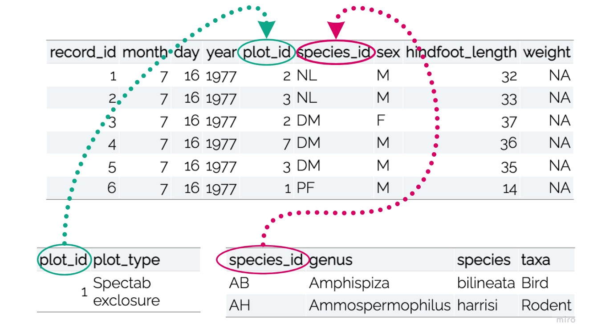
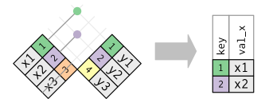
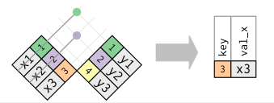

```{r, echo = FALSE, message = FALSE, warning = FALSE, fig.width = 8, fig.height = 6}
knitr::opts_chunk$set(message = FALSE, 
                      warning = FALSE, 
                      fig.align = "center")

library(xaringanthemer)
library(xaringan)
library(tidyverse)
library(kableExtra)
library(flair)

style_duo_accent(
  primary_color      = "#b76352", # mango
  secondary_color    = "#34605f", # bayberry
  header_font_google = google_font("Raleway"),
  text_font_google   = google_font("Raleway", "300", "300i"),
  code_font_google   = google_font("Source Code Pro"),
  header_color = "#793540", #rhubarb
  white_color = "#F5F5F5", # lightest color
  black_color = "#36454F", # darkest color
  text_font_size = "30px", 
  link_color = "#696969" #grey
)

surveys <- read_csv("data/surveys.csv")
plots <- read_csv("data/plots.csv")
species <- read_csv("data/species.csv")

```

class: inverse, center, middle

.larger[Relational Data]

--

.mango[.bitlarger[Mutating joins]] 

.large[*Adds information* from a new dataframe to observations in an existing dataframe
]

--

.mango[.bitlarger[Filtering joins]]

.large[*Filters observations* based on values in new dataframe
]

---

class: center, middle 

.larger[Keys]

.pull-left[
- Uniquely identifies an observation in a dataset

- Relate datasets to each other
]

.pull-right[

]

---

class: center



```{r, echo = FALSE}
surveys  |>  
  head() |> 
  kable() |> 
  kable_styling()
```

</br>

```{r, echo = FALSE, eval = FALSE}
plots |> 
  head(n = 1) |> 
  kable() |> 
  kable_styling()
```

```{r, echo = FALSE, eval = FALSE}
species |> 
  head(n = 2) |> 
  kable() |> 
  kable_styling()
```

---

class: center, middle

.larger[.rhubarb[Inner Join]]

Matches pairs of observations when "keys" are equal

```{r, echo = FALSE, out.width = "100%"}

```

---

class: center

.larger[**Mean Weights**]

```
surveys_weight <- surveys |> 
  group_by(species_id) |> 
  summarize(mean_weight = mean(weight))
```

```{r, echo = FALSE}
surveys_weight <- surveys |> 
  filter(!is.na(weight)) |> 
  group_by(species_id) |> 
  summarize(mean_weight = mean(weight)) 

surveys_weight |> 
  head() |> 
  kable() |> 
  kable_styling()

```

---

class: center

.larger[**Adding Information**]

```{r, eval = FALSE}
surveys_weight |> 
  inner_join(species, by = "species_id")
```

```{r, echo = FALSE}
surveys_weight |> 
  inner_join(species, by = "species_id") |> 
  head() |> 
  kable() |> 
  kable_styling()
```

--

**Would another mutating join resulted in the same dataset?**

---

.pull-left[
.larger[.honey[Mutating Joins]]

- Left Join: Everything is kept in the dataset **on the left**

- Right Join: Everything is kept in the dataset **on the right**

- Full Join: Everything is kept in **both** datasets

]

--

.pull-right[
</br>
   
]

---

class: center

.larger[.pink[Filtering Joins]]

.large[*Keeping Observations*]


.pull-left[
```{r, eval = FALSE}
surveys_weight |> 
  semi_join(species, by = "species_id")
```

```{r, echo = FALSE}
surveys_weight |> 
  semi_join(species, by = "species_id") |> 
  head(n = 5) |> 
  kable() |> 
  kable_styling()
```
]

.pull-right[

</br>
</br>

```{r, echo = FALSE, fig.width = 12, fig.height = 16}

```
]

---

class: center

.larger[.pink[Filtering Joins]]

.large[*Removing Observations*]

.pull-left[
```{r, eval = FALSE}
species |> 
  anti_join(surveys_weight, by = "species_id")
```

```{r, echo = FALSE}
species |> 
  anti_join(surveys_weight, by = "species_id") |> 
  select(species_id, species) |> 
  head(n = 3) |> 
  kable() |> 
  kable_styling()
```
]

.pull-right[

</br>
</br>

```{r, echo = FALSE}

```
]

---

class: middle

.larger[Connections to Data Cleaning]

--

Including observations with **`%in%`** 

```{r include, eval = FALSE, echo = FALSE}
surveys |> 
  filter(!species_id %in% c("BA", "DM", "DS")
         )
```

```{r, echo = FALSE}
decorate(x = "include", eval = FALSE) |> 
  flair(pattern = "%in%")
```

--

<center>

.bitlarger[Similar to **`semi_join()`**!]

---

class: middle

.larger[Connections to Data Cleaning]

--

Excluding observations with **`!%in%`**

```{r not-include, eval = FALSE, echo = FALSE}
surveys |> 
  filter(!species_id %in% c("AB", "AH", "AS")
         )
```

```{r, echo = FALSE}
decorate(x = "not-include", eval = FALSE) |> 
  flair(pattern = "%in%") |> 
  flair(pattern = "!")
```

<center>

.bitlarger[Similar to **`anti_join()`**!]
