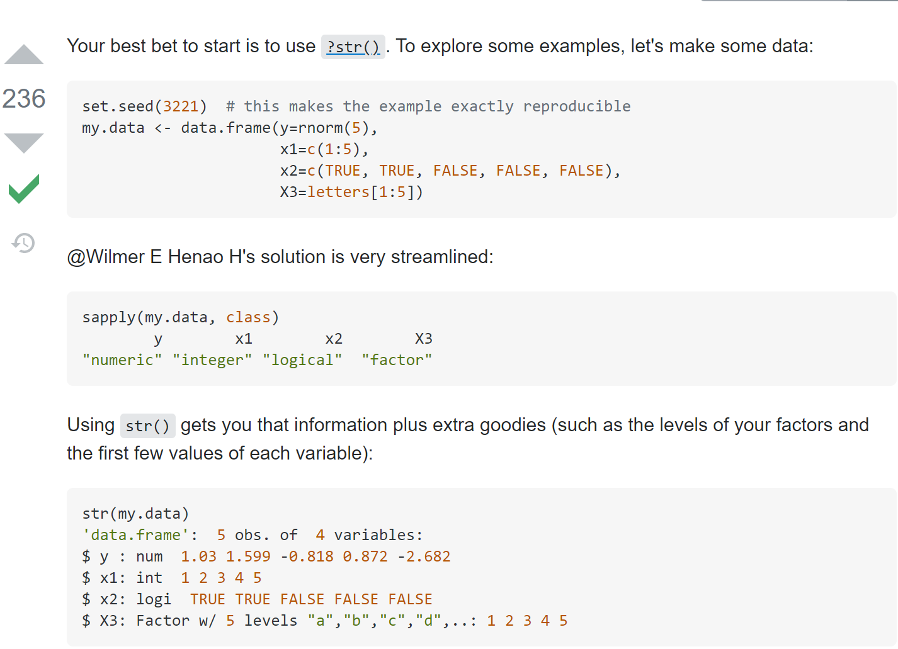
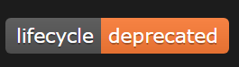

```{r, echo = FALSE, message = FALSE, warning = FALSE, fig.width = 8, fig.height = 6}
knitr::opts_chunk$set(message = FALSE, 
                      warning = FALSE, 
                      fig.align = "center")

library(xaringanthemer)
library(xaringan)
library(tidyverse)
library(kableExtra)

style_duo_accent(
  primary_color      = "#0F4C81", # pantone classic blue
  secondary_color    = "#B6CADA", # pantone baby blue
  header_font_google = google_font("Raleway"),
  text_font_google   = google_font("Raleway", "300", "300i"),
  code_font_google   = google_font("Source Code Pro"),
  text_font_size     = "30px"
)

surveys <- read_csv("data/surveys.csv")
plots <- read_csv("data/plots.csv")
species <- read_csv("data/species.csv")

```

class: inverse

.larger[Handy Helpers]


--


- .large[`rename()`]
  * Change names of columns

--

- .large[`separate()`] 
  * Separate values of a variable

---

class: inverse 

.larger[Semi- and Anti-Join]

--

.pull-left[ `semi_join()`
- Keeps values found in another dataset
]

--

.pull-right[ `anti_join()`
- Keeps values **not** found in another dataset
]

---

.larger[Some words about resources]

<center>


.pull-left[.larger[**Using**]]

.pull-right[.larger[**Learning**]]

---



---

.larger[Some words about deprecated functions]

--

.pull-left[
- `mutate_each()` 
- `funs()` 
- `gather()` & `spread()`
]

.pull-right[

]