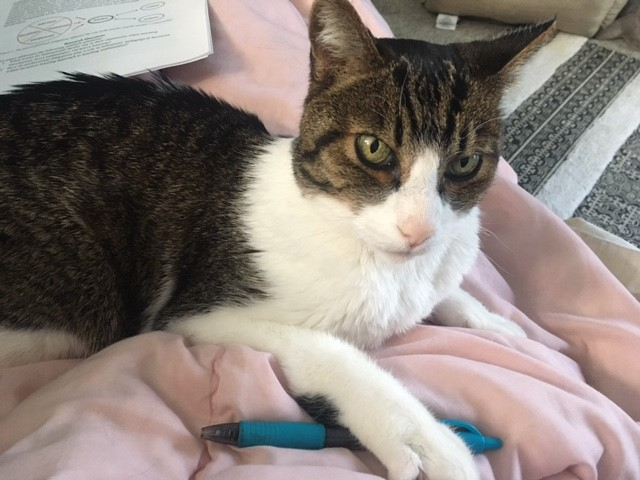
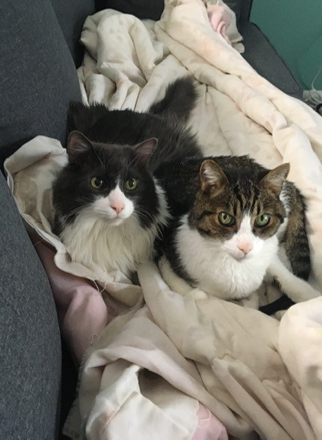
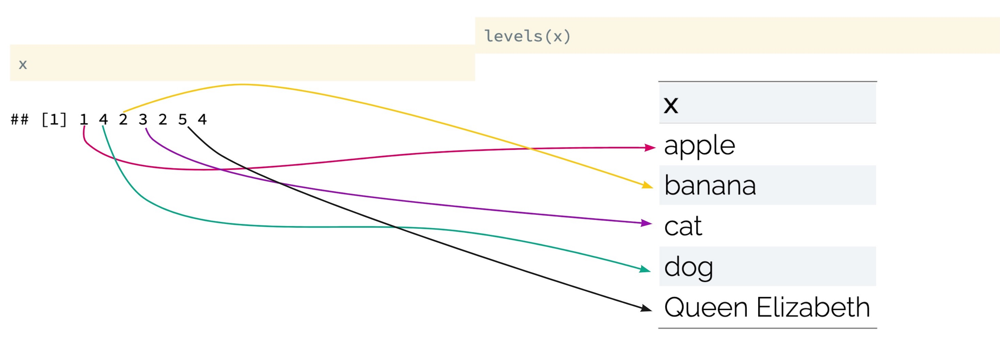
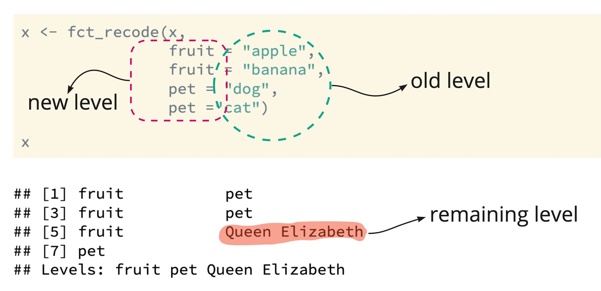
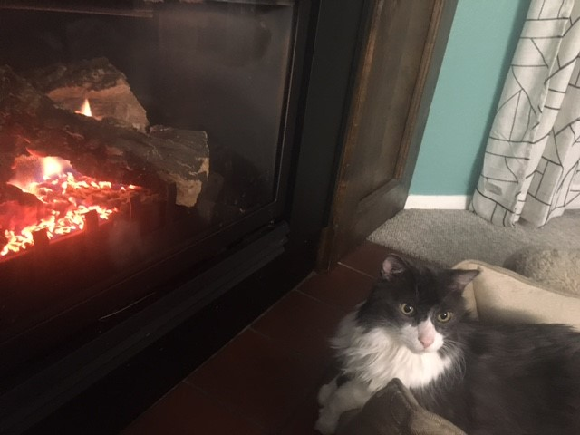

```{r, echo = FALSE, message = FALSE, warning = FALSE, fig.width = 8, fig.height = 6}
knitr::opts_chunk$set(message = FALSE, 
                      warning = FALSE, 
                      fig.align = "center")

options(htmltools.dir.version = FALSE)

library(xaringanthemer)
library(xaringan)
library(tidyverse)
library(tidyverse)
library(kableExtra)
library(palmerpenguins)

style_duo(
  primary_color = "#26116c",
  secondary_color = "#fd5e53",
  title_slide_text_color = "#fff8e7",
  header_font_google = google_font("Roboto"),
  text_font_google   = google_font("Roboto Condensed"),
  code_font_google   = google_font("Droid Mono"), 
  text_font_size     = "30px"
)
```

class: center, middle

# Setup

.pull-left[
Create a new R Markdown file, and load in the dataset `colleges_clean.csv`,
which is posted on the course site.

(This is a pre-cleaned version of the dataset from Practice Activity 2,
"Find the mystery college".)
]

.pull-right[

]
---

class: center, middle, inverse

.larger[Factors & forcats]

.pull-left[
```{r, echo = FALSE, out.width = "60%"}
  
```
]

.pull-right[
```{r, echo = FALSE, out.width = "70%"}
knitr::include_graphics("images/forcats.png")
```
]

---

.larger[Factors & Forcats]

.pull-left[
Common tasks:

* Turn a `character` or `numeric` variable into a factor

* Make a factor by discritizing / "binning" a numeric variable

* Rename or reorder the `levels` of an existing `factor`
]

--

.pull-right[
The packages `forcats` ("for categoricals") gives nice shortcuts for
wrangling categorical variables.
  * `forcats` loads with the `tidyverse`!
]
---

.larger[Create a `factor`]

```{r}
x <- c("apple", "dog", "banana", "cat", "banana", "Queen Elizabeth", "dog")

x
```

```{r}
x <- factor(x)

x

```

---

.larger[What happened?]



---

# Recoding



---

.larger[Try the following:]

</br>

```{r, eval = FALSE}

colleges_clean <- 
  colleges_clean %>%
  mutate(
    CONTROL = factor(CONTROL),
    Type = fct_recode(CONTROL, 
                      Public = "1", 
                      Private = "2")
  )
  
```

</br>
<center>
.large[**What did it do?**]

---

# Forcats Exploration

Find the `forcats` "cheatsheet" at https://resources.rstudio.com/rstudio-developed/factors

Use it to answer the following:

* What is the difference between `fct_relevel()` and `fct_recode()`?

* What is the difference between `fct_collapse()` and `fct_lump()`?

* What is the difference between `fct_reorder()` and `fct_inorder()`?

</br>

*Hint: Make up a couple of factors, and see what happens when you use these functions on them.*

---

class: center, middle

.pull-left[
.larger[Your Turn!]

Adjust the `REGION` variable to have clearer labels and / or better
categories.

]

.pull-right[

]

