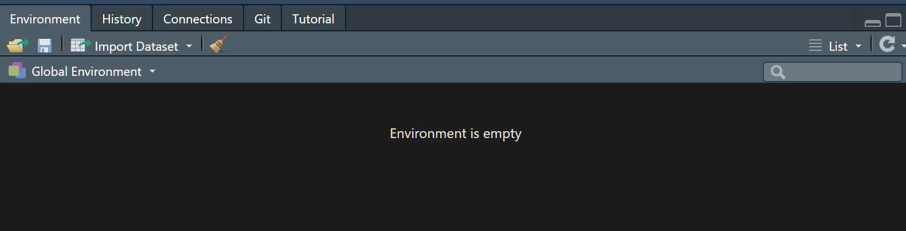

```{r, echo = FALSE, message = FALSE, warning = FALSE, fig.width = 8, fig.height = 6}
knitr::opts_chunk$set(message = FALSE, 
                      warning = FALSE, 
                      fig.align = "center")

options(htmltools.dir.version = FALSE)

library(xaringanthemer)
library(xaringan)
library(tidyverse)
library(tidyverse)
library(flair)

style_duo_accent(
  primary_color      = "#0F4C81", # pantone classic blue
  secondary_color    = "#B6CADA", # pantone baby blue
  header_font_google = google_font("Raleway"),
  text_font_google   = google_font("Raleway", "300", "300i"),
  code_font_google   = google_font("Source Code Pro"),
  text_font_size     = "30px"
)
```


.larger[Environments]

.pull-left[
* The top right pane of your RStudio shows you **environment**.

* This is the "current state" of the objects you've created.


]

--

.pull-right[
* The code inside the function executes in the **function environment**.

* It does not change your **global environment**.

<!-- * (When you knit a `.Rmd` file, it runs the code in another separate environment!) -->
] 

---

.larger[Searching...]

.pull-left[
```{r, error = TRUE}
add_two <- function() {
  
  x + 2
  
}

add_two()
```
]

.pull-right[
```{r}
x <- 10

add_two()
```
]

---

.larger[Returns]

Objects you make in the function don't affect "real life".

.pull-left[
```{r}
add_two <- function(x) {
  
  my_result <- x + 2
  
  return(my_result)
  
}

```
]

.pull-right[
```{r}

my_result <- 2000

add_two(5)

```
]

--

.pull-right[
```{r}
my_result
```
]


