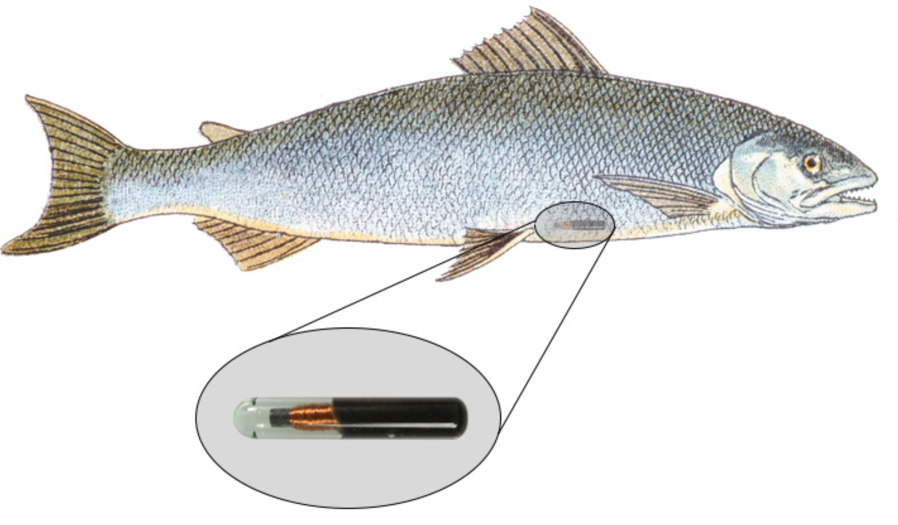

The goal of this lab is learn more about exploring missing data and to teach you
to write modular code. 

```{r global_options, include=FALSE}
knitr::opts_chunk$set(fig.width = 14, 
                      fig.height = 12, 
                      warning = FALSE, 
                      message = FALSE,
                      echo = FALSE)

```

```{r setup, include=FALSE}
library(tidyverse)
library(gridExtra)
library(ggtext)

fish <- read.csv(here::here("7_functions", "Lab", "BlackfootFish.csv"))
```

## The Data

This lab's dataset concerns mark-recapture data on fish from the Blackfoot
River, outside of Helena, Montana. 


Mark-recapture is a common method used by Ecologists to estimate an animal
population's size, when it is impossible to conduct a census (count every 
animal). This method works by "tagging" animals with a tracking device, so 
scientists can track their movement and / or presence. 

<div class="row">
  <div class="column">
```{r, eval = TRUE, echo = FALSE}
knitr::include_graphics("images/grizzly.jpg")
```
  </div>
  <div class="column">
```{r, eval = TRUE, echo = FALSE}
knitr::include_graphics("images/condor.jpg")
```
  </div>
  <div class="column">
```{r, eval = TRUE, echo = FALSE}

```
  </div>
</div>


You may download the `BlackfootFish.csv` dataset on Canvas.

## Part One: Summaries and Plots
## (Midterm Review)

### Task 1 -- Summarizing Missing Data

The measurements of each fish captured were taken by a Biologist on a raft. 
This lack of "laboratory setting" opens the door to the possibility of
measurement errors. 

- How many observations have missing values? 

- What variable(s) have missing values present? 

*Think about outputting both pieces of information in __one__ table!* 

```{r, include = FALSE}
fish %>% 
  summarize(across(
    .cols = everything(), 
    .fns = ~sum(is.na(.) == TRUE)
    )
  ) 
```

### Task 2 -- Visualizing Missing Data

Unfortunately, these missing values are not for only one `year`, `trip`, or
`section` of river. 

Create a thoughtful visualization exploring the frequency of missing values
across the different years, sections, and trips. 

```{r, include = FALSE}
fish %>% 
  filter(is.na(weight)) %>% 
  group_by(year, section, trip) %>% 
  count(is.na(weight)) %>% 
  mutate(trip = as.factor(trip), 
         year = as.factor(year)) %>% 
  ggplot(aes(y = year, x = n, fill = trip)) + 
  geom_col() + 
  facet_wrap(vars(section)) + 
  labs(y = "Sample Year", 
       x = "Number Missing", 
       fill = "Trip Number") +
  scale_fill_brewer(palette = "Paired") + 
  ggtitle(
    str_c("Missing Fish Weights for ",
      "<span style = 'color:#A6CEE3'>**Trip 1**</span>",
      " and <span style = 'color:#1F87B4'>**Trip 2**</span>",
      " on Blackfoot River"
    )
  ) + 
  theme(plot.title = ggtext::element_markdown(), 
        legend.position = "none")

```


<!-- ### Task 3 -->

<!-- Create a thoughtful visualization exploring how the number of fish captured  -->
<!-- differed each year, for each section of river.  -->

<!-- ```{r, include = FALSE, fig.show = 'hold', out.width = "50%"} -->

<!-- fish %>%  -->
<!--   group_by(year, section, species) %>%  -->
<!--   count() %>%  -->
<!--   mutate(year = as.factor(year)) %>%  -->
<!--   ggplot(aes(x = year, y = n, fill = species)) +  -->
<!--   geom_col(position = "fill") +  -->
<!--   facet_wrap(vars(section)) +  -->
<!--   labs(x = "Year of Sample",  -->
<!--        y = "Proportion of Fish Captured",  -->
<!--        fill = "Species of Fish") +  -->
<!--   theme(axis.text.x = element_text(angle = 60, hjust = 1)) -->

<!-- fish %>%  -->
<!--   group_by(year, section, species) %>%  -->
<!--   count() %>%  -->
<!--   mutate(year = as.factor(year)) %>%  -->
<!--   ggplot(aes(x = year, y = n, fill = species)) +  -->
<!--   geom_col(position = "fill") +  -->
<!--   facet_wrap(vars(section)) +  -->
<!--   labs(x = "Year of Sample",  -->
<!--        y = "Proportion of Fish Captured",  -->
<!--        fill = "Species of Fish") +  -->
<!--   theme(axis.text.x = element_text(angle = 60, hjust = 1)) -->

<!-- ``` -->


<!-- ### Task 3 -- Creating a Summary Table -->

<!-- Create a table displaying how the the mean `length` and `weight` for Westslope -->
<!-- Cutthroat Trout (WCT) varied over the different sampling years. The table should -->
<!-- have: -->

<!-- - different values of `year` as (separate) columns -->
<!-- - the median `length` and mean `weight` as (separate) rows  -->

<!-- ```{r, include = FALSE} -->
<!-- fish %>% -->
<!--   filter(species == "WCT") %>%  -->
<!--   group_by(year) %>%  -->
<!--   summarize(median_length = median(length, na.rm = TRUE),  -->
<!--             median_weight = median(weight, na.rm = TRUE)) %>%  -->
<!--   pivot_longer(cols = c(`median_length`, `median_weight`),  -->
<!--                names_to = "measurement",  -->
<!--                values_to = "value") %>%  -->
<!--   pivot_wider(names_from = year,  -->
<!--               values_from = value) -->
<!-- ``` -->

---

## Part Two:  Adjusting the Data (Function Writing)

If I wanted to rescale every quantitative variable in my dataset so
that the variables have values between 0 and 1. I could use the following
formula:  

</br>

$$y_{scaled} = \frac{y_i - min\{y_1, y_2,..., y_n\}}{max\{y_1, y_2,..., y_n\} 
- min\{y_1, y_2,..., y_n\}}$$

</br>

The following `R` code would carry out this rescaling procedure for the `length`
and `weight` columns of the data:  

\vspace{0.25cm}

```{r, echo = TRUE, eval = FALSE}
BlackfootFish$length <- (BlackfootFish$length - min(BlackfootFish$length, na.rm = TRUE)) /
  (max(BlackfootFish$length, na.rm = TRUE) - min(BlackfootFish$length, na.rm = TRUE))

BlackfootFish$weight <- (BlackfootFish$weight - min(BlackfootFish$weight, na.rm = TRUE)) /
  (max(BlackfootFish$weight, na.rm = TRUE) - min(BlackfootFish$length, na.rm = TRUE))
```  

This process of duplicating an action multiple times makes it difficult to
understand the intent of the process. Additionally, it makes it very difficult
to spot the mistakes. _Did you spot the mistake in the weight conversion?_ 

Often you will find yourself in the position of needing to find a function that 
performs a specific task, but you do not know of a function or a library that 
would help you. You could spend time Googling for a solution, but in the amount 
of time it takes you to find something you could have already written your own 
function!  


### Task 1 -- Writing a Function

Let's transform the repeated process above into a `rescale_01()` function.  

- The function should take a single vector as its input.
- The function should return the rescaled vector. 

*Think about the "efficiency" of your function. Are you calling the __same__ 
function multiple times?*

```{r, echo = FALSE}
rescale_01 <- function(x){
  rng <- range(x, na.rm = TRUE)
  scaled <-  (x - rng[1]) / (rng[2] - rng[1])
  return(scaled)
}
```


### Task 2 -- Adding Stops

Now, let's incorporate some checks into your function! Modify your previous code
to create the following checks: 

- the function should stop if the input vector is not numeric
- the function should stop if the length of the vector is not greater than 1 

```{r, echo = FALSE}
rescale_01 <- function(x){
  stopifnot(is.numeric(x), 
            length(x) > 1)
  
  rng <- range(x, na.rm = TRUE)
  scaled <-  (x - rng[1]) / (rng[2] - rng[1])
  return(scaled)
}
```

*No need to write code here, simply add these stops to your code from Task 1!*


### Task 3 - Performing a Simple Test

First, test your function on a simple vector. Verify that the maximum of your 
rescaled vector is 1 and the minimum is 0!

```{r, echo = TRUE}

x <- c(1:25, NA)

```

### Task 4 - Performing a More Difficult Test

Next, let's test the function on the `length` column of the `BlackfootFish`
dataset.

- Make side-by-side plots of the original values of `length` and the rescaled
values of `length`. 

*Hint:* The **gridExtra** package has a `grid.arrange()` function that allows 
for you to arrange multiple `ggplot()` objects into rows and columns. Or, you 
can play around with the `fig.show` and `out.width` options of your code chunk (<https://bookdown.org/yihui/rmarkdown-cookbook/figures-side.html>). 

```{r, include = FALSE}
original <- fish %>% 
  ggplot(aes(x = length)) + 
  geom_histogram(binwidth = 45)

scaled <- fish %>% 
  mutate(length_scaled = rescale_01(length)) %>%  
  ggplot(aes(x = length_scaled)) + 
  geom_histogram(binwidth = .04)


grid.arrange(original, scaled, nrow = 1)

```
        
### Task 5 -- Incorportaing Variables

Suppose you would for your `rescale()` function to perform operations on a 
variable within a dataset. Ideally, your function would take a dataframe and a
variable name as inputs and return a dataframe where the variable has been
rescaled.

Create a `rescale_column()` that accepts two arguments, (1) a dataframe, and 
(2) the name(s) of the variable(s) to be rescaled. The body of the function
should call the original `rescale_01()` function you wrote previously.

```{r, include = FALSE}

rescale_column <- function(data, variables){
  data %>% 
    mutate(
      across(.cols = {{variables}}, 
             .fns = rescale_01)
    )
}
```

### Task 6 -- Another Function Test

Alright, now let's put your `rescale_column()` function to work! Use 
your `rescale_column()` function to rescale **both** the `length` and `weight` 
columns. 

**I expect that you only call the `rescale()` function _one_ time!**  

---

## Challenge: Incorporating Multiple Inputs

A frequently used measurement for fish health is a "condition index." 
[(Wikepedia article)](https://en.wikipedia.org/wiki/Condition_index_in_fish) The
following simple equation can be used to calculate the approximate condition 
index of a fish:

$$\text{condition index} = \frac{weight}{length^3} \times 100$$
```{r, echo = FALSE, eval = FALSE}
find_condition <- function(data, length_var, weight_var){
  data %>% 
    mutate(condition := 
             ( {{ weight_var}} / ({{ length_var }} ^ 3) ) * 100
    )
}
```


### Part 1 

Write a function which calculates the condition index of a fish, given inputs
of weight and length. 

*Consider whether your function will accept vectors as inputs or if it will 
accept variable names as inputs!*

### Part 2 

Make a thoughtful visualization of how fish conditions have varied over the 
duration of this study. 

```{r, echo = FALSE, eval = FALSE}
fish <- find_condition(fish, length, weight)

fish %>% 
  ggplot(aes(y = condition, x = year)) + 
  geom_jitter()
```


---

## Think Out Loud Recording

Walk through the components of your condition function. Be sure to describe 
what each part is doing! 

