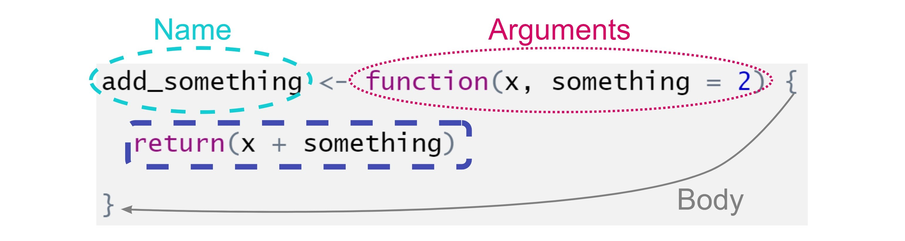
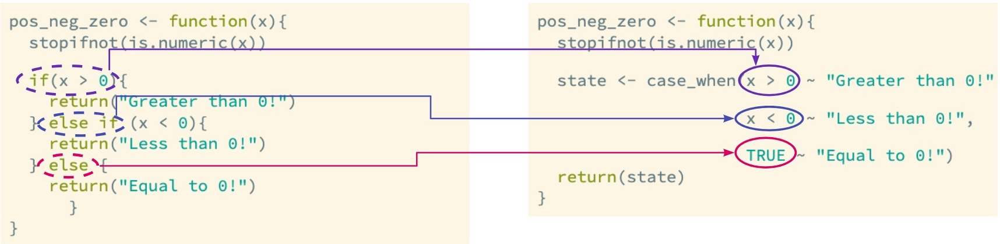

```{r, echo = FALSE, message = FALSE, warning = FALSE, fig.width = 8, fig.height = 6}
knitr::opts_chunk$set(fig.align = "center")

options(htmltools.dir.version = FALSE)

library(xaringanthemer)
library(xaringan)
library(tidyverse)


style_duo_accent(
  primary_color      = "#0F4C81", # pantone classic blue
  secondary_color    = "#B6CADA", # pantone baby blue
  header_font_google = google_font("Raleway"),
  text_font_google   = google_font("Raleway", "300", "300i"),
  code_font_google   = google_font("Source Code Pro"),
  text_font_size     = "30px"
)

my_vec <- c(7, 8, 9, 3)
```

class: inverse, center, middle

.larger[Becoming R Developers!]

---

class: middle, center

.larger[Why write functions?]

--

Don't Repeat Yourself

Less Error Prone

<!-- You can give a function an evocative name that makes your code easier to understand. -->

<!-- You eliminate the chance of making incidental mistakes when you copy and paste -->

Efficient

<!-- As requirements change, you only need to update code in one place, instead of many. -->

---

class: center, middle, inverse

.larger[Function Components]



---

class: inverse, center, middle

.huge[`print()` versus `return()`]

---

<center>

.larger[`return()`]

</center> 
</br>

.pull-left[
```{r}
add_something <- function(x, something = 2) {

  return(x + something)
  
}
```
]

--

.pull-right[
```{r}
add_something(7, 4)

```
]

---

<center>

.larger[`print()`]

</center> 
</br>

.pull-left[
```{r}
add_something <- function(x, something = 2) {

  print(x + something)
  
}
```
]

--

.pull-right[
```{r}
add_something(7, 4)

```
]

---

class: middle, inverse

.larger[Can you `print()` *and* `return()`?] 

--

```{r}
add_something <- function(x, something = 2) {
  
  if (x == 4) {
    
    print("I love 4s!")
    
  }
  
  return(x + something)
  
}
```

---

class: middle

.larger[Returning Errors!]

--

```{r}
add_something <- function(x, something = 2) {
  
  if (!is.numeric(x)) {
    
    stop("Please enter a number!")
    
  }
  
  return(x + something)
  
}
```

--

```{r, error = TRUE}
add_something("bob")
```


---

class: middle

.pull-left[
.bitlarger[How would you check if *both* `x` and `something` were numeric?]
]

.pull-right[
```{r}
add_something <- function(x, something = 2) {
  
  if (!is.numeric(x)) {
    
    stop("Please enter a number!")
    
  }
  
  return(x + something)
  
}
```
]

---

class: center, middle, inverse

.huge[Vectorizing]

---

class: center 

.larger[`times_three()`]

.pull-left[
```{r}
times_three <- function(x){
  stopifnot(is.numeric(x))
  
  if(x == 3){
    print("I love threes!")
  }
  return(x * 3)
}

```
]

.pull-right[

**What happens when you run this?**

```{r, eval = FALSE}
my_vec <- c(7, 8, 9, 3)

times_three(my_vec)
```
]

--

```
Error in if (x == 3) { : the condition has length > 1
```

---

.larger[Vectorized Conditions]

.pull-left[
`if()` and `elseif()` take one input  

That means, they **are not** "vectorized"  
]

--

.pull-right[
`if_else()` and `ifelse()` can take a vector of inputs  

That means, they **are** "vectorized"  
]

---

.larger[`if_else()`]

- Lives in the **dplyr** package 

--

- Requires `TRUE` and `FALSE` to be the **same** data type

--

```{r, error = TRUE}
fix_na <- function(x) {
  if_else(x %in% c(997, 998, 999), NA, x)
}

test <- c(995, 997, 1000, 999)

fix_na(test)
```

---

.larger[A family of `NA`s]

If your `FALSE` data type is numerical, then your `TRUE` data type must be 
numerical! 

--

.pull-left-wide[
```{r}
fix_na <- function(x) {
  if_else(x %in% c(997, 998, 999), NA_real_, x)
}

fix_na(test)
```
]

--

.pull-right-narrow[
Other options within the `NA` family:

- `NA_character_`
- `NA_integer_`
- `NA_complex_`
]

---

.larger[Multiple Checks]

```{r}
pos_neg_zero <- function(x){
  stopifnot(is.numeric(x))
  
  if(x > 0){
    return("Greater than 0!")
  } else if (x < 0){
    return("Less than 0!")
  } else {
    return("Equal to 0!")
      }
}
```

--

```{r}
pos_neg_zero(3)
```


---

.larger[Vectorized Multiple Checks]



```{r, echo = FALSE}
pos_neg_zero <- function(x){
  stopifnot(is.numeric(x))
  
  state <- case_when(x > 0 ~ "Greater than 0!", 
                     
                     x < 0 ~ "Less than 0!", 
                     
                     TRUE ~ "Equal to 0!")
  return(state)
}
```

---

.larger[Try it out!]

--

```{r}
check <- c(0, 1, -1)

pos_neg_zero(check)
```