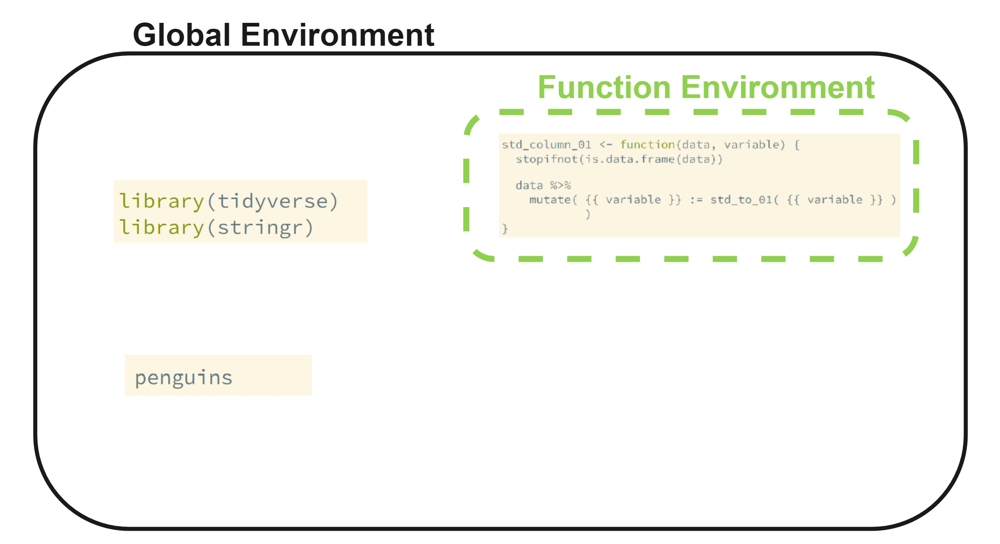
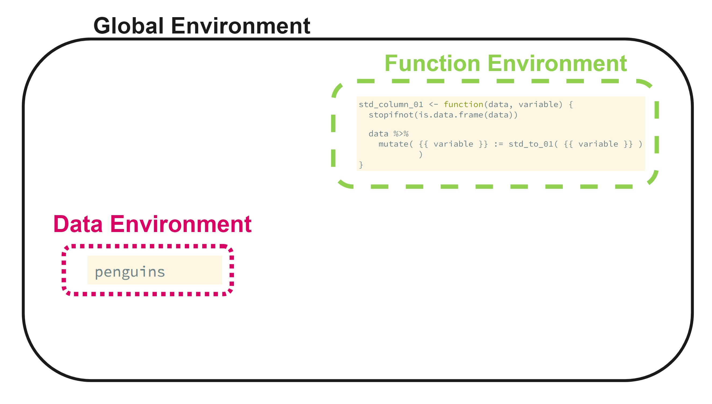
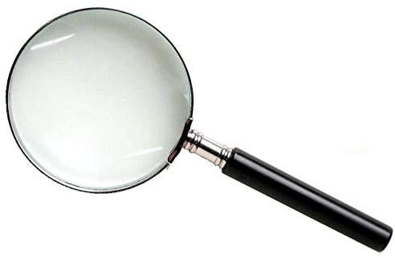

```{r, echo = FALSE, message = FALSE, warning = FALSE}
# R options
options(
  htmltools.dir.version = FALSE,
  tibble.width = 65,
  width = 65
  )

# figure height, width, dpi
knitr::opts_chunk$set(fig.width = 8, 
                      fig.asp = 0.618,
                      out.width = "60%",
                      dpi = 300, 
                      warning = FALSE, 
                      message = FALSE)

# fontawesome
htmltools::tagList(rmarkdown::html_dependency_font_awesome())

# magick
dev.off <- function(){
  invisible(grDevices::dev.off())
}

# xaringanExtra
library(xaringanExtra)
xaringanExtra::use_panelset()

library(emo)
library(tidyverse)
library(ggridges)
library(flair)
library(gridExtra)
library(kableExtra)
library(png)
library(palmerpenguins)

options(show.signif.stars = FALSE)
```

```{r set-theme, include = FALSE}
library(xaringanthemer)
style_duo_accent(
  primary_color      = "#b76352", # mango
  secondary_color    = "#34605f", # bayberry
  header_font_google = google_font("Raleway"),
  text_font_google   = google_font("Raleway", "300", "300i"),
  code_font_google   = google_font("Source Code Pro"),
  header_color = "#793540", #rhubarb
  white_color = "#F5F5F5", # lightest color
  black_color = "#36454F", # darkest color
  text_font_size = "30px", 
  link_color = "#696969" #grey
)
```

class: middle, inverse

.larger[Standardizing Between 0 and 1]


```{r}
std_to_01 <- function(var) {
  stopifnot(is.numeric(var))
  
  num <- var - min(var, na.rm = TRUE)
  denom <- max(var, na.rm = TRUE) - min(var, na.rm = TRUE)
  
  return(num / denom)
}
```

--

<center>

.large[*Could our function be more efficient?*]

---

class: middle

.huge[Still...] 

.large[**We haven't eliminated copy-and-pasting!**] 

```{r, eval = FALSE}
penguins %>% 
  mutate(bill_length_mm = std_to_01(bill_length_mm), 
         bill_depth_mm = std_to_01(bill_depth_mm), 
         flipper_length_mm = std_to_01(flipper_length_mm), 
         body_mass_g = std_to_01(body_mass_g)
  )
```

--

<center>

**What should we do?** 


---

class: middle

.huge[Familiar Option]

--

<center>

.larger[`across()`]

</center>

```{r}
penguins %>% 
  mutate(across(.cols = bill_length_mm:body_mass_g,
                .fns = std_to_01)
  )
```

---

class: inverse, center, middle

.huge[New Option]

--

.larger[.honey[Variables as Arguments!]]

---

.larger[Let's give it a try!]

```{r stdcol}
std_column_01 <- function(data, variable) {
  stopifnot(is.data.frame(data) & is.numeric(variable))
  
  data <- data %>%
    mutate(
      variable = std_to_01(variable)
    )
  return(data)
}
```

--

</br>
<center>
Notice how I relied on the existing function `std_to_01()` inside the new
function, for clarity!

---

.huge[Alas...]

```{r, error = TRUE}
std_column_01(penguins, body_mass_g)
```

--

<center>

.larger[**What happened?**]

---

class: middle 

.larger[Tidy evaluation]

Functions that use **unquoted** variable names as arguments are called
***nonstandard evaluation*** or ***tidy evaluation***.

--


.pull-left[
**Tidy**:

```{r, eval = FALSE}
penguins %>% pull(body_mass_g)
```


```{r, eval = FALSE}
penguins$body_mass_g
```
]

--

.pull-right[
**Untidy**: 

```{r, eval = FALSE}
penguins["body_mass_g"]
```


```{r, eval = FALSE}
penguins[["body_mass_g"]]
```
]

---

class: middle, center, inverse

.huge[.hand[What to do?]]

---

.larger[Option 1 `r emo::ji("shrug")`] 

--

</br>

.bitlarger[**Just don't use it in your functions.**]

</br>

.bitlarger[**Harder to read / use, but safe.**]

---

```{r}
std_column_01 <- function(data, variable) {
  stopifnot(is.data.frame(data) & is.character(variable))
  
  data[[variable]] <- std_to_01(data[[variable]])
  return(data)
}

std_column_01(penguins, "bill_length_mm")
```

---

.larger[Option 2 -- Tunnel] 

--

.pull-left[


In February 2020 **rlang** introduced the "injection" `{{ }}` operator to
simplify writing functions around tidyverse pipelines. 
]

--

.pull-right[
With the `{{ }}` operator you can tunnel data-variables (i.e. columns
from the data frames) through function arguments! 

</br> 

**This only works for `select()` type functions, that use the literal name of
the variable to subset the data.**
]

---

.larger[Recall Our Broken Function]

.pull-left[

```{r, error = TRUE}
std_column_01 <- function(data, variable) {
  data <- data %>%
    mutate(
      variable = std_to_01(variable)
    )
  return(data)
}

std_column_01(penguins, body_mass_g)
```
]

.pull-right[

The problem here is that `mutate()` defuses the R code it was supplied. 

Instead we want it to see `body_mass_g = standardize(body_mass_g)`. 

**This is why we need injection!**

]

---

```{r tunnel, eval = FALSE, echo = FALSE, error = TRUE}
std_column_01 <- function(data, variable) {
  stopifnot(is.data.frame(data))
  
  data %>%
    mutate( {{ variable }} = std_to_01( {{ variable }} )
            )
}
```

```{r, echo = FALSE}
decorate("tunnel", eval = FALSE) %>%
  flair("{{ variable }}")
```

--

.pull-left[
```{r, error = TRUE, echo = FALSE}
std_column_01 <- function(data, variable) {
  stopifnot(is.data.frame(data))
  
  data %>%
    mutate( {{ variable }} = std_to_01( {{ variable }} )
            )
}
```
]

.pull-right[
.huge[
`r emo::ji('sad')`
]
]

---

.larger[The `:=` Operator `r emo::ji('smile')` ]

.pull-left-narrow[

The left hand side of `=` is also diffused! 


<!-- R is very strict about the kind of expressions supported on the LHS of `=`. -->

The "walrus operator" `:=` is an alias of `=`.  

You can use it to supply names, e.g. a := b is equivalent to a = b. 

]

--

.pull-right-wide[

</br>

```{r}
std_column_01 <- function(data, variable) {
  stopifnot(is.data.frame(data))
  
  data %>%
    mutate( {{ variable }} := std_to_01( {{ variable }} )
            )
}
```
]

---

.larger[What if I want to modify multiple columns?]

--

.pull-left-narrow[
</br>
</br>
.large[Our friend `across()`!]

]

--

.pull-right[

```{r}
std_column_01 <- function(data, variables) {
  stopifnot(is.data.frame(data))
  
  data %>%
    mutate( 
      across(
      .cols = {{ variables }}, 
      .fns = std_to_01
      )
    )
}
```
]

--

```{r, eval = FALSE}
std_column_01(penguins, bill_length_mm:body_mass_g)
```

---

class: center, middle, inverse

.larger[Alright, I buy this, but what is .honey[*actually*] happening when you tunnel?]

---

class: center, middle

.larger[R Environments]

In normal R programming objects are defined in the current environment, for 
instance in the global environment or the environment of a function.

--

```{r, echo = FALSE, out.height = "50%"}

```

<!-- If evaluation was performed only in the dataframe, we'd lose track of these -->
<!-- objects and functions necessary to perform computations! -->

---

class: center, middle

.larger[Data Masking]

To keep these objects and functions in scope, the data frame is inserted at the bottom of the current chain of environments. It comes first and has precedence over the user environment. In other words, it masks the user environment.

```{r, echo = FALSE, out.height = "50%", fig.align = 'center'}

```

---

.larger[Environment Pronouns]

Masking blends the data and the user environment, giving priority to the
data environment. 

So, R can sometimes use a dataframe column when you really intended to use a
local object.

--

.pull-left[
```{r}
cyl <- seq(from = 1, 
           to = 1000, 
           by = 2)

summarise(mtcars, mean(cyl))

```
]

--

.pull-right[
```{r}
mtcars %>%
  dplyr::summarise(
    mean_data = mean(.data$cyl),
    mean_env = mean(.env$cyl)
  )

```
]

---

class: center, middle, inverse

.huge[Missing Data]

--

.huge[.honey[are important!]]

---

class: center, middle

.pull-left[
.huge[Looking for Patterns]
]

.pull-right[

]

---

.larger[Assumptions when Removing]

--

**Without inspection:** 

> Observations are "missing **completely** at random" 

<!-- When observations of a variable are missing completely at random, the missing observations are a random subset of all observations; the missing and observed values will have similar distributions. -->

</br>

--

**With information about the "missingness":** 

> Observations are "missing at random"

<!-- Missing at random means there might be systematic differences between the missing and observed values, but these can be entirely explained by other observed variables. -->


---

class: middle, center

.larger[.rhubarb[For example]]

--

.large[.bayberry[If] fish length measurements are missing at random,
conditional on month, year, and river section,]

--

.large[.rhubarb[then] the distributions of lengths will be similar for fish
of the same month, year, and river section.]

---

class: inverse, center, middle

.huge[Scaling Variables]

---

class: middle

.pull-left[

.larger[Why Scale?]

- (More) difficult to compare 

- (More) difficult to model 
]

--

.pull-right[

.larger[Why not Scale?]

- Difficult to interpret
]

---

.larger[Some Interesting Reads]

[Article on How Building Functions with Variable Names has Changed Over the Years](https://www.bryanshalloway.com/2020/06/25/using-across-to-build-functions-with-dplyr-with-notes-on-legacy-approaches/)

[**rlang** Article on Data Masking ](https://rlang.r-lib.org/reference/topic-data-mask.html)
