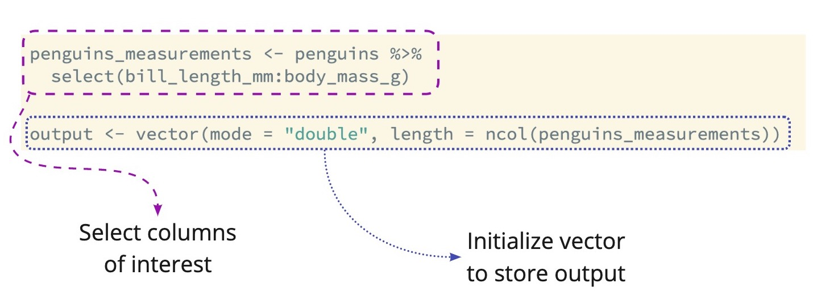
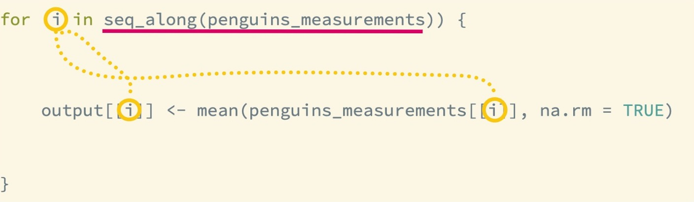
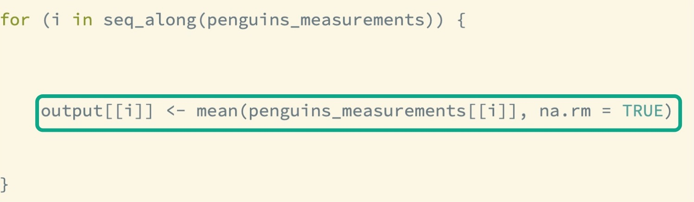

```{r, echo = FALSE, message = FALSE, warning = FALSE, fig.width = 8, fig.height = 6}
knitr::opts_chunk$set(message = FALSE, 
                      warning = FALSE, 
                      fig.align = "center")

options(htmltools.dir.version = FALSE)

library(xaringanthemer)
library(xaringan)
library(tidyverse)
library(flair)
library(palmerpenguins)

style_duo_accent(
  primary_color = "#26116c",
  secondary_color = "#fd5e53",
  title_slide_text_color = "#85858C",
  header_font_google = google_font("Raleway"),
  text_font_google   = google_font("Raleway", "300", "300i"),
  code_font_google   = google_font("Source Code Pro"),
  text_font_size     = "30px"
)
```

class: inverse

.larger[A good first step: `for()` loops]

---

.larger[`for()` loop pieces]

.pull-left[
- **Output**: initialize object to store output
  * Cannot create inside the loop! 
]

--

.pull-left[
- **Sequence**: what indices to loop over 
  * Typically uses `i` to increment indices 
]

--

</br>
<center>

**Body**: what happens at each iteration  
Run repeatedly for each value of `i`

---

.larger[Set-up]



```{r, include = FALSE}
penguins_measurements <- penguins %>% 
  select(bill_length_mm:body_mass_g)


output <- vector(mode = "double", length = ncol(penguins_measurements))

```

---

.larger[The Index]



---

.larger[The Body]



```{r, include = FALSE}
for (i in seq_along(penguins_measurements)) {
    output[[i]] <- mean(penguins_measurements[[i]], na.rm = TRUE)
}
```


---

class: inverse

<center>
.larger[Loops]
</center>

.pull-left[
.bitlarger[**Pros**]

- Easy to understand

- See what happens at each step 

- Can be embedded in a function

- Can handle recursion & unknown sequence lengths
]

--

.pull-right[
.bitlarger[**Cons**]

- A little messy to read

- Not always necessary

- A bit slower
]
