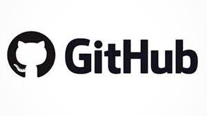
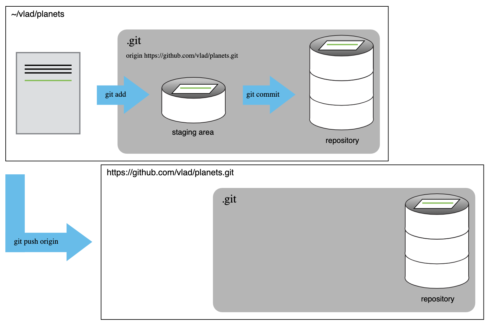
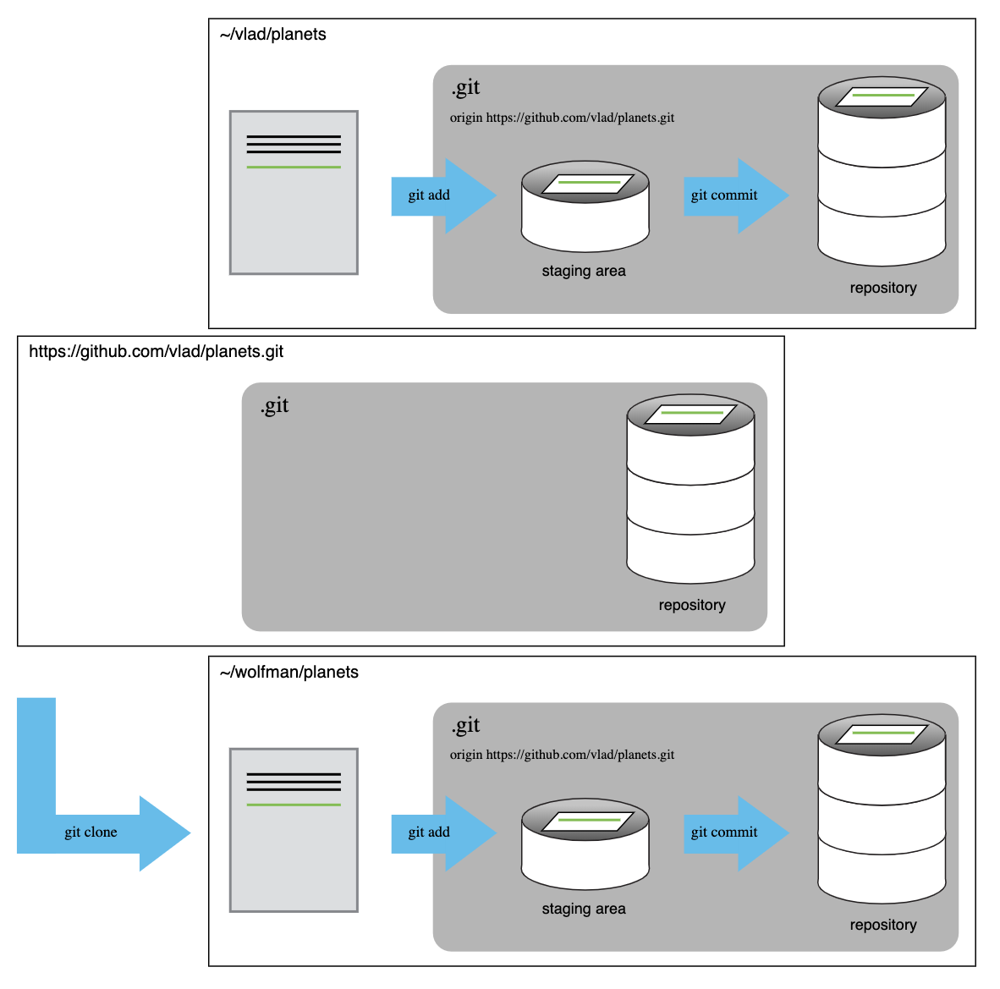

```{r, echo = FALSE, message = FALSE, warning = FALSE, fig.width = 8, fig.height = 6}
knitr::opts_chunk$set(fig.align = "center")

options(htmltools.dir.version = FALSE)

library(xaringanthemer)
library(xaringan)
library(tidyverse)


style_duo_accent(
  primary_color      = "#0F4C81", # pantone classic blue
  secondary_color    = "#B6CADA", # pantone baby blue
  header_font_google = google_font("Raleway"),
  text_font_google   = google_font("Raleway", "300", "300i"),
  code_font_google   = google_font("Source Code Pro"),
  text_font_size     = "30px"
)
```

class: inverse

.pull-left[
 

- Language for version control
- Developed by Linus Torvalds
- Uses command line or GUI
]


.pull-right[

- Cloud-based hosting service
- Basic services are free
- Advanced services are paid 
(Similar to RStudio) 
]

---

.larger[Git Workflow]

```{r, echo = FALSE, out.width = "50%"}
knitr::include_graphics("images/working_github.jpeg")
```

---

.larger[Making Changes]

```{r, echo = FALSE, out.width = "60%"}
knitr::include_graphics("images/add_files.png")
```

---

.larger[Local vs. Remote]

```{r, echo = FALSE, out.width = "60%"}

```

---

.pull-left-narrow[
.larger[Collab- 
orating]
]

.pull-right-wide[
```{r, echo = FALSE, out.width = "80%"}

```
]
