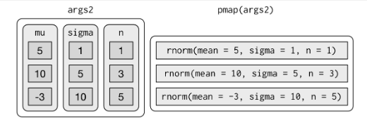

```{r, echo = FALSE, message = FALSE, warning = FALSE, fig.width = 8, fig.height = 6}
knitr::opts_chunk$set(fig.align = "center", 
                      message = FALSE, 
                      warning = FALSE)

options(htmltools.dir.version = FALSE)

library(xaringanthemer)
library(xaringan)
library(tidyverse)
library(flair)
library(palmerpenguins)

style_duo_accent(
  primary_color      = "#0F4C81", # pantone classic blue
  secondary_color    = "#B6CADA", # pantone baby blue
  header_font_google = google_font("Raleway"),
  text_font_google   = google_font("Raleway", "300", "300i"),
  code_font_google   = google_font("Source Code Pro"),
  text_font_size     = "30px"
)
```


class: center, middle, inverse

.huge-text[What is `pmap()` doing?]

---



---

class: center, middle, inverse

.huge-text[Where are we going today?]

---

.bitlarger[Step 1 -- Write a `sing_day()` function]

--

.bitlarger[Step 2 -- Iterate your `sing_day()` function over a set of days]

--

.bitlarger[Step 3 -- Style you output!]


