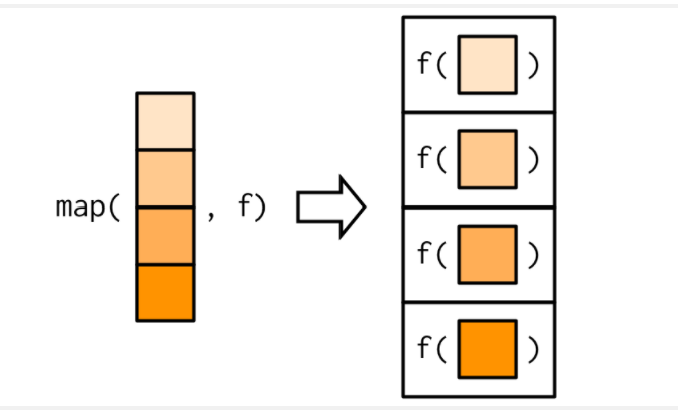
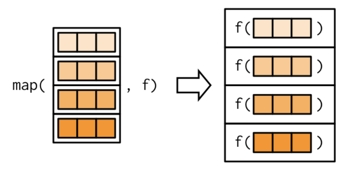
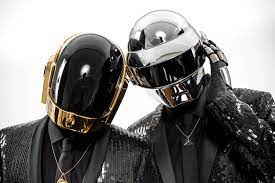
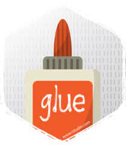

```{r, echo = FALSE, message = FALSE, warning = FALSE, fig.width = 8, fig.height = 6}
knitr::opts_chunk$set(fig.align = "center", 
                      message = FALSE, 
                      warning = FALSE)

options(htmltools.dir.version = FALSE)

library(xaringanthemer)
library(xaringan)
library(tidyverse)
library(flair)
library(palmerpenguins)

style_duo_accent(
  primary_color      = "#0F4C81", # pantone classic blue
  secondary_color    = "#B6CADA", # pantone baby blue
  header_font_google = google_font("Raleway"),
  text_font_google   = google_font("Raleway", "300", "300i"),
  code_font_google   = google_font("Source Code Pro"),
  text_font_size     = "30px"
)
```


class: inverse, center, middle

.larger[Iteration]

</br> 
</br> 

<center>

.bitlarger[**Repeat the _same_ operation multiple times**]

---

class: inverse, center, middle

.bitlarger[.hand[Why not just use loops?]]

--

R is a functional programming language!  

This makes it possible to wrap up loops into a function and call that function
instead! 

---

class: inverse, middle

.larger[The `map()` family]

.pull-left-narrow[

]

--

.pull-right-wide[
```{r, eval = FALSE}
simple_map <- function(x, f, ...) {
  out <- vector(mode = "list", length = length(x))
  for (i in seq_along(x)) {
    out[[i]] <- f(x[[i]], ...)
  }
  out
}
```

]

---

class: middle

.larger[Summary Statistics]

--

.pull-left[
.large[**Familiar**]

```{r, eval = FALSE}
penguins %>% 
  summarize(
    across(
      .cols = where(is.numeric), 
      .fns = mean, 
      na.rm = TRUE
    )
  )
```

What type of output does this produce?

]

--

.pull-right[
.large[**New**]
```{r, eval = FALSE}
penguins %>% 
  select(where(is.numeric)) %>% 
  map_dbl(mean, na.rm = TRUE)
```

What type of output does this produce?

]

---

class: middle, inverse, center

.bitlarger[What is `map_dbl()` doing?]


--



--

.large[**What length of output can `f()` produce?**]

---

class: middle

.larger[Data Wrangling]

--

.pull-left[
.large[**Familiar**]
```{r, eval = FALSE}
penguins %>% 
  mutate(
    across(
      .cols = where(is.numeric), 
      .fns = scale
    )
  )
```

What type of output does this produce?

]

--

.pull-right[
.large[**New**]
```{r, eval = FALSE}
penguins %>% 
  map_if(is.numeric, scale)
```

What type of output does this produce?

]

---

class: center, middle, inverse

.bitlarger[.hand[So why use `map()` and not just use `across()`?]]

--

</br> 

.bitlarger[Not all functions are vectorized! ]

---

class: middle

.larger[Where we are headed...]

--

```{r, eval = FALSE}
sims %>% 
  map( 
    ~ lm(bill_length_mm ~ ., data = .)
      ) %>% 
  map(summary) %>% 
  map_dbl( ~ .$r.squared)
```

---

class: inverse, center, middle

.larger[Today's Lab]

</br> 

--

.larger[**Making a Song!**]

---

.larger[A (Boring) Example]

.pull-left[

]

.pull-right[
.bitlarger[**_Around the World_**]
]

--

</br> 
<center>

Repeats "Around the World" for the duration of the song (144 times)

---

.larger[A Boring `map()`]

```{r map-bore, echo = FALSE}
around_the_world <- function(n){
  lyrics <- map_chr(1:n, ~ "Around the World") 
  
  return(
    glue::glue("{lyrics}") 
    )
}
```

```{r, echo = FALSE}
decorate_chunk("map-bore") %>% 
  flair(pattern = "map_chr")
```

---

.larger[Let's Break it Apart]

```{r map1, eval = FALSE, echo = FALSE}
map_chr(1:n, ~ "Around the World") 
```

```{r, echo = FALSE}
decorate_chunk("map1", eval = FALSE)
```

---

.larger[A Handy Friend]

.pull-left[
**glue** -- "interprets string literals that are small, fast, and 
dependency-free" 

- glue does this by embedding `R` expressions in curly braces which are then
evaluated and inserted into the argument string.
]

.pull-right[
```{r, echo = FALSE, out.width = "30%"}

```

```{r}
library(glue)
name <- "Fred"
glue('My name is {name}.')
```
]

---

class: inverse

.larger[Around the World]

.pull-left-wide[
```{r glue, echo = FALSE}
around_the_world <- function(n){
  lyrics <- map_chr(1:n, 
                ~ "Around the World") 
  
  return( glue::glue("{lyrics}") )
}
```

```{r, echo = FALSE}
decorate_chunk("glue") %>% 
  flair(pattern = "glue::glue")
```


- Long strings are broken by line and concatenated together.

]

--

.pull-right-narrow[

```{r}
around_the_world(4)
```
]

---

.larger[A Better Example]

</br> 

<center>
.bitlarger[**99 Bottles of Beer**] 

</br> 

99 bottles of beer on the wall, 99 bottles of beer.
Take one down, pass it around, 98 bottles of beer on the wall...

---

.larger[Making Lyrics]

```{r}
bottles_lyrics <- function(n){
  lyrics <- glue::glue("{n} bottles of beer on the wall, {n} bottles of beer \nTake one down, pass it around, {n -1} bottles of beer on the wall")
  
  return(lyrics)
}

bottles_lyrics(3)
```


---

.larger[Making a Song]


```{r map-exciting, echo = FALSE}
bottles_song <- function(n){
  song <- map_chr(n:0, bottles_lyrics)
  return(
    glue::glue("{song}")
  )
}
```

```{r, echo = FALSE}
decorate_chunk("map-exciting")
```


---

.larger[What we wanted?]

```{r}
bottles_song(3)
```


---

.larger[But what about the end?]

<center>

.large[
**No more bottles of beer on the wall, no more bottles of beer.  
Go to the store and buy some more, 99 bottles of beer on the wall...**
]

---

.larger[An Alternate Ending]

```{r}
bottles_lyrics <- function(n){
  
  if(n == 0){
    lyrics <- glue::glue("No more bottles of beer on the wall, no more bottles of beer. \nGo to the store and buy some more, 99 bottles of beer on the wall")
    
  } else{
  lyrics <- glue::glue("{n} bottles of beer on the wall, {n} bottles of beer \nTake one down, pass it around, {n -1} bottles of beer on the wall")
  }
  
  return(lyrics)
}
```

```{r, echo = FALSE}
bottles_song <- function(n){
  song <- map_chr(n:0, bottles_lyrics)
  return(
    glue::glue("{song}")
  )
}
```


---

.larger[A Song!]

```{r}
bottles_song(4)
```


