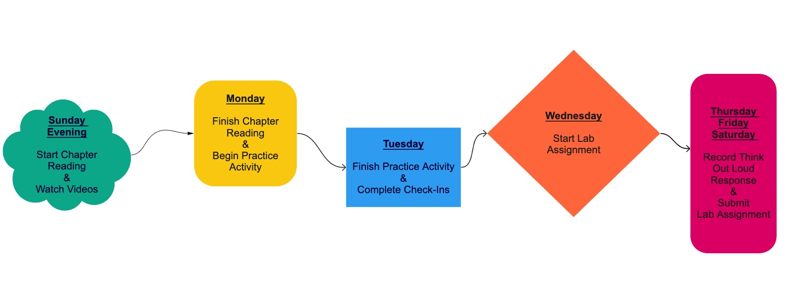
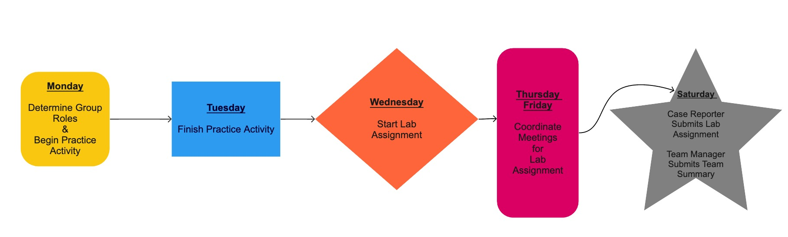

```{r setup, include=FALSE}
knitr::opts_chunk$set(echo = FALSE,
                      warning = FALSE,
                      message = FALSE)

library(RColorBrewer)
library(PridePalettes)
library(DiagrammeR)
library(tidyverse)

pride_pal <- c("#e40303", "#ff8c00", "#ffed00",
               "#008026", "#004dff", "#750787")
brewer_pal <- brewer.pal(n = 9, name = "Purples")
```

## Contact

#### Professor Allison Theobold

**Office:** Building 25, Office 105 & Discord

**Email:** atheobol@calpoly.edu


### Course Discord:

For questions of general interest, such as course clarifications or conceptual
questions, please use the
[Class Discord Server (https://discord.gg/4MY346Bm)](https://discord.gg/4MY346Bm).
Refer to the Day One Class Setup materials for more information on how to
effectively use this server.


### Office Hours:

Tuesdays from 3:30 - 4:30pm **in-person**  
Tuesdays & Thursdays from 4:30 - 5:30pm **on Discord**

If you would like to schedule an individual or team Zoom meeting, feel free to
use the following link: <https://calendly.com/allisontheobold>

## Course Info

**Room:** 38-123 (Math & Science)

**Times:** 

- Section 70: Mondays & Wednesdays from 12:10 - 2:00pm
- Section 71: Mondays & Wednesdays from 2:10 - 4:00pm
- Section 72: Mondays & Wednesdays from 4:10 - 6:00pm


## Welcoming Classroom

I value diversity, social justice, inclusion and equity in this (and every)
class. I hold the fundamental belief that everyone is fully capable of engaging
in and mastering material. There is more than one way to address a computing  
problem, and our learning will be richer by remaining open to different ideas,
by rejecting stereotypes, and being aware of--in order to minimize--our biases.
I look forward to getting to know you all as individuals and as a learning
community. 


### Textbook:

There is no required textbook for this course - we will work with free online
resources. The resources we will use are: 

- *R for Data Science* -- <https://r4ds.had.co.nz/> 
- *Advanced R* -- <https://adv-r.hadley.nz/> 
- *Modern Dive* -- <https://moderndive.com/index.html>


### Equipment

You will require a computer with reliable internet access.  If this requirement
is limiting for you, please contact me ASAP.


### Learning Objectives:

This course will teach you the foundations of statistical computing principles 
in the language of `R`.

After taking this course, you will be able to:

* Work with the RStudio IDE and R Markdown documents.
* Import, manage, and clean data from a wide variety of data sources.
* Visualize and summarize data for informative exploratory data analysis and
presentations.
* Write efficient, well-documented, and tidy `R` code.
* Program simulations from probability models. 

Additionally, it is my hope that you will learn to:

* Extend your `R` skills independently through documentation and online
resources.
* Be thoughtful, deliberate, and ethical in your use of `R` and similar tools.
* Use `R` to be playful, creative, and fun!
* Contribute to and participate in the `R` Open Source Community.


#### COVID-19 Addendum

I understand and appreciate the strange world we find ourselves living in today. 
Surrounded by a variety of factors, many of us find ourselves overwhelmed, 
frustrated, confused, and sad. I appreciate all of these outside forces you are
navigating, and will do my best to monitor the pace of our course so that no one
feels left behind. Yes, this may mean that we may not hit every learning
outcome. Instead, it is of utmost importance to me that you leave this course
with the foundational tools for working with data in a reproducible manner and 
and understanding of the "don't repeat yourself" best practices for computing. 


## Course Components 

Canvas will be your main resource for asynchronous course materials:

- class notes
- lecture videos
- lab assignments
- group projects
- software resources

In the classroom, you will participate in the following:  

- course review 
- team-based activities
- team-based labs

Discord will be the main resource for synchronous office hours and asynchronous
discussions. 


### Communication 

Every Sunday evening there will be an announcement on Canvas
letting you know what is due over the next week, and the material we will be
covering. The module for each week will be released on Sunday evening at 5pm,
so you can look over the content and strategize how you will use your time. 

We will use discussion channels in Discord to manage questions and
responses regarding each week's course content. Please __do not__ send an email
about lab questions or questions about the course material. It will be very
helpful to others in the course to see the questions you have and the responses
to those questions. I will try to answer any questions posted to Discord within
12 hours. If you think you can answer another student’s question, please
respond. I will correct any inaccurate responses. If you have a question about
something, the discussion channels are the first place you should go. Personal
matters may be sent via email.

Generally, I will work **either** Saturday or Sunday each weekend, and will work 
from approximately 8am to 4pm (PST) during the week. I will attempt to respond
to emails in 24 hours, but emails sent on a Saturday night may not be responded
to until Monday morning. If you don't hear back from me in 48 hours, assume I
did not receive your email and resend it!

### Weekly Schedule 

Each week in STAT 331 will, for the most part, look something like this:

**Individual Expectations**

```{r, out.width = '500%', out.height = "500%", fig.align = 'center'}

```

**Group Expectations**

```{r, out.width = '100%', fig.align = 'center'}

```

#### Readings and Videos

As this is a synchronous course, we will be using a "flipped class" format. 
This means I will  provide you with readings, pre-recorded videos, and practice
activities for you to watch, read, and do on your own time. You are expected to
complete the readings and watch the videos __before__ Monday's review session. 
During class on Monday you will work with your team to complete a practice
activity, giving you the opportunity to practice the concepts and skills covered
in the reading. 

I expect that you give the asynchronous materials as much diligence you give the 
synchronous meetings.


#### Check-Ins

Throughout the coursework, you will find short Check-In questions to keep you on 
task.  Make sure you submit your answers to these on Canvas to get credit for
your efforts.  Note that the Canvas Check-In quizzes can be submitted up to
three times without a penalty - so you should get 100% on this part of the
course!

All responses to Check-Ins are due on **Tuesdays at midnight**. 


#### Practice Activities

Each week, you will be given a Practice Activity to complete, to get the hang of 
the week's necessary `R` skills.  These activities will always result in a
single, straightforward correct answer, that you will submit via the Canvas
site.  Therefore, there is no reason you should not get full credit in this
category!

Since these activities are intended to be your first attempt at new skills, they 
are meant to be done with help from me and your peers. Each week, your team will 
work on the practice activity during a large portion of Monday's class. Most 
weeks you will complete the practice activity in class. If your team does not 
complete the activity in class, you can either work together or on your own to 
finish the practice activity. 

Practice Activities are due **Tuesdays at midnight.**


#### Team-based Lab Assignments

Your typical "homework" assignments will be weekly labs. These lab assignments 
will be completed in teams. 

These labs are due on **Saturday at midnight**.  

There are no extensions on lab assignments. Labs turned in later than Saturday
will not be reviewed, and instead will be quickly checked for completeness and
receive an automatic grade of 50%.

**Team Member Roles** 

Your team will be rotating group roles each week, so that one person does 
not act as the "team manager" for more than one week. Instead the following roles
will circulate each week, so that each member of the group is able to complete 
each role.

| Role         | Responsibilities | 
|---------------|------------------|
| Case Manager  | Responsible for organizing team work on the lab and leading discussions during meeting(s). During the discussion the case manager is responsible for making sure everyone has a chance to contribute, asking quiet team members to speak up, asking loud team members to listen to others, and bringing the conversation back to the lab assignment if it deviates. |
| Case Reporter | Responsible for collecting, organizing, and recording answers to the lab assignment during the discussions, compiling the summary of the answers discussed, sending summary to case report editor. |
| Case Report Editor | Responsible for reviewing the draft summary provided by the case reporter, sharing the summary with the team, soliciting feedback from the team, and submitting the final lab assignment by the deadline. |
| Team Manager | Responsible for organizing the team work: making sure all roles were assigned and clear, scheduling meetings, coordinating, leading discussion of lab assignment problems, and submitting a managers report at the end of the week. 

The weekly manager report will be completed on Canvas and shared with Dr.
Theobold. The report will contain (1) a brief summary of how the team 
functioned that week, (2) an outline of who participated in each role, (3) 
descriptions of what aspects went well, and (4) what aspects needed improvement. 

In addition to the weekly manager reports, there will be confidential peer
evaluations completed every two weeks. 

**Team Meetings**

Each group is expected to meet for 1-hour on Mondays and Wednesdays, during the 
synchronous meeting time. The team meetings will take place during the $2^{nd}$ 
hour of the synchronous meetings. If you are absent from both of your team's 
meetings and I do not have an email excusing your absence, you will be expected
to complete the lab assignment on your own. 

My hope is that each member of the group looks over the lab assignment on 
Tuesday, so each member should have some initial ideas to propose by Wednesday's 
team meeting. During Wednesday's class, your team will collaborate to complete 
the lab activity. The case reporter should be the team member recording the 
ideas proposed by everyone. Once class has ended, the case reporter will provide
the case report editor with the initial document summarizing what was discussed
during class. If your team did not complete the lab during class, the team
manager is responsible for scheduling additional meetings for the team to 
collaborate on the assignment. 

**Lab Assignment Grading**

I expect that you will approach each lab assignment seriously, investing 
the necessary time and energy to prepare your responses. Different from what 
you may have experienced, lab assignments are graded for "mastery" of the 
concepts. The degree to which you "mastered" each question is assessed with 
the following four-point scale. 

Score   | Justification
--------|--------------
4       | __Master__ -- Outstanding work that exhibits comprehensive and thoughtful understanding of the content of the question, with an individualized perspective. Errors do not occur in the assignment.
3       | __Practitioner__ -- Work reflects a solid understanding of the content of the question. Work may not exhibit original perspectives. Several errors may occur in the question. 
R       | __Redo (Required)__ -- Work satisfies the requirements of the assignment while missing the spirit of the assignment. May be an incomplete rendering of the assignment. The work may contain inconsistencies or demonstrate limited understanding of the content. May be incoherent or poorly written. 
1       | __Novice__ -- The work shows a lack of understanding of the assignment.
0       | __No credit__ -- The problem was not seriously attempted. 

For questions that you reasonably attempted but did not earn a "Practitioner"
score, you will be requested to revise and resubmit your response. Problems
marked with an “R” have the opportunity to be redone and returned to 
earn "Practitioner" credit. Although you may have as many opportunities as
needed to correctly redo problems, your first attempt at redos __must__ be
completed and turned in within __two days__ (48 hours) after receiving your
lab assignment. 

For each problem marked with an “R”, you will be required to
submit a redo form in order to earn back a "Practitioner" score (3 points) on
the problem. One redo form must be completed for each problem. You will 
submit your revisions to the __same__ assignment portal, along with a redo form 
for every question. 

Each lab assignment will receive a score that reflects the average 
points-per-question. For example, suppose your lab assignment has four
questions and you receive the following scores on each problem: 3, 4, 3, and 4.
Then, your overall score is (3 + 4 + 3 + 4) / 4 = 3.5. Suppose you received the
following scores (3, 4, 3, and R). Then, your initial overall score is
(3 + 4 + 3 + 0) / 4 = 2.5 (Redo 1). 

__Do not__ interpret 3/4 as equivalent to a grade of 75%. This rubric is
intended to be about the quality of your work, not the percentage of points
earned. It is likely that students consistently scoring “Practitioner” on this
rubric will earn at least a B- in the course.

Letter grades will be assigned according to the following minimums: 

3.8 (A), 3.0 (B-), 2.85 (C), below 2.85 (C-, D, or F).


#### Challenges

With each Lab Assignment will come a Challenge, asking you to attempt skills
beyond what is required in the practice activity and lab assignment that week.
Challenges are individual submissions, worth 10 points each. 

As these are extensions to the lab assignments, they are a great opportunity to 
discuss your ideas with your team members. However, I do expect that these 
collaborations are about **ideas** and no `R` code is shared between
individuals. Each person's Challenge submission is expected to reflect their own
thinking, and thus copying the work of others does not provide me with any
information about *your* learning. 

Challenges will be graded based on how you extend your understanding. There is
the opportunity to more than 10 points on a Challenge assignment, by submitting 
a Challenge with impressive effort. Extra bonus points earn you extra credit
toward your overall course grade.

#### Think Out Loud Recordings

Every week you will record a short video explaining what the code from your 
challenge "solution" does. Explaining what code is doing requires a deeper level
of understanding, where you are able to break down the code into simple 
components. This type of explanation requires that **you** understand what the
`R` code you are writing is doing.

Each recording will be done through FlipGrid, associated with a Canvas
assignment. The Canvas assignment portal will direct you to the FlipGrid
application. You will need to use your computer audio to record, and I would
prefer that you use your video camera during your recording. The Flipgrid
submissions will not be viewable to anyone other than yourself, unless I request
permission to share your video (see below).

Because these assignments are intended to give you practice explaining what the 
code is doing, full credit will be given so long as you provide a response that
demonstrates you have spent time thinking about how to explain your code. I will
provide individualized feedback to your recording, letting you know where you
are on the right track and what areas you could review. 

While grading I will look for explanations that provide great explanations and 
contact the students who provided these explanations. You will be asked if you 
are comfortable with me sharing your video with the rest of the course. You are 
permitted to say either "yes" or "no," as your grade is not dependent on this 
request. 


#### Written Exams & Oral Exams 

There will be 2 assessments designed for students to demonstrate their
understanding of content covered during the course. Each assessment will be
held over the course of a 24-hour period, but the dataset associated with the 
exam will be provided one to two days before the exam. 

In the 3-days following the exam, I will schedule follow-up oral exams. These
exams will require for you to explain and justify the choices you made when
solving one to two problems from the written exam. 


#### Final Project 

There will be a final project given to each team in the last two weeks of the 
course. This project will ask you to apply the data science and statistical
computing concepts you have learned in the context of a real world application. 


## Grade Breakdown

How will the learning happen? 

| Individual | Group |
|------------|-------|
| Watch lecture videos | Discuss concepts that are unclear | 
| Read textbook        | Discuss concepts that are unclear    |
| Complete check-in    | Discuss concepts from check-in | 
| Complete practice problems from textbook | Discuss practice problems | 
| Complete practice activity | Discuss practice activity    | 
| Complete think out loud recording | Practice talking through your code | 
| Group Evaluations           | Lab assignments |
| Peer Evaluations           | Final project   |
| Exams                      |                | 

Your grade in STAT 331 will contain the following components.

```{r, echo = FALSE, warning = FALSE, message = FALSE}
grades <- tribble(
  ~category,  ~percent,
  "Check-ins", 5, 
  "Challenges", 10,
  "Think Out Loud Recordings", 5,
  "Practice Activities", 5,
  "Lab Assignments", 15,
  "Team Evaluations", 5, 
  "Midterm Exam", 15,
  "Final Project", 20, 
  "Final Exam", 20
  ) 

grades <- grades %>% 
  mutate(category = factor(category, 
                           levels = c("Check-ins", "Challenges", 
                                      "Think Out Loud Recordings", 
                                      "Practice Activities",
                                      "Lab Assignments", 
                                      "Team Evaluations", 
                                      "Midterm Exam",
                                      "Final Project", 
                                      "Final Exam")
                           )
  )

grades$location <- rep(1, 9)

grades %>% 
  ggplot(aes(x = location, y = percent)) +
  geom_col(aes(fill = category), 
           col = 'black') + 
  guides(fill = FALSE) + 
  geom_text(aes(x = rep(1, 9),
                label = c('Check-ins (5%)',
                          'Challenges (10%)',
                          'Think Out Loud Recordings (5%)',
                          'Practice Activities (5%)',
                          'Lab Assignments (15%)',
                          'Team Evaluations (5%)',
                          'Midterm Exam (15%)', 
                          'Final Project (20%)',
                          'Final Exam (20%)'),
                y = c(98, 90, 83, 78, 68, 58, 47, 30, 10)), 
            size = 5) +
  labs(x = '', y = 'Cumulative percent') + 
  theme(axis.text.x = element_blank()) +
  scale_fill_manual(values = brewer_pal)

```

__Note__: If you have more than three “0” grades due to turning assignments in
late, un-revised “Rs,” failure to participate in group collaborations, or
missed assignments, the highest grade you will earn for the class is a C-. 

## Course Organization

This class is organized into three distinct units.

### Unit 1:  R for Data Science (Weeks 1 - 4)

The first unit will focus on the `R` language itself.  You will become
accustomed to the structure of programming in `R`, and learn to perform and 
present exploratory data analyses.  

This unit will fairly closely follow Part I of 
[R for Data Science](https://r4ds.had.co.nz/) by Hadley Wickham.


### Unit 2: Becoming an R Programmer (Weeks 5 - 8)

The second unit will grow your ability to extend your `R` skills beyond the
basics. You will learn to work with unusual data types, to write your own
functions, to program more efficiently and cleanly, and to teach yourself new
packages.

This unit will borrow from Parts I and II of 
[R for Data Science](https://r4ds.had.co.nz/), bits and pieces of 
[Advanced R](https://adv-r.hadley.nz/), and various other online resources.


### Unit 3: Statistical Computing (Weeks 9 & 10)

The final unit of the course will ask you to use your `R` abilities to implement 
various statistical computing tasks, such as simulation and bootstrapping. 


### Dates

**Midterm:** Will be held in Week 6

**Final Exam:** 

- Section 70: Wednesday, March 16 from 10:10am - 1:00pm  
- Section 71: Friday, March 18 from 1:10pm - 4:00pm  
- Section 72: Monday, March 14 from 4:10 - 7:00pm  


## Other Policies

## Late Work Policy 

Lab assignments and redos are expected to be submitted on time. However, every
student will be permitted to submit **one** assignment 24 hours late without
question. You do not need to contact me to use this allowance, but if you find 
yourself in a position where you have use this allowance and you cannot complete
the assignment by the due date, __you are expected to email me__. Once you email
me, we can work together to find a deadline that is fair to both you and other 
students. If I do not hear from you, I will take a 5% reduction in score for
every day an assignment is late, up to four days

You are also expected to participate in the week's group collaborations in a
timely manner. I will be able to monitor your involvement through your attendance
in the weekly group meetings. If you find that you are unable to participate in
the week's team collaborations in a timely manner, __please contact me__. Once
you contact me, we can create a timeline that will both allow for you to
engage in the lab assignment and allow for members of your team to receive
feedback from you. 

## Behavioral Expectations 

This course will use group work and classroom activities to better engage your
understanding of the material. The environment for these discussions and
activities is expected to adhere to ground rules, so that we create an open
space where everyone feels welcome and supported, and comfortable with voicing 
their opinion. 

By participating in this community, students accept to abide by the classroom 
Code of Conduct and accept the procedures by which any Code of Conduct incidents
are resolved. Any form of behavior to exclude, intimidate, or cause discomfort
is a violation of the Code of Conduct. In order to foster a positive
and professional learning environment we encourage the following kinds of
behaviors in all platforms and events:

- use welcoming and inclusive language
- everyone participates and no one dominates
- listen to understand
- share airtime
- one speaker at a time
- disagree with respect
- be respectful of different viewpoints and experiences
- all ideas are valid
- gracefully accept constructive criticism
- treat everything you hear as an opportunity to learn and grow
- seek common ground and understanding

### Diversity and Inclusion

It is my goal for everyone to feel safe and comfortable in my class. If there
is any way I can make the course more welcoming for you, please do not hesitate
to ask.

In particular, if you have a (dis)ability, I will gladly work with you to make
this class more accessible.

I encourage you to also contact the **Disability Resource Center** *(Building
124, Room 119 or at 805-756-1395)*, who can help you register for extra
accommodations such as extended exam time.

### Cheating and Plagiarism.

Simply put, I will not tolerate cheating or plagiarism. 

Any incident of dishonesty, copying, exam cheating, or plagiarism will be
reported to the Office of Student Rights and Responsibilities.

Cheating will earn you a grade of 0 on the assignment and an overall grade
penalty of at least 10%. In circumstances of flagrant cheating, you may be given
a grade of F in the course.

Paraphrasing or quoting another’s work without citing the source is a form of
academic misconduct. This included the `R` code produced by someone else! 
Writing code is like writing a paper, it is obvious if you copied-and-pasted 
a sentence from someone else into your paper because the way each person writes 
is different. 

Even inadvertent or unintentional misuse or appropriation of another's work
(such as relying heavily on source material that is not expressly acknowledged)
is considered plagiarism. If you are struggling with writing the `R` code for an
assignment, please reach out to me. I would prefer that I get to help you rather
than you spending hours Googling things and get nowhere! 

If you have any questions about using and citing sources, you are expected to
ask for clarification. 

For more information about what constitutes cheating and plagiarism, please see <https://academicprograms.calpoly.edu/content/academicpolicies/Cheating>.
